# 概率论基础

## 随机变量（Random Variable）

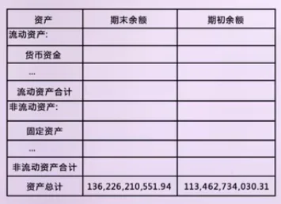

**定义**

随机变量是对随机试验结果的数值化描述。它将不确定的结果映射为数值，使随机现象可以用数学方法进行分析和计算。

从形式上看，随机变量是一个函数：

X : \\Omega \\rightarrow \\mathbb{R}

其中 \\Omega 表示样本空间， \\mathbb{R} 表示实数集。

**随机变量的作用**

随机变量的引入，使得以下分析成为可能：

- 对随机结果进行定量描述

- 对不确定性进行数学建模

- 为后续统计分析提供对象（如期望、方差、检验等）

在量化分析中，价格、收益率、交易结果等都被视为随机变量。

**随机变量的分类**

<u>离散随机变量（Discrete Random Variable）</u>

- 取值为有限个或可数无限个数值

- 常以整数形式出现

典型示例：

- 单日策略是否盈利（0 或 1）

- 一段时间内的交易次数

<u>连续随机变量（Continuous Random Variable）</u>

- 取值在某一区间内连续分布

- 无法逐个列举所有可能取值

典型示例：

- 资产日收益率

- 价格变动幅度

- 波动率指标

**随机变量的本质理解**

需要注意的是：

- 随机性来源于试验结果，而非变量本身

- 随机变量只是对结果的一种数学表示

因此，随机变量并不用于预测单次结果，而是用于描述和分析整体行为特征。

**小结**

- 随机变量是概率论与统计学的核心对象

- 它将随机现象转化为可计算的数值形式

- 是后续学习概率分布、期望、方差和统计推断的基础

## 概率（Probability）

**定义**

概率用于度量随机事件发生的可能性，取值范围为：

0 \\le P(A) \\le 1

其中：

- P(A)=0 ：事件不可能发生

- P(A)=1 ：事件必然发生

在概率论中，概率是对长期频率或不确定性的量化描述。

**样本空间与事件**

<u>样本空间（Sample Space）</u>

样本空间记为 \\Omega ，表示一次随机试验中所有可能结果的集合。

示例：

- 掷一次硬币： \\Omega = \\{\\text{正面}, \\text{反面}\\}

- 单日股票涨跌： \\Omega = \\{\\text{上涨}, \\text{下跌}\\}

<u>事件（Event）</u>

事件是样本空间的子集，表示关注的结果集合。

示例：

- 事件 A：股票上涨

- 事件 B：策略当日盈利

**概率的基本性质**

概率函数满足以下公理性质：

- **非负性**

P(A) \\ge 0

1. **规范性**

P(\\Omega) = 1

1. **可加性 **若事件 A 与 B 互不相交：

P(A \\cup B) = P(A) + P(B)

**概率的直观理解**

概率并不描述单次结果的确定性，而是刻画：

- 事件在大量重复试验中的出现倾向

- 不确定性在整体层面的规律性

因此，概率是统计意义上的概念，而非对单次结果的预测。

**量化分析中的概率**

在量化工程中，概率常用于描述：

- 策略盈利事件发生的可能性

- 风险事件出现的频率

- 市场状态转换的可能性

概率为随机变量的进一步分析提供基础，是连接随机现象与数学建模的核心工具。

**小结**

- 概率用于度量随机事件发生的可能性

- 概率定义在样本空间及其事件之上

- 是后续学习条件概率、联合概率与统计推断的基础

## 条件概率（Conditional Probability）

**引入**

在实际问题中，概率往往是在已知部分信息的前提下进行计算的。 条件概率用于描述：在事件 B 已经发生的情况下，事件 A 发生的可能性。

**定义**

设 A、B 为样本空间 Ω 中的两个事件，且 P(B)\>0，则事件 A 在事件 B 发生条件下的条件概率定义为：

P(A \\mid B) = \\frac{P(A \\cap B)}{P(B)}

**定义的直观含义**

条件概率的本质是样本空间的缩小：

- 原样本空间：Ω

- 已知 B 发生后，新的样本空间变为 B

条件概率衡量的是：

在新的样本空间 B内，事件 A 所占的比例。

**条件概率的特点**

- 依赖已知信息 条件概率反映的是在特定条件下的可能性，而非无条件的总体概率。

- 不对称性

P(A \\mid B) \\neq P(B \\mid A)

条件的方向不同，概率含义完全不同。

- 重新归一化 在条件 B 下：

P(B \\mid B) = 1

说明条件事件成为新的“全集”。

**条件概率与事件关系**

通过条件概率，可以刻画事件之间的关系：

- 若 P(A \\mid B) = P(A) ，则事件 A 与 B 相互独立

- 若两者不相等，则 B 的发生会影响 A 的发生可能性

**量化分析中的条件概率**

在量化工程中，条件概率常用于：

- 市场状态已知时的收益评估

- 已发生事件对未来结果的影响分析

- 分市场、分情景的统计建模

其核心思想是：

在信息已更新的情况下，重新评估不确定性。

**小结**

- 条件概率描述在已知事件发生前提下的概率

- 数学定义基于事件交集与样本空间缩小

- 是理解独立性、贝叶斯定理和统计推断的基础

参考资料：

https://zhuanlan.zhihu.com/p/454910486

https://blog.csdn.net/Informationstrongman/article/details/128511396

## 联合概率（Joint Probability）

**引入**

在概率分析中，往往需要同时关注多个事件是否共同发生。联合概率用于刻画：两个或多个事件同时发生的可能性。

**定义**

设 A、B 为样本空间 Ω 中的两个事件，则事件 A 与事件 B 同时发生的概率称为联合概率，记为：

P(A \\cap B)

其中：

- “∩” 表示事件的交集

- A \\cap B 表示同时满足事件 A 与事件 B 的结果集合

**联合概率的含义**

联合概率回答的问题是：A 和 B 一起发生的可能性有多大。

它不同于：

- P(A)：只关心 A 是否发生

- P(B)：只关心 B 是否发生

联合概率强调的是同时性。

**联合概率与条件概率的关系**

联合概率与条件概率之间存在直接关系：

P(A \\cap B) = P(A \\mid B)\\, P(B)

同样也有：

P(A \\cap B) = P(B \\mid A)\\, P(A)

这说明：

- 联合概率可以看作“先发生一个事件，再发生另一个事件”的结果

- 条件概率是对联合概率的拆解

**联合概率的对称性**

需要注意：

P(A \\cap B) = P(B \\cap A)

联合概率本身是对称的，但对应的条件概率一般不对称。

**量化分析中的联合概率**

在量化工程中，联合概率常用于：

- 多个条件同时成立时的统计分析

- 多因子信号共同触发的情形

- 风险事件叠加发生的可能性评估

例如：

“市场下跌且波动率上升”就是一个典型的联合事件。

**小结**

- 联合概率描述多个事件同时发生的可能性

- 数学形式为事件的交集概率

- 是连接条件概率与独立性的重要桥梁

## 全概率公式（Law of Total Probability）

**引入**

在实际问题中，直接计算某个事件的概率往往较为困难，但可以将其拆分为在不同条件下发生的概率之和。

全概率公式用于解决：

> 当事件 A 的发生依赖于多种互斥情形时，如何计算 A 的总体概率。

**条件划分**

设样本空间 Ω 被一组事件 {B1,B2,…,Bn} 划分，满足：

B\_i \\cap B\_j = \\varnothing \\quad (i \\neq j)

\\bigcup\_{i=1}^n B\_i = \\Omega

P(B\_i) \> 0

这组事件称为样本空间的完备事件组。

**全概率公式**

对任意事件 A，有：

P(A) = \\sum\_{i=1}^{n} P(A \\mid B\_i)\\, P(B\_i)

**公式的直观理解**

全概率公式的核心思想是：

- 事件 A 一定发生在某一个 B\_i 的条件下

- 各种 B\_i 互不重叠，覆盖所有可能情况

因此：

> 总体概率 = 各种情形下概率的加权和

**与联合概率的关系**

全概率公式可由联合概率直接推导：

P(A) = \\sum\_{i=1}^{n} P(A \\cap B\_i)

再利用：

P(A \\cap B\_i) = P(A \\mid B\_i)\\, P(B\_i)

**量化分析中的应用意义**

在量化工程中，全概率公式常用于：

- 按市场状态拆分收益或风险

- 按情景合成整体概率评估

- 将复杂问题分解为多个可计算子问题

例如：

- 不同波动率区间下的策略表现

- 不同宏观状态下的违约概率

**小结**

- 全概率公式用于将复杂概率问题拆解为多种互斥情形

- 样本空间的合理划分是使用该公式的前提

- 是贝叶斯定理的重要基础工具

## 贝叶斯定理（Bayes’ Theorem）

### 先验概率（Prior Probability）

先验概率是指在引入当前观测数据之前，对事件或假设成立可能性的概率判断。它反映的是在没有使用当前信息时，对不确定性的初始认识。

先验并不是结论，而是后续概率更新的起点。它提供了一个在观测发生之前的参考尺度，使得不同假设在更新前具有可比性。

### 3. 似然（Likelihood）

似然用于描述在某一假设成立的前提下，观测数据出现的可能性。它刻画的是假设对数据的解释能力，而不是假设本身发生的概率。

在推断过程中，数据被视为已知量，似然用于衡量不同假设在当前数据下的相对支持程度。

### 3. 后验概率（Posterior Probability）

后验概率是指在引入观测数据之后，对事件或假设成立可能性的更新结果。它综合了先验概率和似然所提供的信息，是贝叶斯推断中的最终概率判断。

后验并不是单独由数据决定，也不是完全继承先验，而是两者在统一概率框架下的结合。

### 贝叶斯定理（Bayes’ Theorem）

**引入**

在概率论中，许多实际问题并不是直接计算某个事件发生的概率，而是需要在观察到结果之后，重新评估不同原因发生的可能性。

通常情况下：

- 正向条件概率 P(B \\mid A) 可以通过历史数据或实验统计获得；

- 但决策真正关心的是反向概率 P(A \\mid B) 。

由于条件概率本身不具备对称性，不能直接交换条件与结果，因此需要一种系统的方法来完成这种反向推断，贝叶斯定理正是为此而提出的。

**定义**

设 A、B 为样本空间中的两个事件，且 P(B)\>0，则贝叶斯定理表述为：

该公式将一个难以直接估计的条件概率，转化为三个相对容易理解和估计的概率项，为实际应用提供了可操作的计算路径。

在贝叶斯定理中，各概率项具有明确的统计含义：

- 先验概率 P(A) 表示在未观察到新信息之前，对事件 A 发生可能性的初始判断，通常来源于历史经验或长期统计。

- 似然 P(B∣A) 描述在事件 A 已经发生的前提下，观察到当前结果 B 的可能性，用于衡量新信息与假设之间的匹配程度。

- 后验概率 P(A∣B) 表示在观察到事件 B 之后，对事件 A 发生可能性的更新结果，是贝叶斯推断的最终目标。

分母 P(B) 并非独立给定，而是通过 <u>全概率公式 </u>计算得到：

P(B) = \\sum\_{i=1}^{n} P(B \\mid A\_i)\\, P(A\_i)

其中 {A1,A2,…,An} 为一组完备事件。

该项的作用主要体现在两点：

- 将所有可能导致结果 B 的情形纳入考虑；

- 保证在给定 B 的条件下，各后验概率之和等于 1。

**贝叶斯定理的理解**

从结构上看，贝叶斯定理体现了一个信息更新过程：

- 先验概率提供初始判断；

- 新观测数据通过似然函数对判断进行修正；

- 全概率项完成归一化，形成一致的概率体系。

这一过程并非一次性结论，而可以在获得更多信息时反复进行。

贝叶斯定理建立在条件概率的定义之上，但解决的问题方向不同：

- 条件概率关注在条件已知时结果发生的概率；

- 贝叶斯定理关注在结果已知时条件成立的可能性。

因此，贝叶斯定理不是新的概率定义，而是对已有概率关系的重新组织和利用。

**在量化分析中的意义**

在量化工程中，贝叶斯定理的价值在于：

- 提供了一种将历史统计与最新数据相结合的方法；

- 允许模型在信息不断变化的环境中进行动态更新；

- 为不确定性决策提供可解释的概率依据。

其思想广泛应用于状态识别、风险评估及模型参数更新等问题中。

**小结**

- 贝叶斯定理用于在观察结果后更新对原因的概率判断；

- 其推导基于联合概率与全概率公式；

- 是概率论中处理信息更新问题的核心工具之一。

### 最大似然估计（Maximum Likelihood Estimation, MLE）

**引入**

在统计建模中，参数推断的目标是在给定观测数据 D 的条件下，对模型参数 θ 的取值进行估计。贝叶斯定理给出了参数后验概率的表达式：

P(\\theta \\mid D) = \\frac{P(D \\mid \\theta)\\, P(\\theta)}{P(D)}

该公式表明，在贝叶斯框架中，对参数 θ 的推断基于三部分信息：

- 数据在参数 θ 下出现的可能性（似然）；

- 参数在观测前的概率描述（先验）；

- 用于归一化的总体概率。

贝叶斯定理本身并不提供具体的参数取值，而是给出了参数不确定性的完整概率描述。

**从后验分布到点估计**

在实际应用中，往往需要从后验分布中给出一个确定的参数估计值，以便进行预测或计算。这就引入了点估计的思想。

一种自然的做法是选择后验概率最大的参数取值，即最大后验估计（MAP）：

\\hat{\\theta}\_{\\text{MAP}} = \\arg\\max\_{\\theta} P(\\theta \\mid D)

将贝叶斯定理代入，有：

\\hat{\\theta}\_{\\text{MAP}} = \\arg\\max\_{\\theta} \\big\[ P(D \\mid \\theta)\\, P(\\theta) \\big\]

**最大似然估计**

若在参数推断中不引入任何关于 θ 的先验偏好，即假设先验概率 P(θ) 为常数，则后验概率与似然成正比：

P(\\theta \\mid D) \\propto P(D \\mid \\theta)

此时，最大后验估计退化为：

\\hat{\\theta}\_{\\text{MLE}} = \\arg\\max\_{\\theta} P(D \\mid \\theta)

这一定义即为最大似然估计。

从形式上看，最大似然估计等价于在先验为常数时的最大后验估计，因此可以将最大似然估计视为最大后验估计在特殊先验假设下的结果。

最大似然估计的基本思想是： 选择使观测数据出现概率最大的参数取值。

在这一过程中：

- 数据被视为已知且固定；

- 参数被视为待估计的未知量；

- 参数的不确定性不再通过分布刻画，而是通过一个最优点来表示。

最大似然估计完全依赖数据本身，不引入外部信息。

**与贝叶斯方法的关系**

从贝叶斯定理的角度看：

- 贝叶斯推断给出了参数的后验分布；

- 最大似然估计是在特定条件下，对该后验分布进行点估计的结果；

- 最大似然估计并非独立于贝叶斯理论，而是其在“无信息先验”情形下的自然简化。

### 最大后验估计（Maximum A Posteriori, MAP）

**引入**

在参数估计问题中，最大似然估计完全依赖观测数据，当样本数量有限或数据噪声较大时，参数估计结果容易出现不稳定或极端取值。贝叶斯方法通过在推断中引入先验概率，为参数提供额外信息。最大后验估计正是在这一背景下提出的一种点估计方法，其目标是在观测数据和先验信息的共同约束下，选择最合理的参数取值。

**数学形式**

设观测数据为 D，模型参数为 θ，最大后验估计定义为：

\\hat{\\theta}\_{\\text{MAP}} = \\arg\\max\_{\\theta} P(\\theta \\mid D)

根据贝叶斯定理，有：

P(\\theta \\mid D) \\propto P(D \\mid \\theta)\\, P(\\theta)

因此，MAP 等价于在参数空间中最大化似然函数与先验概率的乘积。

在实际计算中，通常对目标函数取对数，由于对数函数是单调递增的，上式等价于：

\\hat{\\theta}\_{\\text{MAP}} = \\arg\\max\_{\\theta} \\big\[ \\log P(D \\mid \\theta) + \\log P(\\theta) \\big\]

其中：

- \\log P(D \\mid \\theta) 为 **对数似然项 **；

- \\log P(\\theta) 为 **对数先验项 **。

这种形式将乘法关系转化为加法关系，既便于数值计算，也更适合与常见的优化算法结合使用。

**MAP 与MLE的关系**

最大似然估计可以看作 MAP 在先验概率为常数时的特例。当先验不对参数取值施加任何偏好时，MAP 与 MLE 给出的结果一致；当先验具有明确结构时，MAP 会在最大似然解的基础上进行修正。因此，MAP 在数据与先验信息之间起到平衡作用，既保留了数据驱动的特性，又引入了对参数空间的约束。

**MAP 在量化工程中的作用**

在量化建模中，MAP 常用于参数维度较高、样本相对有限或需要控制模型复杂度的场景。通过合理设置先验，可以抑制参数估计的剧烈波动，提高模型在样本外的稳定性。从工程角度看，MAP 提供了一种在贝叶斯思想下可直接实现的参数估计方法，既避免了完整贝叶斯推断的计算复杂度，又比纯粹的最大似然估计更加稳健。

参考资料：

[贝叶斯估计、最大似然估计、最大后验估计三者的区别](https://yuanxiaosc.github.io/2018/06/20/%E8%B4%9D%E5%8F%B6%E6%96%AF%E4%BC%B0%E8%AE%A1%E3%80%81%E6%9C%80%E5%A4%A7%E4%BC%BC%E7%84%B6%E4%BC%B0%E8%AE%A1%E3%80%81%E6%9C%80%E5%A4%A7%E5%90%8E%E9%AA%8C%E4%BC%B0%E8%AE%A1%E4%B8%89%E8%80%85%E7%9A%84%E5%8C%BA%E5%88%AB/)

## 期望值（Expected Value）

**定义**

期望值用于刻画随机变量在统计意义下的平均水平，是概率论中最基本的数值特征之一。它描述的是在大量重复试验或长期观察中，随机变量取值的平均趋势，而不是某一次试验的结果。期望值是一个理论量，反映随机变量整体行为的中心位置。

设随机变量为 X。

对于离散随机变量，期望值定义为：

\\mathbb{E}\[X\] = \\sum\_i x\_i\\, P(X = x\_i)

对于连续随机变量，期望值定义为：

\\mathbb{E}\[X\] = \\int\_{-\\infty}^{+\\infty} x\\, f\_X(x)\\, dx

其中 f\_X(x) 为随机变量 X 的概率密度函数。

从数学形式上看，期望值是对随机变量取值按其概率进行的加权平均。

**基本性质**

期望值最重要的性质是线性。对任意随机变量 X,Y 以及常数 a,b，有：

\\mathbb{E}\[aX + bY\] = a\\,\\mathbb{E}\[X\] + b\\,\\mathbb{E}\[Y\]

该性质在实际建模中具有基础性作用，并且不依赖于随机变量之间是否相互独立。

**在量化分析中的作用**

在量化工程中，期望值常用于描述收益、损失或其他指标的长期平均水平，是评估策略理论表现的重要参考量。需要注意的是，期望值仅刻画平均水平，不能反映结果的波动性或风险，因此通常需要结合方差、标准差等统计量进行综合分析。

## 方差（Variance）

**定义**

方差用于刻画随机变量相对于其期望值的离散程度，是衡量随机变量波动大小的基本统计量。与期望值描述“平均水平”不同，方差关注的是随机变量围绕平均值的偏离情况。在概率与统计分析中，方差常被用来度量不确定性和风险的大小。

设随机变量为 X，其期望值为 E\[X\]，则方差定义为：

\\mathrm{Var}(X) = \\mathbb{E}\\!\\left\[(X - \\mathbb{E}\[X\])^2\\right\]

对于离散随机变量：

\\mathrm{Var}(X) = \\sum\_i (x\_i - \\mathbb{E}\[X\])^2 \\, P(X = x\_i)

对于连续随机变量：

\\mathrm{Var}(X) = \\int\_{-\\infty}^{+\\infty} (x - \\mathbb{E}\[X\])^2 f\_X(x)\\, dx

方差通过对“偏离均值的平方”取期望，保证了偏离方向不会相互抵消。

**基本性质**

方差具有以下常用性质：

- 非负性

\\mathrm{Var}(X) \\ge 0

- 与常数的关系

\\mathrm{Var}(X + c) = \\mathrm{Var}(X)

\\mathrm{Var}(aX) = a^2 \\mathrm{Var}(X)

其中 a,c 为常数。

这些性质说明：平移不会改变波动大小，而缩放会按比例放大或缩小波动。

**在量化分析中的作用**

在量化工程中，方差常用于刻画收益或损失的波动程度，是风险度量的重要基础。与期望值相比，方差更直接反映结果的不稳定性，因此在策略评估、组合分析和风险控制中具有核心地位。需要注意的是，方差与期望值通常需要结合使用，才能对随机变量的行为形成完整判断。

## 标准差（Standard Deviation）

**定义**

标准差是方差的平方根，用于刻画随机变量围绕其期望值的典型偏离程度。与方差相比，标准差与随机变量本身具有相同的量纲，因此在实际分析中更直观、更易解释。标准差反映的是随机变量在平均意义下偏离均值的“典型大小”。

设随机变量 X 的方差为 Var(X)，则标准差定义为：

\\sigma\_X = \\sqrt{\\mathrm{Var}(X)}

结合方差的定义，可写为：

\\sigma\_X = \\sqrt{\\mathbb{E}\\!\\left\[(X - \\mathbb{E}\[X\])^2\\right\]}

标准差本质上是对随机变量波动幅度的一种尺度化度量。

**基本性质**

标准差继承了方差的主要性质：

- 非负性

\\sigma\_X \\ge 0

- **平移不变性**

\\sigma\_{X + c} = \\sigma\_X

其中 c 为常数。

- **线性缩放性**

\\sigma\_{aX} = \|a\|\\, \\sigma\_X

其中 a 为常数。

这些性质说明，标准差度量的是相对波动程度，而不受位置变化的影响。

**在量化分析中的作用**

在量化工程中，标准差常被直接用作波动性指标，用于衡量收益、价格或其他随机变量的风险大小。与方差相比，标准差在数值尺度上更直观，便于不同资产或策略之间的比较。因此，在策略评估、风险控制和资产配置中，标准差是最常用的离散程度度量之一。

## 协方差（Covariance）

**定义**

协方差用于刻画两个随机变量共同变化的方向和程度。与方差描述单个随机变量的波动不同，协方差关注的是：当一个随机变量偏离其期望值时，另一个随机变量是否倾向于同时向同一方向或相反方向偏离。

从统计意义上看，协方差反映的是两个随机变量之间的 <u>线性共同波动关系 </u>，但 <u>不刻画这种关系的强弱比例 </u>。

设随机变量为 X,Y，其期望值分别为 E\[X\] 和 E\[Y\]，则协方差定义为：

\\mathrm{Cov}(X, Y) = \\mathbb{E}\\!\\left\[(X - \\mathbb{E}\[X\])(Y - \\mathbb{E}\[Y\])\\right\]

也可写为等价形式：

\\mathrm{Cov}(X, Y) = \\mathbb{E}\[XY\] - \\mathbb{E}\[X\]\\mathbb{E}\[Y\]

该表达式在实际计算中更为常用。

**基本性质**

协方差具有以下常见性质：

- 对称性

\\mathrm{Cov}(X, Y) = \\mathrm{Cov}(Y, X)

- 与常数的关系

\\mathrm{Cov}(aX, bY) = ab\\, \\mathrm{Cov}(X, Y)

其中 a,b 为常数。

- 与方差的关系

\\mathrm{Var}(X) = \\mathrm{Cov}(X, X)

此外，若 X 与 Y 相互独立，则：

\\mathrm{Cov}(X, Y) = 0

但协方差为零并不必然意味着独立。

**在量化分析中的作用**

在量化工程中，协方差是多资产和多因子分析的基础，用于刻画不同资产收益之间的联动关系。投资组合的总体波动不仅取决于各资产的方差，还取决于它们之间的协方差结构。因此，协方差在组合风险评估和资产配置中具有核心地位。

需要注意的是，协方差的数值大小受变量量纲影响，难以直接比较不同变量对之间的相关程度，这也是引入相关系数的主要原因。

## 大数法则（Law of Large Numbers）

**定义**

大数法则描述的是随机变量在重复试验或长期观测下，其平均值的稳定性。它说明：当试验次数或样本数量不断增大时，随机变量的样本均值会趋近于其期望值。 大数法则并不针对单次结果，而是刻画随机现象在整体和长期意义下的规律性，是连接理论期望与实际样本统计的重要桥梁。

**数学表述**

设 {X1,X2,…,Xn} 为一组独立同分布的随机变量，且其期望为 \\mu = \\mathbb{E}\[X\_i\] 。定义样本均值为：

\\bar{X}\_n = \\frac{1}{n}\\sum\_{i=1}^n X\_i

大数法则表明，当 n \\to \\infty 时，样本均值 \\bar{X}\_n 将以概率意义趋近于 \\mu ：

\\bar{X}\_n \\to \\mu

这意味着，样本数量越大，样本均值越稳定，越能反映真实的期望水平。

**与期望和方差的关系**

大数法则的成立依赖于随机变量期望的存在，并与方差大小密切相关。方差越小，样本均值围绕期望值波动越小，收敛速度越快；方差越大，则需要更多样本才能观察到稳定的平均水平。

因此，大数法则并不意味着“样本多了就一定准确”，而是强调在满足一定条件下，统计平均具有可预期的稳定性。

**在量化分析中的意义**

在量化工程中，大数法则为使用历史数据估计收益、风险等统计量提供了理论基础。策略的长期平均收益、因子的期望表现，都是在大数法则假设下通过样本均值进行估计的。

需要注意的是，大数法则并不保证短期表现，也不保证样本之间独立或分布稳定。在实际应用中，若数据存在结构变化或相关性，大数法则的效果会受到影响。

# 概率分布

## 概率分布（Probability Distribution）

**定义**

概率分布用于描述随机变量在所有可能取值上的概率分配情况。它刻画的不是单个结果，而是随机变量整体取值行为的结构，是连接“随机变量”和“概率”的核心概念。

从统计意义上看，概率分布回答的是：

> 一个随机变量更可能取哪些值？概率如何在取值空间中分布？

因此，概率分布是对随机现象的全局描述，而不是对某一次结果的判断。

**数学形式**

根据随机变量类型的不同，概率分布具有不同的数学表示方式。

- 离散随机变量 用概率质量函数（PMF）描述：

P(X = x\_i), \\quad \\sum\_i P(X = x\_i) = 1

- 连续随机变量 用概率密度函数（PDF）描述：

f\_X(x) \\ge 0, \\quad \\int\_{-\\infty}^{+\\infty} f\_X(x)\\,dx = 1

其中，单点概率为零，区间概率通过积分计算。

此外，常引入分布函数（CDF）：

F\_X(x) = P(X \\le x)

它对离散和连续随机变量都适用，用于描述概率的累积情况。

**基本性质**

概率分布具有以下基本性质：

- 非负性：概率或概率密度不小于零

- 规范性：所有可能结果的概率之和（或积分）为 1

- 完整性：概率分布完整描述了随机变量的统计行为

一旦概率分布确定，随机变量的期望、方差、协方差等统计量都可以由其推导得到。

**在量化分析中的作用**

在量化工程中，概率分布用于对收益、风险和不确定性进行建模。不同的分布假设对应不同的市场行为理解，例如尾部风险、波动结构等。

概率分布为统计推断、参数估计、风险度量等方法提供基础，是后续学习假设检验、贝叶斯方法和随机过程的前提。

## 均匀分布（Uniform Distribution）

**定义**

均匀分布描述的是这样一种随机现象：在给定范围内，所有可能取值出现的可能性完全相同。 从统计意义上看，均匀分布体现的是“无偏好”的不确定性，即在缺乏额外信息的情况下，对所有结果一视同仁。

均匀分布常被用作概率分布学习中的起点，也常作为其他复杂分布的对照基准。

**数学形式**

均匀分布既可以是离散的，也可以是连续的。

- 离散均匀分布 若随机变量 X 在有限个取值 {x1,x2,…,xn} 上均匀分布，则：

P(X = x\_i) = \\frac{1}{n}, \\quad i = 1,2,\\dots,n

- 连续均匀分布 若随机变量 X 在区间 \[a,b\] 上均匀分布，记为：

X \\sim U(a, b)

- 其概率密度函数为：

f\_X(x) = \\begin{cases} \\dfrac{1}{b-a}, & a \\le x \\le b, \\\\ 0, & \\text{其他}. \\end{cases}

**基本性质**

对于连续均匀分布 X∼U(a,b)，有：

- 期望值

\\mathbb{E}\[X\] = \\frac{a + b}{2}

- 方差

\\mathrm{Var}(X) = \\frac{(b - a)^2}{12}

此外，在区间 \[a,b\] 内任意等长子区间上的概率相同，这正是“均匀性”的数学体现。

**在量化分析中的作用**

在量化工程中，均匀分布常用于表示缺乏先验偏好的情况，例如参数初始化、随机采样或模拟实验中的基准假设。 虽然真实金融数据很少严格服从均匀分布，但它在建模中具有重要的参考意义，用于对比其他分布所引入的结构性假设。

## 正态分布（Normal Distribution）

**定义**

正态分布是一类连续概率分布，用于描述大量独立随机因素共同作用下形成的随机现象。其分布形态以均值为中心，对称分布，呈钟形曲线。从统计意义上看，正态分布刻画的是随机变量围绕其平均水平进行波动的典型模式。

在统计学中，正态分布具有基础性地位，许多统计方法和近似结果都以正态分布为理论依据。

**数学形式**

设随机变量 X 服从均值为 μ、方差为 \\sigma^2 的正态分布，记为：

X \\sim \\mathcal{N}(\\mu, \\sigma^2)

其概率密度函数为：

f\_X(x) = \\frac{1}{\\sqrt{2\\pi}\\sigma} \\exp\\!\\left(-\\frac{(x - \\mu)^2}{2\\sigma^2}\\right), \\quad x \\in (-\\infty, +\\infty)

其中，参数 μ 决定分布的位置，σ 决定分布的离散程度。

**基本性质**

正态分布具有以下重要性质：

- 对称性：分布以 μ 为中心左右对称

- 均值、众数、中位数一致

\\mathbb{E}\[X\] = \\mu, \\quad \\mathrm{Var}(X) = \\sigma^2

- 标准化性质：若 X \\sim \\mathcal{N}(\\mu,\\sigma^2) ，则 Z = \\frac{X - \\mu}{\\sigma} \\sim \\mathcal{N}(0,1)

- 线性变换封闭性：正态随机变量的线性组合仍服从正态分布

**在量化分析中的作用**

在量化工程中，正态分布常被用作收益、误差或噪声的基准模型，也是许多统计推断方法（如置信区间、假设检验）的基础。虽然真实金融数据并不严格服从正态分布，但正态分布在建模与近似分析中具有重要参考价值，常作为更复杂分布的起点。

## 二项分布（Binomial）

**定义**

二项分布用于描述在固定次数的独立重复试验中，某一事件发生的次数。每一次试验只有两种可能结果，通常称为“成功”和“失败”，且每次试验中成功的概率保持不变。

从统计意义上看，二项分布刻画的是重复随机试验中成功次数的整体概率结构，而不是单次试验的结果。

**数学形式**

设随机变量 X 表示在 n 次独立试验中成功的次数，且每次试验成功的概率为 p，则 X 服从参数为 n,p 的二项分布，记为：

X \\sim \\mathrm{Bin}(n, p)

其概率质量函数为：

P(X = k) = \\binom{n}{k} p^k (1 - p)^{n-k}, \\quad k = 0,1,\\dots,n

其中， \\binom{n}{k} 表示从 n 次试验中选取 k 次成功的组合数。

|  | 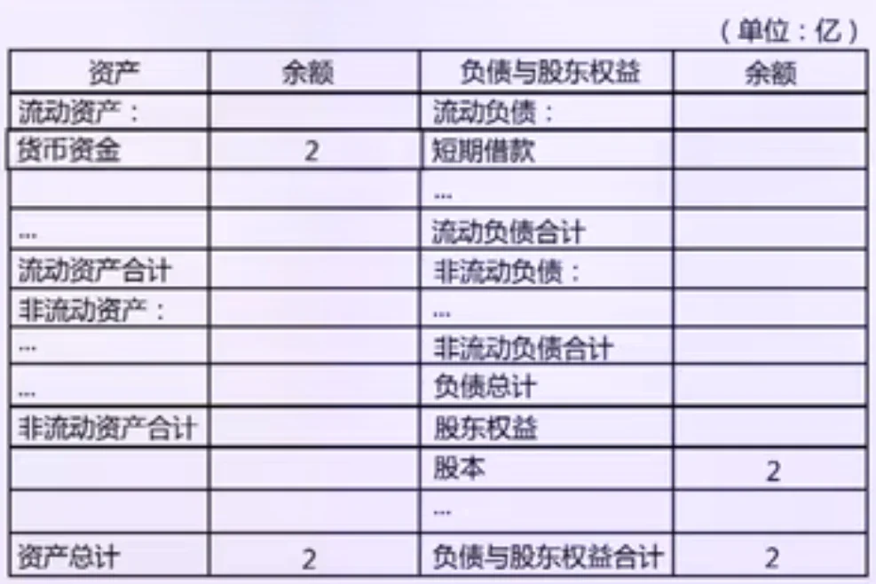 |  |
| --- | --- | --- |

**基本性质**

若 X \\sim \\mathrm{Bin}(n, p) ，则：

- 期望值

\\mathbb{E}\[X\] = np

- 方差

\\mathrm{Var}(X) = np(1 - p)

这些性质反映了成功次数在平均水平及波动程度上的统计特征。

**二项分布 PMF 与正态分布的关系**

二项分布是离散分布，其概率由概率质量函数（PMF）给出：

P(X = k) = \\binom{n}{k} p^k (1-p)^{n-k}

当试验次数 n 较小时，该分布呈现明显的离散特征；随着 n 的增大，分布形态在均值 np 附近逐渐变得平滑。

在 n 较大且 p 不接近 0 或 1 的条件下，二项分布可以用正态分布进行近似：

X \\approx \\mathcal{N}\\big(np,\\; np(1-p)\\big)

该近似在均值和方差层面与二项分布保持一致，其统计基础可视为中心极限定理在二项分布情形下的具体体现。

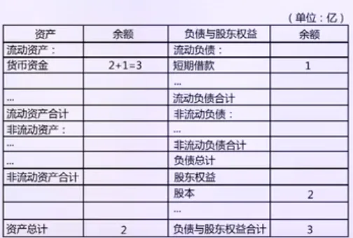

这一关系使得在大样本条件下，可以用连续的正态分布近似计算二项分布的概率，从而显著简化计算过程。但在样本规模较小或分布高度偏斜的情况下，应优先使用二项分布的精确 PMF。

**在量化分析中的作用**

在量化工程中，二项分布常用于描述具有明确成败结果的重复事件，例如某一信号在多次观测中被触发的次数，或某种策略在给定周期内出现特定状态的频率。 二项分布也是许多统计方法的基础分布，其极限形式与正态分布之间存在重要联系，这为后续的近似分析和推断方法奠定了基础。

参考资料：

https://www.datacamp.com/tutorial/binomial-distribution

## 泊松分布（Poisson Distribution）

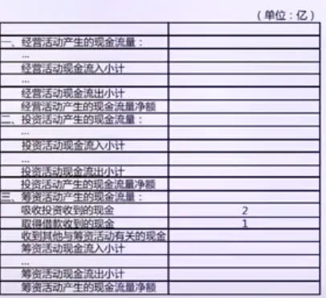

**二项分布到泊松分布的时间极限推导**

在实际问题中，我们常关心的是 <u>在固定时间区间内事件发生的次数 </u>，例如单位时间内的成交次数、故障次数或跳价次数。为刻画这一问题，可以从二项分布出发，并在连续时间极限下推导出泊松分布。

考虑在长度为 T 的时间区间内，将时间划分为 n 个等长的小区间，每个区间长度为

\\Delta t = \\frac{T}{n}

假设事件具有稳定的发生强度 λ，表示单位时间内事件的平均发生次数。则在一个足够小的时间区间 Δt 内，事件发生一次的概率近似为

p = \\lambda \\Delta t = \\frac{\\lambda T}{n}

且在同一时间区间内发生两次及以上事件的概率可以忽略。

<u>泊松极限条件</u>

令随机变量 X 表示在总时间 T 内事件发生的次数，则 X 可近似服从二项分布：

X \\sim \\text{Binomial}(n, p)

其概率质量函数为

P(X=k)=\\binom{n}{k}p^k(1-p)^{n-k}

令

p = \\frac{\\lambda T}{n}

并令 n \\to \\infty ，则有：

- 观察次数 n \\to \\infty （时间划分越来越细）

- 单次发生概率 p \\to 0 （每个时间片内事件极其罕见）

- 期望发生次数保持不变： \\mathbb{E}\[X\]=np=\\lambda T

这正是“大量观察、小概率事件、有限期望”的条件。

<u>极限推导</u>

将 p=\\lambda T/n 代入二项分布的概率质量函数，有

P(X=k) = \\binom{n}{k} \\left(\\frac{\\lambda T}{n}\\right)^k \\left(1-\\frac{\\lambda T}{n}\\right)^{n-k}

将组合项展开可得

\\binom{n}{k} = \\frac{n(n-1)\\cdots(n-k+1)}{k!}

从而

P(X=k) = \\frac{n(n-1)\\cdots(n-k+1)}{n^k} \\cdot \\frac{(\\lambda T)^k}{k!} \\cdot \\left(1-\\frac{\\lambda T}{n}\\right)^{n-k}

当 n\\to\\infty 且 k 为固定整数时，有

\\frac{n(n-1)\\cdots(n-k+1)}{n^k} = \\prod\_{j=0}^{k-1}\\left(1-\\frac{j}{n}\\right) \\longrightarrow 1

同时

\\left(1-\\frac{\\lambda T}{n}\\right)^{n-k} = \\left(1-\\frac{\\lambda T}{n}\\right)^n \\left(1-\\frac{\\lambda T}{n}\\right)^{-k} \\longrightarrow e^{-\\lambda T}

因此，在保持期望 np=λT 为常数的条件下，二项分布的概率质量函数收敛为

P(X=k) \\longrightarrow \\frac{(\\lambda T)^k}{k!}e^{-\\lambda T}

在上述极限条件下，随机变量 X 的分布收敛为泊松分布：

X \\sim \\text{Poisson}(\\lambda T)

在固定时间区间内，若事件发生是稀疏的、独立的，并具有稳定的平均发生率，则事件发生次数可由泊松分布刻画。

泊松分布是将时间无限细分后，在单次发生概率趋于零但整体期望保持常数的条件下，二项分布的极限形式。

**定义**

泊松分布用于描述在 <u>固定时间 </u>或 <u>空间区间 </u>内，某类事件发生的次数。这些事件被假设为随机发生，且 <u>在单位区间内的平均发生次数保持稳定 </u>。

从统计意义上看，泊松分布刻画的是稀疏、独立事件的计数行为，与指数分布所描述的“相邻事件之间的等待时间”在同一随机机制下互为补充。

**数学形式**

设随机变量 X 表示在给定时间区间长度为 T 内事件发生的次数，设 λ\>0 表示单位时间内事件的平均发生率，则随机变量 X 服从参数为 λT 的泊松分布，记为：

X \\sim \\mathrm{Poisson}(\\lambda T)

其概率质量函数为：

P(X = k) = \\frac{(\\lambda T)^k}{k!} e^{-\\lambda T}, \\quad k = 0,1,2,\\dots

**基本性质**

若 X \\sim \\mathrm{Poisson}(\\lambda T) ，则有以下性质：

- 期望值： \\mathbb{E}\[X\] = \\lambda T

- 方差： \\mathrm{Var}(X) = \\lambda T

- 可加性：若 X\_1 \\sim \\mathrm{Poisson}(\\lambda\_1 T),\\quad X\_2 \\sim \\mathrm{Poisson}(\\lambda\_2 T) 且 X\_1 与 X\_2 相互独立，则有：

X\_1 + X\_2 \\sim \\mathrm{Poisson}\\big((\\lambda\_1 + \\lambda\_2)T\\big)

**在量化分析中的作用**

在量化工程中，泊松分布常用于描述事件计数问题，如订单到达次数、或突发事件的出现频率。

> 单位时间交易发生次数

> 某期货合约在正常交易时段内，成交是随机发生的。历史数据显示，该合约平均每分钟成交 30 笔。假设成交在时间上相互独立，且单位时间内成交率稳定。

- 单位时间（1 分钟）平均成交笔数：λT=30

- 时间区间长度：t=1 分钟

> 1 分钟内恰好成交 40 笔 的概率是多少？

> 设随机变量 N(t) 表示 t 分钟内的成交笔数。根据假设，N(t) 服从泊松分布：

> N(t) \\sim \\text{Poisson}(\\lambda t)

> 泊松分布的概率质量函数为：

> P(N(t)=k)=\\frac{(\\lambda t)^k}{k!}e^{-\\lambda t}

> 代入：

> P(N(1)=40)=\\frac{30^{40}}{40!}e^{-30}= 0.014

- 该概率极小，说明 40 笔成交异常活跃

- 可作为高频策略的流动性 <u>异常检测信号: </u>“这一分钟是不是突然热闹过头了？”

> 日内跳价次数

> 定义“跳价”为：1 秒内收益率绝对值超过某阈值 θ。历史数据显示，该合约平均每天发生 2 次跳价。

- 每日跳价均值：λ=2

> 某一天内发生 至少 3 次跳价 的概率是多少？

> 设随机变量 J 表示一天内跳价次数：

> J \\sim \\text{Poisson}(2)

> P(J \\ge 3)=1-P(J\\le 2)

> P(J\\le2)=\\sum\_{k=0}^{2}\\frac{2^k}{k!}e^{-2}

> P(J \\ge 3)=1-e^{-2}\\left(1+2+\\frac{2^2}{2}\\right) = 0.32

## 

> 当 λ=2 时，日内出现至少 3 次跳价的概率约为 32%。这表明，在该市场环境下，多次跳价并非极端事件，而是具有较高发生频率的风险状态。因此，对跳价高度敏感的交易策略必须进行专门的风险控制设计。

参考资料：

[详解泊松分布和指数分布](https://www.bilibili.com/video/BV1LG411L7qt/?spm_id_from=333.337.search-card.all.click&vd_source=c8041efd376e7f34e73272f6ae86b7a5)

[泊松分布及其在现实生活中的应用_泊松分布适用范围-CSDN博客](https://blog.csdn.net/2501_91479538/article/details/146914594)

## 指数分布（Exponential）

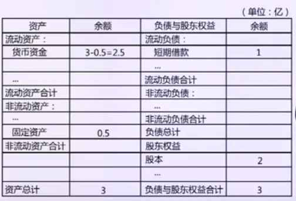

**从泊松分布形式推导指数分布**

设随机变量 X 表示在时间区间长度为 T 内事件发生的次数，单位时间内事件的平均发生率为 λ\>0，则

X \\sim \\mathrm{Poisson}(\\lambda T), \\quad P(X=k)=\\frac{(\\lambda T)^k}{k!}e^{-\\lambda T}

定义随机变量 W 表示从时间 0 开始到第一次事件发生所需的等待时间。事件“W\>t”等价于“在时间区间 \[0,t\] 内没有事件发生”，即

\\{W\>t\\}\\;\\Longleftrightarrow\\;\\{X=0 \\text{ 于区间长度 } T=t\\}

由泊松分布的概率质量函数，当 k=0)时有

P(X=0)=\\frac{(\\lambda t)^0}{0!}e^{-\\lambda t}=e^{-\\lambda t}

因此等待时间的生存函数为

P(W\>t)=e^{-\\lambda t}, \\quad t\\ge 0

由分布函数与生存函数的关系，

F\_W(t)=P(W\\le t)=1-P(W\>t)=1-e^{-\\lambda t}

对分布函数 FW(t) 关于 t 求导，得到等待时间的概率密度函数

f\_W(t)=\\frac{d}{dt}F\_W(t)=\\lambda e^{-\\lambda t}, \\quad t\\ge 0

由此可知，泊松过程中第一次事件的等待时间服从参数为 λ 的指数分布，即

W \\sim \\mathrm{Exponential}(\\lambda)

**定义**

指数分布用于描述 <u>等待时间 </u>或 <u>事件发生间隔时间 </u>的概率分布。它刻画的是在随机事件以稳定速率发生的条件下，等待下一次事件所需时间的不确定性。

从统计意义上看，指数分布描述的是一种无记忆的随机过程：已经等待了多长时间，并不会影响未来还需要等待多久。

**数学形式**

设随机变量 T 表示等待时间，参数 λ\>0 表示事件发生速率，则 T 服从指数分布，记为：

T \\sim \\mathrm{Exponential}(\\lambda)

其概率密度函数为：

f\_T(t) = \\begin{cases} \\lambda e^{-\\lambda t}, & t \\ge 0, \\\\ 0, & t < 0. \\end{cases}

对应的分布函数为：

F\_T(t) = 1 - e^{-\\lambda t}, \\quad t \\ge 0

**基本性质**

指数分布具有以下重要性质：

- 期望值： \\mathbb{E}\[T\] = \\frac{1}{\\lambda}

- 方差： \\mathrm{Var}(T) = \\frac{1}{\\lambda^2}

- 无记忆性： P(T \> s + t \\mid T \> s) = P(T \> t) ，该性质是指数分布最具代表性的特征。

**在量化分析中的作用**

在量化与统计建模中，指数分布常用于刻画事件到达间隔、极端事件的等待时间或随机触发过程。它是泊松过程的基本组成部分，在建模交易到达、订单事件或突发冲击时具有重要作用。指数分布为理解更复杂的时间序列模型和点过程提供了基础。

> 下一笔成交的等待时间

> 某期货合约在正常交易时段内，成交是随机发生的。历史数据显示，该合约平均每分钟成交 30 笔。假设成交在时间上相互独立，且单位时间内成交率稳定，假设成交笔数服从泊松过程。现在刚刚发生了一笔成交。

- 成交强度：λ=30 笔/分钟

> 下一笔成交等待时间超过 5 秒的概率是多少？

> 设随机变量 T 表示两笔相邻成交之间的等待时间。

> 泊松过程的相邻事件间隔时间服从指数分布：

> T \\sim \\text{Exponential}(\\lambda)

> 指数分布的生存函数为：

> P(T\>t)=e^{-\\lambda t}

> 将时间统一为分钟：

> 5 \\text{ 秒} = \\frac{1}{12} \\text{ 分钟}

> 代入：

> P(T\>\\tfrac{1}{12})=e^{-30\\times \\frac{1}{12}}=e^{-2.5} = 0.082

> 91.8% 的情况下，5 秒内一定会有成交。当成交强度为 λ=30 笔/分钟时，两笔成交之间的等待时间服从指数分布。等待时间超过 5 秒的概率约为 8.2%，说明在该市场环境下，成交具有较强的连续性和流动性，较长的成交间隔属于低概率事件。在这种情况下，高频交易和做市策略的挂单通常能较快成交，持仓暴露时间短，交易效率较高。

> 如果在这种背景下，实际观察到成交等待时间明显超过 5 秒，则说明当前市场比正常情况要安静，这在统计意义上属于不常见状态。此时应提高警惕，可以考虑减少交易、放慢下单节奏，或暂时避免开新仓，以防在流动性不足时承受额外风险。

> 持仓到止损的时间

> 某策略中，持仓被止损的触发是随机的。经验上看，单位时间内被止损的概率近似恒定。

- 止损触发强度：λ=0.5 (次/小时)

> 该策略的持仓时间超过 3 小时的概率是多少？

> 设随机变量 T 表示持仓到止损的时间：

> T \\sim \\text{Exponential}(\\lambda)

> 指数分布生存函数：

> P(T\>t)=e^{-\\lambda t}

> 代入：

> P(T\>3)=e^{-0.5\\times 3}=e^{-1.5} = 0.22

> 平均持仓时间： E\[T\]=\\frac{1}{\\lambda}=2 \\text{ 小时} ，当持仓时间超过 3 小时的概率仅为 22% 时，说明该策略的平均持仓时间较短，止损触发较为频繁。策略运行过程中，大部分仓位会在较短时间内被平仓，因此对交易频率、手续费成本以及资金周转效率较为敏感。该类策略更适合快节奏交易环境，不适合依赖长期持仓来获取收益。

## 偏度（Skewness）

**定义**

偏度用于衡量 <u>概率分布相对于其均值的对称程度 </u>，反映分布在左右两侧延伸不均衡的方向与程度。 从统计意义上看，偏度描述的是随机变量取值在均值两侧分布的 <u>不对称性结构 </u>，而不是离散程度。

当分布左右完全对称时，其偏度为零；偏度不为零意味着分布在某一侧具有更长或更厚的尾部。

**数学形式**

设随机变量 X 的期望为 μ，标准差为 σ，则总体偏度定义为：

\\gamma\_1 = \\mathbb{E}\\!\\left\[ \\left(\\frac{X - \\mu}{\\sigma}\\right)^3 \\right\]

该定义通过三阶中心矩对分布的不对称性进行度量，并通过标准化使偏度具有无量纲特性。

**性质**

- 正偏（右偏）： \\gamma\_1 \> 0 ，右尾较长

- 负偏（左偏）： \\gamma\_1 < 0 ，左尾较长

- 对称分布： \\gamma\_1 = 0 （如正态分布）

偏度刻画的是整体形态特征，单个极端值可能对偏度产生显著影响，因此偏度对尾部行为较为敏感。

**在量化分析中的作用**

在量化工程中，偏度常用于分析收益分布的非对称性，判断模型是否存在单侧极端风险。正态分布的偏度为零，而真实金融数据往往表现出显著偏度，这提示需要谨慎使用对称分布假设。

| 偏度（Skew） | 风险含义 | 策略直觉 |
| --- | --- | --- |
| ≈ 0 | 分布近似对称 | 常规收益结构 |
| −0.3 ～ 0.3 | 偏度可忽略 | 偏度风险不显著 |
| −0.5 | 轻度负偏 | 存在尾部亏损风险 |
| −1.0 | 明显负偏 | 高频小收益 + 偶发大亏 |
| −2.0 | 严重负偏 | 典型卖期权型收益 |
| < −3 | 极端负偏 | 尾部风险主导，不可忽视 |

> 在量化交易中，偏度常用于刻画策略收益分布中尾部风险的方向性。

> 以卖出虚值看跌期权的策略为例，该类策略在大多数交易日依赖时间价值衰减获得小额稳定收益，但在少数极端行情下可能遭遇大幅亏损。

> 对某卖出期权策略过去三年的日收益率统计显示，其样本均值为正，日波动率处于可接受水平，但收益分布的偏度为 −2.1 (很高） ，且具有较高峰度。

> 这表明该策略的收益分布明显左偏，盈利主要来自多数时间的小收益，而风险集中在少数极端亏损事件中。在这种情况下，仅依据均值和波动率评估策略风险会显著低估尾部损失的可能性，因为负偏度意味着极端亏损的发生概率远高于正态分布假设。

> 实际量化决策中，这类偏度特征会直接影响仓位管理和风控设计，例如需要限制杠杆、设置严格的单日亏损上限，并在市场波动率快速上升时主动减仓或对冲。更重要的是，偏度帮助判断策略是否具备长期可持续性：即使策略具有正的长期期望收益，若其收益分布呈现显著负偏，策略仍可能在一次极端事件中遭受致命打击。

> 因此，在现实量化场景中，偏度并非辅助指标，而是理解收益来源结构、控制尾部风险以及评估策略生存能力的关键工具。

参考资料：

https://cloud.tencent.com/developer/article/1671707

## 峰度（Kurtosis）

**定义**

峰度用于衡量概率分布在均值附近的集中程度以及尾部厚度，反映分布相对于正态分布在“尖峭程度”和“尾部风险”上的差异。 从统计意义上看，峰度刻画的是随机变量取值在中心区域与极端区域之间的分布结构特征，而不是分布是否对称。

**数学形式**

设随机变量 X 的期望为 μ，标准差为 σ，则总体峰度定义为：

\\gamma\_2 = \\mathbb{E}\\!\\left\[ \\left(\\frac{X - \\mu}{\\sigma}\\right)^4 \\right\]

在实际应用中，常使用超额峰度（Excess Kurtosis）：

\\kappa = \\gamma\_2 - 3

其中正态分布的超额峰度为 0。

**性质**

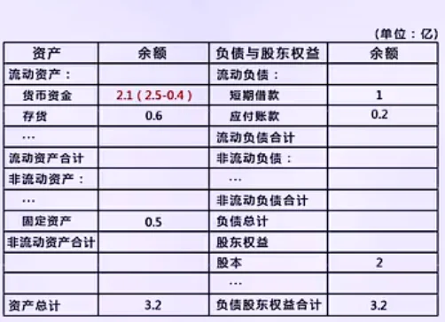

当方差相同时：

- 高峰厚尾： \\kappa \> 0 ，分布在中心更集中，尾部更厚

- 低峰薄尾： \\kappa < 0 ，分布较为平坦，尾部较轻

- 正态分布： \\kappa = 0

峰度对极端值高度敏感，尾部少量异常观测即可显著改变峰度估计。

**在量化分析中的作用**

在量化工程中，峰度常用于刻画收益分布的尾部风险。高峰度意味着极端收益或损失出现的概率高于正态分布假设，是风险管理中需要重点关注的特征。偏度与峰度结合使用，可以更全面地描述真实数据分布与正态分布之间的结构性差异。

> 用峰度判断回测结果是否“可信”

> 某量化团队在做策略筛选，比较两套日频股票策略 A 和 B。两套策略在过去 3 年（约 750 个交易日）上的统计结果如下：

> 指标 策略 A 策略 B

> 日均收益 0.06% 0.06%

> 日波动率 1.1% 1.1%

> 超额峰度 0.2 3.4

> <u>哪个策略更接近“正常市场波动”？ </u>策略 A。

> 超额峰度接近 0，极端收益出现频率接近正态分布。

> <u>哪个策略更容易被“少数极端日”美化回测？ </u>策略 B。 超额峰度高，回测收益更可能由少数异常交易日贡献。

> <u>如果只能选一个上线，应更警惕哪一个？ </u>策略 B。 高峰度意味着实盘结果对极端行情高度敏感，可复制性和稳定性更差。

## 中心极限定理（Central Limit Theorem）

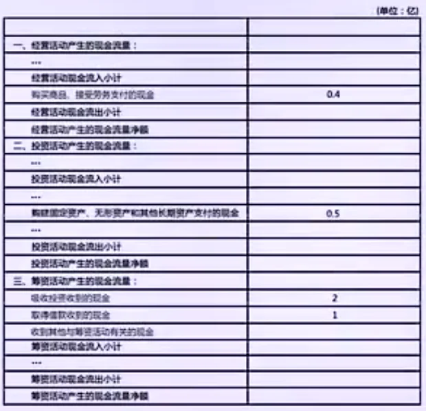

**引入**

在概率论与统计学中，单个随机变量的分布形式可以多种多样，现实数据往往表现出偏斜、厚尾或明显的非正态特征。然而，在统计推断与工程应用中，人们更关心的是多个随机变量的 <u>和 </u>或 <u>平均值 </u>，例如样本均值、累计误差、组合收益等。

中心极限定理正是研究以下核心问题：

> 当大量随机变量进行求和或取平均时，其分布形态将呈现怎样的极限行为？

该定理为统计推断中广泛使用正态分布提供了理论基础，是参数估计、假设检验与置信区间构造的根本依据。

**定义与数学形式**

设随机变量序列 {X1,X2,…,Xn} 相互独立且同分布，并满足：

\\mathbb{E}\[X\_i\] = \\mu,\\quad \\mathrm{Var}(X\_i) = \\sigma^2 < \\infty

定义样本均值：

\\bar{X}\_n = \\frac{1}{n}\\sum\_{i=1}^n X\_i

则当样本容量 n \\to \\infty 时，有：

\\frac{\\bar{X}\_n - \\mu}{\\sigma / \\sqrt{n}} \\;\\xrightarrow{d}\\; \\mathcal{N}(0,1)

等价地，样本均值在大样本条件下近似服从正态分布：

\\bar{X}\_n \\approx \\mathcal{N}\\!\\left(\\mu,\\; \\frac{\\sigma^2}{n}\\right)

需要强调的是，定理并 <u>不要求原始随机变量服从正态分布 </u>，仅要求其具有有限的期望与方差。

**分布形态的收敛机制**

中心极限定理的核心并不在于“求和本身”，而在于在统一尺度下对随机扰动进行聚合与标准化后，分布形态发生的系统性变化。

对于一组相互独立且同分布的随机变量，均值在求和过程中具有线性可加性，方差在独立性条件下亦具有可加性；在进一步标准化后，样本均值的方差随样本量按 1/n 收缩。

与此相比，高阶分布特征的行为存在本质差异：

- 偏度（即三阶中心矩的标准化形式）在样本均值中随样本规模按 1/\\sqrt{n} 衰减，

- 超额峰度（四阶中心矩的标准化形式）在样本均值中随样本规模按 1/n 衰减。

这表明，在随机变量的聚合与平均过程中，分布的偏斜性与尖峭性并不会像均值和方差那样累积，而是被逐步“稀释”和“平均掉”。

随着样本规模的扩大，聚合变量的分布形态越来越少地依赖高阶矩，而主要由均值与方差所刻画；正态分布恰恰是完全由这两个参数决定的极限分布形式。因此，正态分布在统计建模中的普遍性，并非源于现实数据天然服从正态分布，而是独立随机扰动在叠加并标准化后的必然统计结果。

**在量化分析中的作用**

在量化分析与金融工程中，中心极限定理主要用于解释和支持以下做法：

- 使用正态分布近似样本均值或累计收益；

- 构造基于均值与方差的统计检验；

- 在大样本条件下进行参数推断与风险估计。

但该定理的适用性依赖于其前提条件。在以下情形中应谨慎使用正态近似：

- 原始分布具有极重尾特征，导致方差不存在或极不稳定；

- 数据之间存在显著依赖性（如波动聚集、强自相关）；

- 样本规模不足以削弱偏度和峰度的影响。

因此，中心极限定理应被理解为一种 <u>渐近工具 </u>，而非对有限样本数据分布形态的直接断言。

参考资料：

https://cosx.org/2013/01/story-of-normal-distribution-2/

## 经验法则（Empirical Rule）

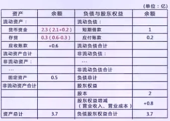

**定义**

经验法则（Empirical Rule），又称 68–95–99.7 法则，描述了正态分布随机变量在均值附近的概率集中程度。

设随机变量

X \\sim \\mathcal{N}(\\mu, \\sigma^2)

则有近似关系：

\\begin{aligned}P(\|X - \\mu\| \\le \\sigma) &\\approx 0.68, \\\\ P(\|X - \\mu\| \\le 2\\sigma) &\\approx 0.95, \\\\ P(\|X - \\mu\| \\le 3\\sigma) &\\approx 0.997\\end{aligned}

经验法则并非独立定理，而是正态分布累积分布函数数值性质的总结性表达。

其适用前提是：

- 随机变量（或统计量）近似服从正态分布

- 关注的是区间概率而非精确分布形态

**统计来源**

经验法则的统计基础来自两点：

- 正态分布的对称性与集中性。 正态分布的概率质量高度集中在均值附近，尾部概率衰减速度快。

- 中心极限定理的间接支撑。 虽然原始数据不一定服从正态分布，但在大量独立扰动叠加或对样本做均值化处理后，所得统计量往往可以近似看作正态分布。

因此，在统计推断中，经验法则更多是用于：

- 样本均值

- 估计误差

- 残差项

- 聚合后的风险度量

而非原始数据本身。

**经验法则的近似性质与误差理解**

需要强调的是：经验法则是近似规则，而非严格概率界限。

例如：

- 68\\%，95\\%，99.7\\% 并非精确值

- 实际概率取决于正态分布函数 \\Phi(x) 的数值

经验法则的价值不在于精度，而在于数量级判断能力：

- 2σ 区间外的事件是“小概率事件”

- 3σ 区间外的事件是“极小概率事件”

这使得经验法则成为风险控制、异常检测和误差评估中的基础工具。

**量化工程中的使用方式**

在量化工程实践中，经验法则常用于：

- 快速评估收益或误差的波动范围

- 构建基于标准差的风险阈值

- 判断观测值是否属于异常波动

但其使用边界同样明确：

- 对厚尾分布（如金融收益）可能严重低估尾部风险

- 对非平稳序列缺乏鲁棒性

- 不应替代完整的分布建模或极值分析

因此，经验法则更适合作为统计直觉工具，而不是最终的建模结论。

## 厚尾分布（Fat Tail）

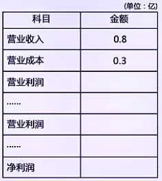

**定义**

厚尾分布是指其尾部区域仍保留显著概率质量的一类概率分布。与正态分布相比，厚尾分布在远离均值的区域中，极端取值出现的概率明显更高。

需要强调的是，厚尾特征关注的是尾部行为，而非均值附近的分布形态。一个分布可以在中心区域近似正态，同时在尾部呈现明显的非正态特性。

**尾部衰减与统计刻画**

从尾部概率的衰减速度来看，正态分布具有指数级衰减特性：

P(\|X\|\>x) \\sim \\frac{2}{x\\sqrt{2\\pi}} \\exp\\!\\left(-\\frac{x^2}{2}\\right), \\quad x\\to\\infty

而厚尾分布的尾部概率衰减速度更慢，常见形式包括多项式衰减：

P(\|X\| \> x) \\sim x^{-\\alpha}, \\quad \\alpha \> 0

在实际数据分析中，厚尾通常通过以下统计现象加以识别：

- 样本峰度显著大于正态分布

- 极端样本出现频率远高于正态预测

- 方差和高阶矩对个别观测高度敏感

**厚尾分布对正态近似的影响**

经验法则及大量统计推断方法隐含正态分布的尾部行为假设。例如，在正态分布下：

P(\|X-\\mu\| \> 3\\sigma) \\approx 0.3\\%

在厚尾分布情形中，该概率可能被系统性低估。这意味着：

- 标准差区间不再对应稳定的概率覆盖率

- 基于 kσ 的异常判定规则失效

- 极端风险被显著低估

**量化工程中的含义**

在量化工程与金融数据中，厚尾现象普遍存在，尤其在资产收益、损失分布和高频波动中表现明显。

这一事实带来的建模启示包括：

- 正态分布不应作为默认分布假设

- 尾部风险需要被显式识别与建模

- 稳健统计方法在实践中更具优势

## 极端风险（Tail Risk）

**定义**

极端风险是指概率分布尾部的极端事件所带来的风险，即那些远离均值、发生概率低但潜在损失巨大的事件。

核心特征：

- 关注尾部行为，而非均值附近的波动

- 极端事件虽然概率低，但一旦发生可能对资产或组合造成重大影响

- 与厚尾分布密切相关：厚尾越明显，极端风险越高

**数学形式**

极端风险的量化通常通过尾部概率和极值理论实现。

<u>尾部概率（Tail Probability）</u>

设随机变量 X 的均值为 μ，标准差为 σ：

\\text{Tail Risk}\_+ = P(X \> \\mu + k\\sigma), \\quad \\text{Tail Risk}\_- = P(X < \\mu - k\\sigma)

其中 k 为标准差倍数。对于厚尾分布，尾部概率衰减较慢：

P(\|X-\\mu\|\>x) \\sim x^{-\\alpha}, \\quad \\alpha \> 0

<u>极值理论（Extreme Value Theory, EVT）</u>

对尾部超过阈值 u 的事件，尾部分布可近似表示为：

P(X \> u + y \\mid X \> u) \\approx \\left(1 + \\frac{\\xi y}{\\beta}\\right)^{-1/\\xi}, \\quad y\>0

其中 ξ 为形状参数，β 为尺度参数。

<u>风险分位数指标</u>

- VaR（Value at Risk）：

\\text{VaR}\_\\alpha = \\inf\\{x: P(X \\le x) \\ge \\alpha\\}

- CVaR（Conditional VaR）：

\\text{CVaR}\_\\alpha = \\mathbb{E}\[X \\mid X \\le \\text{VaR}\_\\alpha\]

**性质**

极端风险具有以下重要性质：

- 低概率高损失：尾部事件出现概率低，但一旦发生，损失可能巨大。

- 厚尾敏感性：尾部概率高于正态预测，经验法则（68–95–99.7%）在极端事件中不适用。

- 非线性累加：多个风险因子叠加时，尾部效应往往超过均值与方差的线性预测。

- 非平稳依赖：尾部风险对波动聚集、均值漂移及市场结构变化高度敏感。

**量化分析中的作用**

在量化工程和金融分析中，极端风险管理至关重要：

- 尾部建模：使用厚尾分布或 EVT 替代正态分布，提高尾部概率和极端损失估计的准确性。

- 稳健风险指标：CVaR、分位数风险、压力测试可覆盖极端市场环境，确保风险控制可操作。

- 动态调整：结合滚动窗口、波动聚集模型或 regime switching，对尾部风险参数进行动态更新。

- 策略优化与风控设计：在资产配置、对冲策略与止损策略中纳入尾部风险，防止极端事件造成巨大损失。

## VaR (value at Risk)

**定义**

在金融风险管理中，Value at Risk（VaR）用于刻画在给定置信水平与时间尺度下，损失可能达到的最大阈值。

设随机变量 X 表示某一投资组合在固定持有期内的 loss，其分布函数为

F(x) = P(X \\le x)

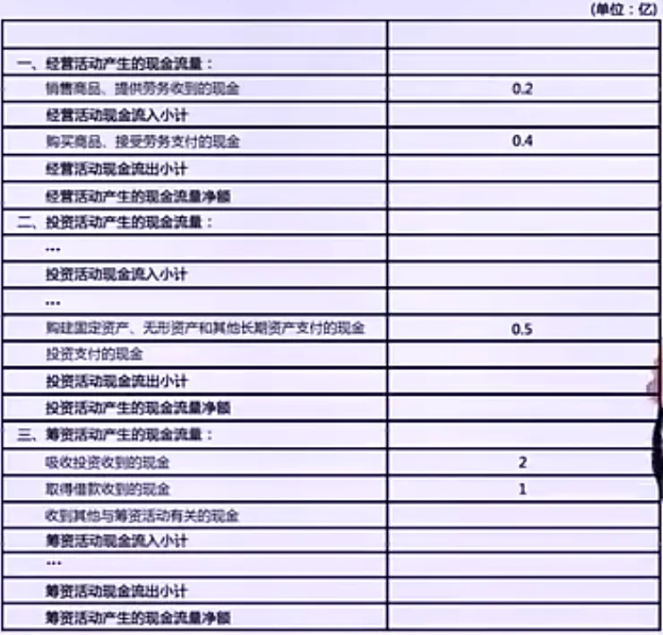

则在置信水平 α∈(0,1) 下，VaR 定义为：

\\mathrm{VaR}\_\\alpha = \\inf \\{ x : P(X \\le x) \\ge \\alpha \\}

从统计角度看，VaR 是损失分布的 α 分位数。

从风险解释角度看：

- \\mathrm{VaR}\_{0.95} ：95% 的情况下，损失不会超过该值

- VaR 描述的是一个边界风险，而非平均风险

- VaR 只对“置信区间内”的风险负责

因此，VaR 并不是“最大损失”，而是在高概率意义下的最大可接受损失水平。

**计算方法**

在实际应用中，VaR 的计算依赖于对损失分布的刻画，常见方法包括以下三类。

<u>参数法（Parametric VaR）</u>

假设收益或损失服从某一已知分布，最常见的是正态分布：

X \\sim \\mathcal{N}(\\mu, \\sigma^2)

则：

\\mathrm{VaR}\_\\alpha = \\mu + z\_\\alpha \\sigma

其中 z\_α 为标准正态分布的 α 分位数。该方法计算简单，但强依赖分布假设。

| 左尾概率 p（%） | 置信水平（%） | 分位数 (z\_p) | 常见用途 |
| --- | --- | --- | --- |
| 0.1 | 0.9 | −1.28 | 90% VaR |
| 0.05 | 0.95 | −1.65 | 95% VaR |
| 0.025 | 0.975 | −1.96 | 置信区间 |
| 0.01 | 0.99 | −2.33 | 99% VaR |
| 0.005 | 0.995 | −2.58 | 极端风险 |
| 0.001 | 0.999 | −3.09 | 灾难级风险 |

> 参数法（正态）VaR 的计算与解读

> 某股票量化策略的 日收益率 在历史回测中表现稳定，风险部门暂时采用参数法 VaR进行风险评估。

> 根据历史数据估计：

- 日均收益率 \\mu = 0.1\\% = 0.001

- 日收益率标准差 \\sigma = 2\\% = 0.02

> 假设日收益率 X 服从正态分布：

> X \\sim \\mathcal{N}(\\mu, \\sigma^2)

> <u>计算 99% 一日 VaR</u>

> 标准正态分布的 99% 分位数为： z\_{0.01} = -2.33

> 代入参数法公式：

> \\mathrm{VaR}\_{99\\%} = \\mu + z\_{0.01} \\sigma= 0.001 + (-2.33)\\times 0.02=−0.0456

> <u>给出该 VaR 的风险解释</u>

> \\mathrm{VaR}\_{99\\%} \\approx -4.56\\%

> 在正态分布假设下， 99% 的交易日，策略亏损不会超过 4.56%。

> 但要注意：

> 这是一个边界值, 并不代表最大亏损, 剩下 1% 的日子可能亏得更多。

> <u>从量化角度说明该方法的潜在风险</u>

> 参数法 VaR 虽然计算简单、实现成本低，但它隐含了较强的分布假设：收益分布被认为是对称的，尾部风险呈指数级衰减，极端事件出现的概率非常低。然而在真实金融市场中，资产收益往往表现出明显的厚尾特征，极端亏损发生得比正态模型所预测的更频繁，从而导致参数法 VaR 系统性低估尾部风险。因此，该方法更适合用于市场相对平稳时期的快速风险评估，而不应作为衡量极端风险的唯一工具。

<u>历史模拟法（Historical VaR）</u>

直接使用历史样本：

- 收集历史损失序列

- 对样本排序

- 取经验分布的 α 分位数作为 VaR

该方法不依赖参数分布假设，但假设：历史可以代表未来

> 历史模拟法（Historical VaR）

> 某量化策略记录了最近 20 个交易日的 日收益率 （单位：%）如下（负数表示亏损）：

> \\{-0.4,\\; 0.3,\\; -1.2,\\; 0.6,\\; -0.8,\\; 0.1,\\; -2.5,\\; 0.4,\\; -0.6,\\; 0.2, \\\\ -0.9,\\; 0.5,\\; -1.5,\\; 0.7,\\; -0.3,\\; 0.0,\\; -3.0,\\; 0.8,\\; -0.7,\\; 0.2\\}

> 风险部门希望基于历史数据估计 95% 一日 VaR。

> <u>使用历史模拟法计算 95% VaR</u>

> 1️⃣ 整理并排序历史样本

> 先按从小到大排序（最亏的在前）：

> \\{-3.0,\\; -2.5,\\; -1.5,\\; -1.2,\\; -0.9,\\; -0.8,\\; -0.7,\\; -0.6,\\; -0.4,\\; -0.3, \\\\ 0.0,\\; 0.1,\\; 0.2,\\; 0.2,\\; 0.3,\\; 0.4,\\; 0.5,\\; 0.6,\\; 0.7,\\; 0.8\\}

> 2️⃣ 确定分位数位置

> 95% VaR → 左尾 5%，样本量 n=20，分位点位置：

> k = \\lceil 0.05 \\times 20 \\rceil = 1

> 3️⃣ 取经验分位数

> 第 1 个最小值为：

> \\mathrm{VaR}\_{95\\%} = -3.0\\%

> <u>给出该 VaR 的风险含义</u>

> 基于最近 20 个交易日的历史表现，95% 的交易日，策略亏损不会超过 3%。

> <u>简要说明该方法的局限性</u>

- 完全依赖历史样本

- 样本中没出现过的极端事件 → 永远估不出来

- 对样本区间和市场状态高度敏感

<u>蒙特卡洛模拟法（Monte Carlo VaR）</u>

通过建立随机模型生成大量情景路径：

- 模型收益过程

- 模拟未来损失分布

- 从模拟分布中提取分位数

该方法灵活但计算成本高，模型风险也更集中。

> 蒙特卡洛模拟法（Monte Carlo VaR）

> 某量化策略的 日收益率 被建模为随机过程：

> R\_t = \\mu + \\sigma Z\_t,\\quad Z\_t \\sim \\mathcal N(0,1)

> 其中：

- 日均收益率 μ=0

- 日波动率 σ=2%

> 风险部门决定采用蒙特卡洛模拟法评估该策略的 99% 一日 VaR。

> <u>描述 Monte Carlo VaR 的建模与模拟步骤</u>

> 1️⃣ 建立收益模型

> 假设日收益率服从正态过程：

> R\_t \\sim \\mathcal N(0,\\; 0.02^2)

> 该模型明确给出了：

> 分布形状，波动水平，随机性来源

> 2️⃣ 蒙特卡洛模拟

> 生成 N=100,000 个独立样本：R(1), R(2), …, R(N)，每个样本代表一个可能的未来交易日收益

> 这一步相当于：“用模型假想 10 万个平行世界里的明天”。

> 3️⃣ 构造损失分布并取分位数

> 定义 损失 ： L = -R ， 对 \\{L^{(i)}\\} 排序，取 99% 分位数作为 VaR：

> \\mathrm{VaR}\_{99\\%} = \\text{Quantile}\_{0.99}(L)

> <u>说明如何从模拟结果中计算 99% VaR</u>

> 若模拟结果给出：

> \\mathrm{VaR}\_{99\\%} \\approx 4.7\\%

> 则意味着：在模型假设成立的前提下，99% 的交易日，策略亏损不会超过 4.7%。

> <u>从量化工程角度说明该方法的优势与风险</u>

> **优势：**

- 可处理复杂分布与非线性收益

- 可自然引入厚尾、跳跃、波动聚集

- 适合多资产、路径依赖策略

> **风险：**

- 所有风险都被“压缩”进模型假设

- 模型一旦设错，模拟再多也没用

- 计算成本高

**VaR 的统计性质与局限性**

<u>VaR 不是一致风险度量（Coherent Risk Measure）</u>

VaR 不满足次可加性（Subadditivity）：

\\mathrm{VaR}(X + Y) \\le \\mathrm{VaR}(X) + \\mathrm{VaR}(Y) \\quad \\text{不一定成立}

这意味着：

- 合并投资组合后，VaR 可能反而变大

- VaR 无法保证“分散化一定降低风险”

<u>VaR 忽略尾部损失结构</u>

VaR 只关心一个分位点：

- 不区分“刚刚超过 VaR”与“极端灾难性损失”

- 对厚尾分布和极端风险刻画不足

这也是后续引入 CVaR / ES（Expected Shortfall） 的核心原因。

<u>VaR 对分布假设高度敏感</u>

- 正态假设下，VaR 往往低估尾部风险

- 在非平稳、波动聚集的时间序列中稳定性不足

**在量化分析中的作用**

尽管存在局限，VaR 仍然是量化金融中最基础、最常用的风险指标之一。

在实际量化分析中，VaR 的核心作用主要体现在三点：

- 一是风险约束工具

通过设定 VaR 上限来限制单一策略或整体组合的敞口规模，并作为仓位和杠杆调整的直接约束；

- 二是风险对齐尺度

将不同资产和策略的风险统一到同一可比较的量纲，便于组合层面的汇总与管理；

- 三是尾部风险分析的起点

VaR 本身只给出风险边界，实际风控通常以 VaR 为入口，进一步扩展到 CVaR、压力测试等更全面的极端风险评估。

## CVaR (Conditional Value at Risk)

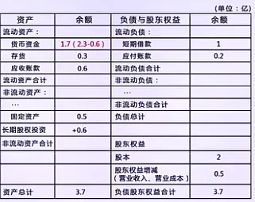

**定义**

Value at Risk（VaR）刻画的是损失分布中的一个分位点，但并不描述超过该分位点之后的损失结构。为弥补这一不足，引入条件风险价值（Conditional Value at Risk，CVaR），也称为 Expected Shortfall（ES）。

设随机变量 X 表示 损失 ，在置信水平 α 下，CVaR 定义为：

\\mathrm{CVaR}\_\\alpha = \\mathbb{E}\\left\[ X \\mid X \\ge \\mathrm{VaR}\_\\alpha \\right\]

直观理解上：

- VaR：损失“刚刚进入最坏 (1-\\alpha) 区域”的位置

- CVaR：已经进入最坏 (1-\\alpha) 后，平均会亏多少

因此，CVaR 描述的是尾部区域的平均损失水平，而非一个边界点。

**数学形式**

在连续分布情形下，CVaR 可以写成 VaR 的积分形式：

\\mathrm{CVaR}\_\\alpha = \\frac{1}{1-\\alpha} \\int\_\\alpha^1 \\mathrm{VaR}\_u \\, du

这一表达揭示了 CVaR 的一个重要特征：CVaR 是高分位 VaR 的加权平均，这意味着 CVaR 并非关注单一点，而是整段尾部区间。

在数值计算中，CVaR 也常被表示为一个优化问题：

\\mathrm{CVaR}\_\\alpha = \\min\_{t} \\left\[ t + \\frac{1}{1-\\alpha} \\mathbb{E} \\left( (X - t)^+ \\right) \\right\]

其中 (x)^+ = \\max(x, 0) 这一形式在凸优化和组合风险最小化中具有重要价值。

**统计性质与相对优势**

与 VaR 相比，CVaR 具有更优的统计与风险度量性质。

<u>一致风险度量（Coherent Risk Measure）</u>

CVaR 满足四个一致性公理：

- 单调性（Monotonicity）：如果一个损失总是比另一个损失大，那么它的风险也应该大。

X \\le Y \\implies \\mathrm{CVaR}\_\\alpha(X) \\le \\mathrm{CVaR}\_\\alpha(Y)

- 正齐次性（Positive Homogeneity）：将损失放大 k 倍，风险也放大 k 倍。

\\quad \\mathrm{CVaR}\_\\alpha(k X) = k \\cdot \\mathrm{CVaR}\_\\alpha(X)，∀k≥0

- 平移不变性（Translation Invariance）：在损失上加上一个确定数，风险也增加相同的数。：

\\quad \\mathrm{CVaR}\_\\alpha(X + a) = \\mathrm{CVaR}\_\\alpha(X) + a，∀a∈R

- 次可加性（Subadditivity）：合并两个风险源，总风险不会超过单独风险的和。

\\mathrm{CVaR}\_\\alpha(X + Y) \\le \\mathrm{CVaR}\_\\alpha(X) + \\mathrm{CVaR}\_\\alpha(Y)

<u>对厚尾与极端风险更敏感</u>

由于 CVaR 显式使用尾部区域的期望：

- 对厚尾分布更加敏感

- 能反映极端损失的严重程度

- 不会像 VaR 一样忽略尾部形态

<u>估计稳定性仍依赖样本质量</u>

需要注意的是：

- CVaR 比 VaR 使用的数据更少（只用尾部）

- 在小样本下方差可能更大

- 对尾部建模假设仍然敏感

因此，CVaR 更“风险保守”，但并非无代价。

**在量化分析中的作用**

在现代量化金融中，CVaR 已逐步取代 VaR，成为尾部风险分析的核心工具。

CVaR 主要应用

- 组合优化：直接作为目标函数，构建尾部风险最小化的资产配置。

- 极端评估：在压力测试中取代 VaR，提供更符合直觉的平均损失规模。

- 建模协同：与\*\*厚尾分布（t 分布、EVT）\*\*结合，修正正态假设对风险的低估。

- 监管主流：Basel III 标准转向，确立了其在机构风险框架中的核心地位。

CVaR 与 VaR 核心对比：

- VaR：损失分布的分位数（不满足次可加性，可能低估组合风险）。

- CVaR：损失分布的尾部期望值（具备相干性，更适合风险聚合计算）。

参考资料：

https://link.springer.com/rwe/10.1007/978-1-4419-1153-7\_1232

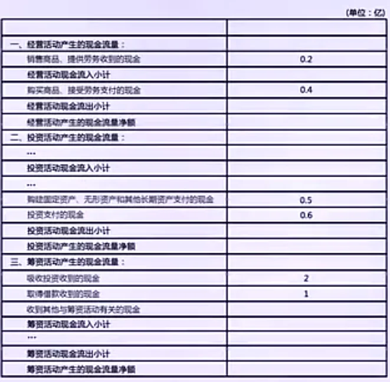

| 左尾概率 α=P(T≤t) | t 值 tα,4 | 说明 |
| --- | --- | --- |
| 0.5 | 0 | 中位数 |
| 0.25 | -0.741 | 25% 左尾 |
| 0.1 | -1.533 | 10% 左尾 |
| 0.05 | -2.132 | 5% 左尾 |
| 0.025 | -2.776 | 2.5% 左尾 |
| 0.01 | -3.747 | 1% 左尾 |
| 0.005 | -4.604 | 0.5% 左尾 |
| 0.00375 | -5 | 0.375% 左尾 |
| 0.001 | -6.869 | 0.1% 左尾 |

| 左尾概率 (P(Z < z)) | Z 值 | 说明 |
| --- | --- | --- |
| 0.5 | 0 | 中位数 |
| 0.4 | -0.253 | 中位数 |
| 0.35 | -0.385 | 35% 左尾 |
| 0.3 | -0.524 | 30% 左尾 |
| 0.25 | -0.674 | 25% 左尾 |
| 0.2 | -0.842 | 20% 左尾 |
| 0.15 | -1.036 | 15% 左尾 |
| 0.1 | -1.282 | 10% 左尾 |
| 0.05 | -1.645 | 5% 左尾 |
| 0.025 | -1.96 | 2.5% 左尾 |
| 0.01 | -2.326 | 1% 左尾 |
| 0.005 | -2.576 | 0.5% 左尾 |
| 0.001 | -3.09 | 0.1% 左尾 |
| 0.0005 | -3.291 | 0.05% 左尾 |

> 期货策略的极端风险管理

> 某量化团队设计了一个日内期货交易策略，历史数据表明：

- 日收益率 R 的分布厚尾明显（经验峰度为 5，正态分布为 3）

- 历史 99% 一日 VaR 为 1.5%

> 团队希望在策略执行中控制极端损失：每天亏损超过 2% 的概率不超过 0.5%。

> 已知：

- 日收益率可用t分布拟合（自由度 ν=4），厚尾特性显著。

- 目前策略每日仓位固定为 1 张合约，持有现金保证金 100,000 元。

- 策略每日收益波动较大，偶尔出现极端亏损。

> 问题：

1. 根据 t 分布模型，计算每日亏损超过 2% 的概率，并与正态假设下的概率比较。

> <u>t 分布下的计算</u>

> 已知日收益率 *R *服从自由度 \\nu=4 的 t 分布，标准化形式为

> T=\\frac{R}{σ}∼t(4)

> 累积分布函数为 F(x) 。

> 已知 99\\% 的一日 VaR 为 1.5%，

> P(R \\ge -1.5\\%) = 0.99 \\implies P(R < -1.5\\%) = 0.01

> P(\\frac{R}{σ}< \\frac{−1.5\\%}{σ})=1\\% \\implies P(T< \\frac{−1.5\\%}{σ})=1\\%

> 对应 t(4) 分布的临界值（查表）

> t\_{0.01, 4} \\approx -3.747 ,

> 所以

> \\frac{−1.5\\%}{σ} = -3.747

> 由此可求得尺度参数 σ ：

> σ = \\frac{-1.5\\%}{-3.747} \\approx 0.4003\\%

> 现在计算亏损超过 2\\% 的概率：

> t\_{score} = \\frac{-2\\%}{0.4003\\%} \\approx -4.996

> 查 t(4) 分布表，当 t \\approx 5 时，单尾概率

> P(T < -4.996) \\approx \\mathbf{0.38\\%}

> 虽然 0.38% < 0.5%，但这是基于纯数学模型的理想值。由于经验峰度 5 高于 4 的理论峰度（ t(4) 峰度无穷大，实际拟合常需偏态 t 分布），在量化实务中，厚尾会比模型预估更极端，通常会判定该策略处于风控边缘或违规状态。

> <u>正态分布下的计算</u>

> 若假设收益率服从正态分布 N(0, \\sigma^2) ：

> P(R \\ge -1.5\\%) = 0.99 \\implies P(R < -1.5\\%) = 0.01

> Z = \\frac{R}{\\sigma} \\sim N(0,1)

> 左尾概率写成标准化形式：

> P(R < -1.5\\%) = P\\Big(\\frac{R}{\\sigma} < \\frac{-1.5\\%}{\\sigma}\\Big) = P(Z < \\frac{-1.5\\%}{\\sigma}) = 0.01

> 查标准正态分布临界值

> z\_{0.01} \\approx -2.326

> 对应关系：

> \\frac{-1.5\\%}{\\sigma} = -2.326 \\implies \\sigma = \\frac{1.5\\%}{2.326} \\approx 0.6448

> 计算亏损超过 2% 的概率

> Z = \\frac{-2\\%}{\\sigma} = \\frac{-2\\%}{0.6448\\%} \\approx -3.10

> 查标准正态分布表：

> P(R < -2\\%) = P(Z < -3.10) \\approx 0.1\\%

> 正态分布低估了约 4倍 的极端风险。

1. 如果概率超过 0.5%，应如何调整仓位或止损策略以控制风险？

> 调整仓位

- 假设仓位比例线性缩放亏损： P(\\text{亏损} \> L) = P(R \\cdot \\text{position} < -L)

- 若计算后概率超限，可减少仓位，例如从 1 张降到 0.8 张，直接降低极端亏损暴露。

> 止损策略

- 设置每日最大亏损限制，比如 2% 或 1.5% 的保证金，一旦触发立即平仓，确保亏损概率不超阈值。

- 止损可以用 动态阈值：结合滚动窗口的 VaR（见问题 3）更新每日止损点。

> 结合仓位 + 止损

- 小幅减少仓位 + 设置止损阈值，可以同时降低极端风险，又不完全牺牲收益。

1. 提出一个滚动窗口更新 VaR的方案，提高尾部风险动态识别能力。

> 选择窗口长度

- 常用 100\~250 个交易日（可按策略波动调整）

- 滚动计算历史收益率序列的分布参数

> 拟合厚尾分布

- 对每个滚动窗口内收益率 RtR\_tRt 拟合 t 分布或 EVT（极值理论）

- 更新尺度参数 σ\\sigmaσ 和自由度 ν\\nuν

> 计算滚动 VaR

- 每日使用当前窗口拟合的 t 分布计算 99%99\\%99% VaR

- 得到每日极端风险阈值，可作为止损或仓位调整参考

> 动态调整仓位 / 止损

- 当滚动 VaR 升高 → 风险增加 → 减少仓位或收紧止损

- 当滚动 VaR 下降 → 风险降低 → 可以适度增加仓位

> 可视化与报警机制

- 绘制滚动 VaR 曲线，设置阈值提醒，确保策略执行中及时响应极端风险

# 描述性统计

## 均值 / 中位数 / 众数

**定义**

<u>均值（Mean / Expected Value）</u>

\\mu = \\mathbb{E}\[X\] = \\sum\_i x\_i p\_i \\quad \\text{(离散)} ,\\quad \\mu = \\int x f(x) dx \\quad \\text{(连续)}

- 平均水平，描述数据中心位置

- 对极端值敏感

<u>中位数（Median）</u>

- 将数据排序后，使得一半样本在其上方、一半在下方的数值

- 对极端值稳健

<u>众数（Mode）</u>

- 出现次数最多的数值

- 描述最常见或最典型的状态

**数学特性对比**

| 指标 | 极端值敏感性 | 分布形态依赖 | 用途 |
| --- | --- | --- | --- |
| 均值 | 高 | 对称性要求较低，但极端值影响大 | 期望收益、策略优化、回报计算 |
| 中位数 | 低 | 对称/偏态都适用 | 稳健统计、抗极端异常 |
| 众数 | 低 | 适合离散分布或有明显峰值的连续分布 | 离散事件或频率分析中有价值 |

**在量化分析中的应用**

在量化分析中，均值、中位数与众数各有侧重：

- 均值（Mean）：用于投资组合期望收益计算、量化策略收益基准以及风险调整后的收益指标（如 Sharpe 比率）。均值对极端值敏感，在厚尾收益或异常事件存在时可能被扭曲，因此需要结合风险管理手段使用。

- 中位数（Median）：用于稳健收益测量和历史收益序列描述，尤其在极端事件或小样本环境下表现稳定。回测与风控中，中位数能够提供比均值更稳健的策略表现评估。

- 众数（Mode）：适用于离散事件建模，如价格跳动方向或交易信号频率。在高频交易策略和统计模式分析中，众数有助于识别常见状态或模式，但对连续收益通常结合直方图或分布分析使用。

量化工程师通常以均值作为收益或策略优化的核心指标，中位数用于稳健描述策略表现，众数用于事件或信号模式识别，三者结合使用可全面刻画收益特征及风险特征。

## 变异系数（Coefficient of Variation, CV）

**定义**

变异系数（CV）是衡量数据相对离散程度的指标，定义为：

\\mathrm{CV} = \\frac{\\sigma}{\|\\mu\|}

其中：

- σ 为样本或分布的标准差

- μ 为样本或分布的均值

特点：

- 无量纲指标，可用于不同规模或不同量纲的收益比较

- 越大表示相对波动越高，风险越大

**数学性质**

- 无量纲性：可以比较不同资产、不同市场或不同策略的相对风险

- 正值指标： \\mathrm{CV} \\ge 0 ，标准差越大、均值越小，CV 越高

- 敏感性：当均值接近零时，CV 会极端放大，需要谨慎解释

**与其他波动指标的关系**

| 指标 | 特点 | 使用场景 |
| --- | --- | --- |
| 标准差 σ | 绝对波动，单位与数据相同 | 单一资产风险衡量 |
| 变异系数 CV | 相对波动，无量纲 | 跨资产或跨策略比较，风险调整后的收益衡量 |
| 方差 σ2 | 绝对波动平方 | 理论建模与优化公式中常用 |

标准差是“绝对风险”，CV 是“单位收益的相对风险”。

**在量化分析中的应用**

变异系数（Coefficient of Variation，CV）定义为收益标准差与期望收益之比，用于衡量单位期望收益所对应的风险水平。 通过无量纲化处理，CV 消除了收益规模差异对风险比较的影响，使不同资产或策略具有可比性。 在实际应用中，CV 越小，表示在获得单位收益时承担的波动风险越低，常用于资产或策略的初步筛选与横向比较。

> 策略筛选

> 你正在对 3 个量化策略进行初步筛选，使用的是最近 12 个月的月度收益率数据，已计算得到以下统计量（单位：%）：

> 策略 月均收益 μ 月收益标准差 σ

> 策略 A 1.20 3.00

> 策略 B 0.60 1.20

> 策略 C 1.80 6.00

> <u>问题 1</u>

> 分别计算三种策略的 变异系数（CV）。

> \\mathrm{CV} = \\frac{\\sigma}{\|\\mu\|}

- 策略 A

> \\mathrm{CV}\_A = \\frac{3.0}{1.2} = 2.50

- 策略 B

> \\mathrm{CV}\_B = \\frac{1.2}{0.6} = 2.00

- 策略 C

> \\mathrm{CV}\_C = \\frac{6.0}{1.8} \\approx 3.33

> <u>问题 2</u>

> 如果你的目标是：在不考虑无风险利率的前提下，选择单位收益所承担波动最小的策略, 你会优先选择哪一个？为什么？

> 比较 CV 大小：

> \\mathrm{CV}\_B < \\mathrm{CV}\_A < \\mathrm{CV}\_C

> 优先选择策略 B。策略 B 的变异系数最低，说明在获得单位期望收益时，其所承担的收益波动最小，风险收益结构最优。

> <u>问题 3</u>

> 如果策略 B 的月均收益来自较高换手和交易成本压缩后的净收益，而策略 A 和 C 为低频策略，从风险指标角度，你是否仍然坚持问题 2 的选择？请说明理由（不超过 3 句话）。

> 不一定坚持选择策略 B。 策略 B 的较低 CV 建立在高换手和交易成本压缩后的净收益之上，其期望收益稳定性可能对市场环境高度敏感。在交易成本或流动性条件恶化时，CV 可能迅速上升。相比之下，低频策略 A 的风险收益结构可能更具可持续性。

> <u>问题 4</u>

> 为什么在这个例子中，只用标准差排序可能会得出与 CV 不同的结论？请用一句话解释。

> 只看标准差排序：

> \\sigma\_B < \\sigma\_A < \\sigma\_C

> 会认为 B 风险最低，C 风险最高。但这忽略了收益水平差异。

> 标准差衡量的是绝对波动，而 CV 衡量的是相对波动强度，在收益均值差异较大时，仅使用标准差会低估低收益策略的真实风险。

## Z 值（Z-Score）

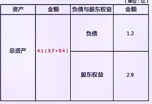

**定义**

Z 值（Z-Score）用于衡量某个观测值相对于总体均值的标准化偏离程度，定义为：

Z = \\frac{X - \\mu}{\\sigma}

其中：

- X：观测值

- μ：总体或样本均值

- σ：总体或样本标准差

Z 值表示：该观测值距离均值有多少个标准差。

**统计含义与标准化作用**

- 无量纲化处理

- 消除量纲和尺度影响, 使不同资产、不同因子、不同时间序列具有可比性

- 中心化与尺度统一

- 均值变为 0, 方差变为 1

Z \\sim N (0,1) \\quad \\text{（在正态假设下）}

- 与概率的关系（在正态假设下）
  - \|Z\| \\le 1 ：约 68%
  - \|Z\| \\le 2 ：约 95%
  - \|Z\| \\le 3 ：约 99.7%

**使用前提与局限性**

- **分布假设依赖**

- Sharpe Ratio 的概率解释隐含一个重要前提： **收益分布近似正态 **。在该假设下，均值与方差能够较充分地刻画收益的不确定性，Sharpe Ratio 可被视为单位标准差所获得的期望超额收益，并可借助 Z 值或置信区间进行统计推断。

- 但在实际市场中，策略收益常呈现 **厚尾、偏态或跳跃 **特征。厚尾分布下，极端收益发生的概率显著高于正态分布的预测，此时较大的 Z 值并不罕见，标准差也不再仅反映常规波动，而是混合了尾部风险。

- 因此，在非正态分布下，Sharpe Ratio 的统计显著性解释会减弱：高 Sharpe 可能由少数极端结果驱动，低 Sharpe 也可能源于尾部风险被计入方差。此时，应结合分布形态分析或引入 CVaR 等尾部风险指标进行补充评估。

- **对均值与标准差敏感**

- Sharpe Ratio 对收益的 **均值与标准差高度敏感 **。在存在极端收益的情况下，少数异常观测即可显著拉动均值或放大标准差，从而改变 Sharpe Ratio 的数值。由于 Z 值本质上依赖于均值与标准差的比值，当这两个统计量被极端值扭曲时，Z 值将不再准确反映策略的真实显著性，容易产生过度乐观或过度悲观的判断。

- **时间稳定性问题**

- 在概率统计中，Z 值用于刻画样本均值偏离其期望的程度，其有效性依赖于两个关键前提：分布形态稳定与参数估计可靠。在金融时间序列中，收益往往呈现非平稳特征，均值与方差会随时间变化。当序列的统计特性发生漂移时，基于历史样本估计得到的 μ 与 σ 将不再代表未来分布，此时由其计算得到的 Z 值会迅速失去解释力。

- 

**在量化分析中的应用**

- 因子标准化与横截面排序

- 对不同因子进行 Z-score 归一化, 构造可比较的因子暴露

- 异常值与极端信号识别

- 利用 ∣Z∣ 阈值识别异常收益或价格偏离, 常见于统计套利与均值回复策略

- 信号构造与仓位控制

- 将 Z 值映射为交易信号强度, 通过 Z 值大小控制仓位规模

- 风险监控与预警指标

- 对波动率、回撤等风险量进行标准化监控

Z 值是量化分析中最常用的标准化工具之一，其核心价值在于可比性与信号强度刻画。但其有效性依赖于均值和波动估计的稳定性，在厚尾或非平稳环境下，应配合稳健统计方法使用。

## 夏普比率（Sharpe Ratio）

**定义**

夏普比率（Sharpe Ratio）用于衡量单位风险所获得的超额收益，定义为：

\\mathrm{Sharpe} = \\frac{\\mathbb{E}\[R\_p\] - R\_f}{\\sigma\_p}

其中：

- R\_p ：投资组合或策略收益率

- R\_f ：无风险利率

- \\sigma\_p ：策略收益的标准差

夏普比率回答的问题是：每承担一单位波动风险，能获得多少超额收益。

**数学与统计特性**

- 无量纲指标：可比较不同资产、不同策略、不同时间尺度的表现

- 基于均值—方差框架：隐含收益分布“近似对称、波动可代表风险”的假设

- 与变异系数的关系：

\\mathrm{Sharpe} \\approx \\frac{1}{\\mathrm{CV}} \\quad (\\text{当 } R\_f \\approx 0)

即：

CV 衡量单位收益的风险，Sharpe 衡量单位风险的收益，二者是对偶关系。

**估计与使用注意事项**

- 对极端值敏感

- 厚尾分布或跳跃收益会通过平方项显著放大标准差，使 Sharpe Ratio 对收益分布形态高度敏感。在左尾风险占主导的情况下，标准差被尾部亏损拉大，Sharpe 往往偏低；而当正收益以持续右偏而非单次跳跃的形式出现时，均值可能相对快于标准差上升，从而使 Sharpe 被高估。因此，在非正态收益分布下，Sharpe 的解释需要结合尾部风险指标。

- 时间尺度依赖

- Sharpe Ratio 在不同时间尺度之间的换算通常采用 \\sqrt{N} 法则，该方法隐含各期收益独立同分布的假设。当收益序列存在自相关、波动率聚集或结构性变化时，Sharpe 的时间尺度换算将产生偏差，因此年化 Sharpe 需结合收益序列特征谨慎解释。

\\mathrm{Sharpe}\_{\\text{annual}} = \\mathrm{Sharpe}\_{\\text{period}} \\sqrt{N}

- 小样本偏差

- 在回测样本期较短的情况下，Sharpe Ratio 往往存在系统性高估。这一偏差源于 Sharpe 本身作为均值与波动之比的比值统计量，在小样本下均值和标准差估计均不稳定；同时，策略筛选与参数优化会进一步放大偶然的高 Sharpe 结果。因此，短样本回测中得到的 Sharpe 需结合显著性检验与稳健性分析进行验证，而不宜作为策略优劣的唯一依据。

- 

**在量化分析中的应用**

Sharpe Ratio 是量化分析中最常用的风险调整收益指标之一，广泛用于因子、择时和套利策略之间的横向比较，也是回测报告中的基础统计量。在组合构建层面，最大化 Sharpe 比率等价于均值—方差框架下寻找最优的风险调整收益组合，因此常被作为组合优化的目标函数或约束条件。在实际工程应用中，Sharpe 还承担着策略筛选与风控基准的角色：Sharpe 较低的策略往往难以长期覆盖交易成本与执行误差，因而在实务中常被用作策略上线、扩容或下线的硬性参考指标。

> 用概率视角理解不同风险指标的含义

> 某量化研究员对三种交易策略进行了 36 个月的历史回测，所有收益均为月度收益率。假设无风险利率为 0，收益分布在样本区间内相对稳定。

> 三种策略的统计指标如下：

> 指标 策略 A 策略 B 策略 C

> 月均收益 μ 1.00% 0.60% 1.40%

> 月标准差 σ 2.00% 0.90% 3.50%

> Sharpe Ratio 0.50 0.67 0.40

> 变异系数 CV = σ / μ 2.00 1.50 2.50

> 95% CVaR（月） -6.00% -4.00% -15.00%

> <u>问题 1：</u>

> 为什么三种策略“看起来都不错”，但结论却不同？

> 从期望值角度看，策略 C 的月均收益最高； 从波动性角度看，策略 C 的标准差也最大； 从尾部风险角度看，策略 C 在最坏 5% 情况下的平均损失最严重。

> 单一概率统计量不足以全面描述风险。

> <u>问题 2：</u>

> 变异系数（CV）在这里解决了什么问题？

> 变异系数定义为：

> \\mathrm{CV} = \\frac{\\sigma}{\\mu}

> 它衡量的是：获得 1 单位期望收益，需要承担多少波动风险。

> 在本例中：

- 策略 B 的 CV 最小，说明单位收益对应的波动最小

- 策略 C 的 CV 最大，说明其收益“性价比”最差

> 因此，CV 更适合用于不同收益水平策略之间的横向比较。

> <u>问题 3：</u>

> 为什么还需要 CVaR？

> CVaR 定义为：在超过 VaR 阈值的极端损失区间内的平均损失。

> 在本例中：

- 策略 C 的 95% CVaR 为 -15%，显著大于 A、B

- 这表明其损失集中在分布左尾，存在“少数极端事件决定结果”的特征

> Sharpe Ratio 与变异系数给出不同策略排序的情形

> 在某量化回测中，研究员对两种策略在"相同时间尺度（月度）"下的表现进行了评估。假设无风险利率为 0.6% / 月，策略收益特征如下表所示：

> 策略 月均收益 μ 月标准差 σ

> 策略 A 1.20% 2.40%

> 策略 B 0.80% 1.00%

> 已知：

- Sharpe Ratio 定义为

> \\mathrm{Sharpe}=\\frac{\\mu-r\_f}{\\sigma}

- 变异系数（CV）定义为

> \\mathrm{CV}=\\frac{\\sigma}{\\mu}

> 问题：

- 分别计算策略 A 和策略 B 的 Sharpe Ratio 与 变异系数（CV）。

- 基于 Sharpe Ratio，哪一策略更优？

- 基于变异系数，哪一策略更优？

- 若两种指标给出不同结论，应如何理解这种差异？

> 答：

> <u>指标计算</u>

> Sharpe Ratio

- 策略 A：

> \\frac{1.2\\%-0.6\\%}{2.4\\%}=0.25

- 策略 B：

> \\frac{0.8\\%-0.6\\%}{1.0\\%}=0.20

> 变异系数（CV）

- 策略 A：

> \\frac{2.4\\%}{1.2\\%}=2.00

- 策略 B：

> \\frac{1.0\\%}{0.8\\%}=1.25

> <u>基于Sharpe Ratio 的结论</u>

> Sharpe(A) \> Sharpe(B)，策略 A 的风险调整后超额收益更高。

> <u>基于变异系数的结论</u>

> CV(B) < CV(A)，策略 B 的单位收益波动更小，收益更稳定。

> <u>结论差异的理解</u>

> Sharpe Ratio 与变异系数刻画的风险含义不同：

- Sharpe Ratio 关注的是超过无风险利率的收益效率，当策略均值接近无风险利率时，低波动策略可能被显著削弱。

- 变异系数衡量的是单位总收益所承担的相对波动强度，不考虑无风险利率的存在。

> 因此，在低超额收益环境中，Sharpe Ratio 与 CV 可能对策略给出不同排序。这并非指标矛盾，而是风险评估视角的差异。当 Sharpe Ratio 与变异系数给出不同排序时，应优先明确策略在系统中的角色：

- 若策略作为组合构件，应偏向 CV 较低的稳定型策略；

- 若策略需独立承担资金成本，则应以 Sharpe Ratio 作为核心准则。

## 相关性（Correlation）

**基本概念**

相关性用于描述两个随机变量之间是否存在依赖关系，以及这种依赖关系的方向与强弱。

直观上，如果两个变量：

- 往往一起变大或一起变小 → 正相关

- 一个变大时另一个倾向变小 → 负相关

- 变化之间没有明显关系 → 弱相关或不相关

则称它们之间存在不同程度的相关性。

需要强调的是：相关性描述的是统计依赖，而非因果关系。

**相关性与独立性的区别**

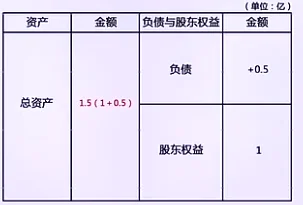

- 独立性是一个严格的概率概念

P(X,Y)=P(X)P(Y)

- 相关性是对变量“共同变化趋势”的描述

二者关系为：

- 独立 ⇒ 不相关

- 不相关 ⇏ 独立

这意味着：即使两个变量在均值意义下“看起来没关系”，仍可能存在更复杂的依赖结构。

**统计意义上的相关性**

从统计角度看，相关性反映的是：

- 两个变量偏离各自均值时，是否倾向于同向或反向偏离

- 这种共同偏离是否具有稳定的统计模式

相关性是从联合分布中抽取的结构信息，而不是单变量分布所能反映的内容。

这也是为什么单变量统计量（均值、方差）不足以描述多资产或多因子的风险结构。

**在量化分析中的作用**

在量化分析中，即便不引入具体的相关系数形式，相关性本身仍具有核心意义：

- 资产之间的联动性判断

- 判断资产是否在同一市场驱动下波动，识别潜在的系统性风险来源

- 组合分散化的前提认知

- 分散化依赖于“低相关性”，而非单纯多资产。若资产高度相关，组合风险难以有效降低

- 因子结构与信息重叠识别

- 判断不同因子是否反映相同信息，避免策略或模型中信息冗余

- 市场状态变化的信号

- 在极端行情中，资产相关性往往上升。相关性变化本身是重要的风险信号

- 

## Pearson相关系数（Correlation Coefficient）

**定义**

相关系数衡量两个随机变量 <u>线性 </u>关系的强弱和方向，是协方差的标准化形式。

数值范围 \[−1,1\]

- \\rho = +1 ：完全正线性关系

- \\rho = -1 ：完全负线性关系

- \\rho = 0 ：无线性关系（不等于独立）

相关系数克服了协方差受量纲限制的问题，使不同变量间的线性关系可直接比较。

在量化工程中，它常用于分析资产收益、因子信号和策略指标之间的线性联动，判断多因子模型是否存在冗余因子。

**数学形式**

设随机变量 X,Y 的方差分别为 \\sigma\_X^2, \\sigma\_Y^2 ，协方差为 \\mathrm{Cov}(X, Y) ，则相关系数定义为：

\\rho\_{X,Y} = \\frac{\\mathrm{Cov}(X,Y)}{\\sigma\_X \\, \\sigma\_Y}

结合协方差公式：

\\rho\_{X,Y} = \\frac{\\mathbb{E}\[(X - \\mathbb{E}\[X\])(Y - \\mathbb{E}\[Y\])\]}{\\sqrt{\\mathbb{E}\[(X - \\mathbb{E}\[X\])^2\]} \\,\\sqrt{\\mathbb{E}\[(Y - \\mathbb{E}\[Y\])^2\]}}

在样本计算中，对 n 个观测值 \\{(x\_i, y\_i)\\}\_{i=1}^n ，样本相关系数为：

r\_{X,Y} = \\frac{\\sum\_{i=1}^n (x\_i - \\bar{x})(y\_i - \\bar{y})}{\\sqrt{\\sum\_{i=1}^n (x\_i - \\bar{x})^2} \\, \\sqrt{\\sum\_{i=1}^n (y\_i - \\bar{y})^2}}

**基本性质**

- 对称性： \\rho\_{X,Y} = \\rho\_{Y,X}

- 界限性： -1 \\le \\rho\_{X,Y} \\le 1

- 线性解释：
  - \|\\rho\| \\approx 1 表示强线性关系
  - \|\\rho\| \\approx 0 表示弱线性关系

- 量纲无关：不受变量单位影响，可直接比较不同变量之间的线性关系。

- 协方差与相关系数的关系：

\\mathrm{Cov}(X,Y) = \\rho\_{X,Y}\\, \\sigma\_X \\sigma\_Y

**在量化分析中的应用**

- 资产组合分析：判断不同资产收益的联动性，优化组合波动。

- 因子分析：检测因子冗余，避免多因子模型中高相关因子带来的过拟合。

- 风险管理：衡量系统性风险及跨资产的共同波动。

相关系数提供了标准化的线性关系度量，相比协方差更易解释和比较。在理解相关系数后，再学习大数法则和期望、方差的长期性质会更加自然，因为相关性影响组合或多因子策略的整体波动行为。

参考资料：

https://heth.ink/Correlation/

> 相关系数在组合风险评估中的误用

> 某量化工程师在构建两策略组合时，计算了两策略的月度收益相关系数，结果如下：

> 策略 A 与策略 B 的相关系数

> \\rho\_{A,B} = -0.30

> 工程师据此认为：“两策略负相关，组合后风险一定会显著降低”，于是将两策略以相等权重进行组合。

> 已知两策略的月度收益特征如下：

> 策略 月均收益 μ 月标准差 σ

> A 1.00% 1.00%

> B 1.00% 5.00%

> 问题

- 计算等权组合的月度收益标准差。

- 判断该组合的风险是否显著低于策略 A 单独持有的风险。

- 说明仅凭相关系数判断组合风险是否充分，并给出原因。

> <u>组合标准差计算</u>

> 等权组合方差为：

> \\sigma\_p^2 = w\_A^2\\sigma\_A^2 + w\_B^2\\sigma\_B^2 + 2w\_A w\_B \\rho\_{A,B}\\sigma\_A\\sigma\_B

> 代入数值：

> \\sigma\_p^2 = 0.25\\times(1.0\\%)^2 + 0.25\\times(5.0\\%)^2 + 2\\times0.5\\times0.5\\times(-0.3)\\times1.0\\%\\times5.0\\% =0.0025+0.0625−0.0075=0.0575

> \\sigma\_p \\approx 2.4\\%

> <u>风险比较</u>

- 策略 A：σ = 1.0%

- 组合策略：σ ≈ 2.4%

> 组合风险显著高于策略 A 单独持有的风险。

> <u>解释</u>

> 相关系数仅刻画资产收益在方向上的一致性，并不反映波动幅度本身。组合风险由各资产自身的波动项与协方差项共同决定，其中相关系数只影响协方差项的方向，而无法消除单个资产的固有风险。在波动水平差异较大的情况下，即使相关系数为负，高波动资产仍可能主导组合整体风险。

> 因此，负相关只能削弱风险之间的相互作用，并不保证组合风险显著下降；正相关虽然会放大协方差项，但是否导致组合风险上升，仍取决于各资产的波动水平与权重配置。

> 负相关是实现风险分散的必要条件之一，但并非充分条件，只有在波动水平相近、权重合理的前提下，相关结构才能有效降低组合风险。

## 线性关系（Linear Relationship）

**定义**

在线性关系中，一个随机变量的变化可以用另一个随机变量的线性函数来近似描述。其一般形式为：

Y = a + bX + \\varepsilon

其中：

- a：截距，表示基准水平

- b：斜率，刻画 X 对 Y 的线性影响方向与强度

- ε：随机扰动项，代表无法由线性结构解释的部分

线性关系强调的是：变量之间的平均变化趋势是线性的，而非每一次观测都严格落在直线上 **。**

**统计意义**

从统计角度看，线性关系具有两个核心特征：

<u>条件期望的线性结构</u>

\\mathbb{E}\[Y \\mid X\] = a + bX

<u>残差的随机性</u>

\\mathbb{E}\[\\varepsilon \\mid X\] = 0

这意味着：

- 线性关系描述的是“在平均意义下”的依赖

- 随机扰动是模型的一部分，而非误差或异常

**线性关系与相关性的区别**

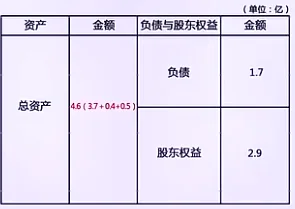

Spearman相关系数（线性相关系数） vs. Chatterjee相关系数（非线性相关系数）

- 相关性：描述变量是否存在共同变化趋势

- 线性关系：描述这种趋势是否可以用线性函数刻画

两者关系为：

- 存在线性关系 ⇒ 通常存在相关性

- 存在相关性 ⇏ 一定是线性关系

因此，相关性是现象描述，线性关系是结构假设。

**在量化分析中的作用**

在量化分析中，线性关系具有基础性地位：

- 模型简化与可解释性

- 多数量化模型以线性结构为起点，便于理解变量之间的边际影响。

- 风险暴露刻画

- 因子模型中，资产收益被表示为因子的线性组合，线性系数反映风险暴露程度。

- 策略构建与信号叠加

- 多信号线性加权是常见策略形式，线性结构便于参数优化与稳定性分析。

- 统计推断的基础假设

- 回归分析、假设检验均以线性关系为前提，非线性方法往往在此基础上扩展。

> 线性关系在因子收益分析中的理解

> 某量化工程师在进行因子有效性检验时，分析了市场因子 M 与某股票收益 R 的历史月度数据，并对两者进行了线性回归分析，得到如下结果：

> R = 0.8 + 1.2 M + \\varepsilon

> 同时，样本统计结果显示：

- 因子与股票收益的相关系数为 \\rho\_{M,R} = 0.45

- 回归残差的标准差明显大于回归解释部分

> 问：

- 回归系数 1.2 在经济含义上代表什么？

- 相关系数仅为 0.45，是否说明该因子“作用不明显”？

- 在什么情况下，线性关系存在但相关系数并不高？

- 对量化工程师而言，应如何正确解读这一结果？

> 答：

> <u>回归系数的含义</u>

> 回归系数 1.2 表示：在平均意义下，因子 M 每上升 1 个单位，股票收益 R 期望上升 1.2 个单位，刻画的是线性敏感度（暴露度）。

> <u>相关系数低是否意味着因子无效</u>

> 不一定。相关系数反映的是线性关系的强弱，而非因子是否存在系统性影响。即使相关系数中等，只要回归系数稳定、方向明确，因子仍可能具有可解释的经济意义。

> <u>线性关系存在但相关系数不高的情形</u>

> 当收益中存在大量非系统性噪声、波动较大或样本周期较短时，线性关系可能被噪声掩盖，从而导致相关系数偏低。

> <u>量化工程师的正确解读方式</u>

> 量化工程师应区分“是否存在平均线性作用”与“线性关系解释能力的强弱”。回归系数反映因子暴露，相关系数反映共动程度，两者关注的问题不同，不能互相替代。

> 因子研究中，线性关系用于刻画平均作用方向，而相关系数仅描述线性共动强度。二者结合使用，才能避免对因子有效性的误判。

## 非线性（Nonlinearity）

**定义**

在统计与数学建模中，非线性关系是指变量之间的关系不能用一次函数准确描述。 当自变量发生变化时，因变量的变化幅度不成比例，或依赖于变量所处的区间，即属于非线性关系。

与线性关系相比，非线性关系具有以下特征：

- 变量之间的影响强度随水平变化

- 关系可能存在拐点、阈值或饱和区间

- 正负方向的影响可能不对称

在金融市场中，非线性关系普遍存在，是刻画真实市场行为的重要特征。

**金融数据中的非线性特征**

在量化分析中，非线性通常体现在以下几个方面：

- 阈值效应 某些变量只有在超过特定水平后才对结果产生显著影响，例如：
  - 波动率在高位时对风险的影响明显增强
  - 成交量在放大到一定程度后才反映市场情绪变化

- 边际效应递减或递增 自变量增加相同幅度，其对因变量的影响并不恒定：
  - 动量因子在中等区间有效，在极端区间效果减弱
  - 杠杆水平越高，单位风险增加越快

- 非对称性 上涨与下跌对收益或风险的影响不相同，例如：
  - 资产下跌时风险上升速度通常快于上涨时

- 

**线性假设的局限性**

线性模型因其结构简单、可解释性强，在统计分析和量化研究中被广泛使用。然而，线性假设在实际应用中存在明显局限：

- 难以刻画变量之间的复杂关系

- 容易低估极端情况下的风险

- 在存在拐点或结构变化时拟合效果较差

因此，在实际量化建模中，单纯依赖线性关系往往不足以反映市场真实结构。

**非线性在量化分析中的应用**

在量化分析中，非线性处理主要体现在以下方面：

- 特征变换 通过对变量进行对数变换、幂变换或分段处理，引入非线性特征，使模型能够刻画更复杂的关系。

- 分区或分状态建模 根据市场状态（如高波动与低波动）构建不同模型，以反映不同区间下变量关系的变化。

- 风险建模中的非线性 尾部风险度量（如 VaR、CVaR）本身即体现非线性思想，强调极端损失而非平均水平。

总体而言，非线性分析是连接简单统计方法与真实金融市场行为的重要桥梁，在收益建模、风险管理和策略设计中具有基础性作用。

> 波动率分区下的策略收益建模

> 你在做一个日内动量策略，发现一个现象：

> 当市场低波动时，信号强度 X 和未来收益 R 近似线性正相关。当市场高波动时，同样的信号 X，收益不但不放大，反而经常出现回撤加剧、极端亏损。

> 你手里有三列数据：

> X：策略信号强度

> σ：当日市场波动率

> R：下一交易日策略收益

> 问：

- 如果你直接用一个线性模型

> R = aX + b

> 来建模，会出现什么问题？

- 请给出一种非线性处理思路，使模型能更好反映真实风险结构（不用写代码，用文字说明即可）。

- 在风险管理角度，为什么这种处理比单纯看平均收益更合理？

> 答：

> <u>第 1 问 </u>一个线性模型会“平均一切”，把高波动下的尾部风险当成噪声 → 风险被低估。

> <u>第 2 问 </u>常见做法包括：

- 按波动率分区建模（低 σ / 高 σ 两套模型）

- 或构造非线性特征，如

> R = aX + c \\cdot X \\cdot \\mathbf{1}(\\sigma \> \\sigma\_0)

> <u>第 3 问 </u>在量化分析中，策略评估不仅关注其期望收益水平，更重要的是识别和刻画收益分布在不利情形下的表现。尤其需要关注在特定市场状态下，策略是否会暴露出显著放大的下行风险或尾部损失。

## 自相关（Autocorrelation）

**定义**

设 \\{X\_t\\} 为时间序列，自相关刻画的是同一随机变量在不同时间点之间的线性依赖关系。 k 阶自相关定义为：

\\mathrm{Cov}(X\_t, X\_{t-k})

在实践中，更常使用标准化形式，以消除量纲影响。

**自相关函数（Autocorrelation Function, ACF）**

对平稳时间序列，k 阶自相关系数定义为：

\\rho(k) = \\frac{\\mathrm{Cov}(X\_t, X\_{t-k})}{\\mathrm{Var}(X\_t)}

其中：

- k 为滞后阶数（lag）

- \\rho(0)=1

- \\rho(k)\| \\le 1

自相关函数 \\{\\rho(k)\\}\_{k=1}^{\\infty} 描述了时间序列的整体时间依赖结构，其衰减速度反映了序列的“记忆长度”。

**金融时间序列中的经验特征**

在金融数据中，自相关表现出明显的结构差异：

- 收益率序列：短期自相关通常接近 0，近似不相关

- 波动率或绝对收益：常表现出显著正自相关，并随滞后缓慢衰减

- 成交量序列：自相关显著，反映交易活跃度的持续性

这表明金融市场中，价格变化本身接近随机，而风险状态具有较强的时间依赖性。

**量化分析中的作用**

自相关在量化工程中具有基础性作用：

- 模型假设检验：检验样本是否满足独立同分布（i.i.d.）假设

- 时间序列建模依据：决定是否需要引入滞后项或动态结构

- 风险建模与预测：刻画风险指标（如波动率）的持续性

- 策略有效性判断：若收益存在显著自相关，可能暗示可利用的时间结构

在量化实践中，自相关并不直接等同于可交易信号，但它决定了是否存在值得建模的时间结构。

参考资料：

https://www.geeksforgeeks.org/machine-learning/autocorrelation/

> 自相关在量化建模中的作用

> 某量化工程师在评估一条日频股票多头策略的可行性。 他收集了该策略过去 3 年的日收益率序列，并计算了一阶与多阶自相关系数，得到以下结果：

- 一阶自相关系数 ρ₁ = 0.28（在 1% 显著性水平下显著）

- 二阶及以上自相关系数不显著

- 收益率分布的均值接近 0，但波动率在时间上呈现聚集现象

> 问题：

- 从 *i.i.d. *假设的角度判断，该收益序列是否满足独立同分布？请说明理由。

- 基于自相关结果，在收益建模中是否有必要引入滞后项？为什么？

- 针对观察到的波动率聚集现象，应该在哪一类模型中重点考虑自相关结构？

- 该策略收益存在显著一阶自相关，是否可以直接据此构建可交易信号？请结合量化实践进行解释。

> 答：

> <u>是否满足 i.i.d. 假设？</u>

> 不满足。 收益率序列存在显著的一阶自相关（ρ₁ = 0.28，且在 1% 显著性水平下显著），这违反了 *i.i.d. *假设中的独立性要求。独立同分布要求各期收益之间不存在线性依赖，而显著自相关表明当前收益与过去收益之间存在系统性关系。

> <u>是否有必要在收益建模中引入滞后项？</u>

> 有必要。 显著的一阶自相关说明收益序列具有可观测的线性时间结构，引入滞后项（如 AR(1) 模型）有助于刻画这种依赖关系。是否能提升预测能力需要进一步通过样本外检验确认，但从建模角度看，引入动态结构是合理的。

> <u>波动率聚集现象应在哪类模型中重点考虑自相关？</u>

> 应在波动率建模中重点考虑。 波动率聚集通常表现为收益平方或绝对值的自相关，而非收益本身的均值自相关。因此，应考虑 GARCH 等条件异方差模型，在二阶矩层面刻画风险的时间持续性。

> <u>显著一阶自相关是否可以直接构建可交易信号？</u>

> 不可以直接作为交易信号。 自相关仅表明收益序列存在时间依赖结构，并不保证该结构具有可交易性。交易可行性还取决于信号稳定性、交易成本、样本外表现及风险暴露等因素。在量化实践中，自相关更多用于判断是否值得建模，而非直接指导交易。

# 统计推断与假设检验

## 假设检验（Hypothesis Testing）

**基本思想**

假设检验是一种基于样本数据，对总体性质作出统计判断的方法。其核心目标不是“证明某个结论为真”，而是在给定风险水平下，判断样本是否提供了足够强的证据来否定某一假设。

在统计建模中，检验问题通常表述为一组对立假设：

H\_0:\\ \\text{原假设（Null Hypothesis)}

H\_1:\\ \\text{备择假设（Alternative Hypothesis)}

其中，原假设通常代表“无效应、无差异、无结构”，而备择假设代表研究者关心的现象。

**检验统计量与抽样分布**

假设检验基于一个由样本构造的检验统计量 T(X\_1,\\dots,X\_n) ，该统计量在原假设 H\_0 成立时具有已知或可近似的分布。

典型形式为：

T = \\frac{\\text{估计值} - \\text{假设值}}{\\text{标准误差}}

在 H\_0 成立条件下，T 的分布（如正态分布、t 分布等）用于衡量样本结果出现的“罕见程度”。假设检验的本质，是将观测结果与该分布进行比较。

**显著性水平与拒绝规则**

假设检验需要事先设定显著性水平 α，表示在 H\_0 为真时，错误拒绝 H\_0 的最大可接受概率。

基于显著性水平，检验规则可表述为：

- 若统计量落入拒绝域，则拒绝 H\_0

- 否则，不拒绝 H\_0

等价地，可以通过 p 值（p-value） 描述检验结果：

\\text{p-value} = P(\\text{在 } H\_0 \\text{ 成立下，观察到同样或更极端的统计量})

当 \\text{p-value} < \\alpha 时，拒绝原假设。

**量化分析中的意义**

在量化分析中，假设检验主要用于判断观测到的统计特征是否可能由随机性产生，而非直接给出交易决策。常见应用包括：

- 检验策略收益是否显著偏离零

- 判断两个策略或模型表现是否存在统计差异

- 验证时间序列是否满足独立性或正态性等建模假设

需要注意的是，统计显著性并不等同于经济显著性。在大样本或高频数据下，即使极小的效应也可能通过统计检验，因此假设检验应始终结合实际收益、风险和交易成本进行解读。

## 统计显著性（Statistical Significance）

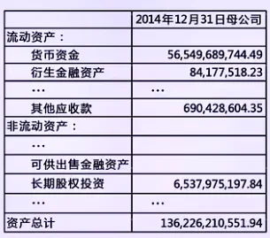

**定义**

统计显著性用于衡量样本中观察到的结果是否足以否定随机波动这一解释。若在原假设成立的前提下，当前样本结果出现的概率足够小，则称该结果在统计意义上是显著的。

判断统计显著性依赖于显著性水平 α，常见取值为 0.1, 0.05, 0.01。当检验结果满足

\\text{p-value} < \\alpha

时，称结果在显著性水平 α 下具有统计显著性。

**p 值的统计含义**

p 值并不是“原假设为真的概率”，而是在原假设成立的条件下，观察到当前或更极端样本结果的概率：

\\text{p-value} = P\\big(T \\ge T\_{\\text{obs}} \\mid H\_0\\big)

其中 T\_{\\text{obs}} 为样本计算得到的检验统计量。在原假设成立的前提下，p 值越小，说明当前观察值出现的可能性越低；而该结果却真实发生了，因此对原假设形成越强的不利证据。

**显著性与效应大小的区别**

统计显著性只反映“是否偏离随机噪声”，并不衡量偏离的实际大小。在大样本或高频数据下，即便极小的效应也可能具有统计显著性。

因此，需要区分：

- 统计显著性：是否拒绝随机性解释

- 效应大小：偏离的实际幅度与经济意义

在量化分析中，仅依赖显著性结论而忽略效应大小，容易导致策略在真实交易中不可行。

**量化分析中的实践意义**

统计显著性在量化工程中主要用于模型验证与结果筛选，而非直接作为交易信号。其作用包括：

- 判断策略收益是否显著不同于零

- 评估因子暴露是否具有统计支撑

- 检验模型改进是否带来真实提升

在实际应用中，应结合样本稳定性、风险暴露、交易成本及样本外表现进行综合判断，避免将“统计显著”误解为“可持续盈利”。

## P 值（P-Value）

**定义**

P 值是在原假设 H\_0 成立的前提下，观察到当前样本统计量或更极端结果的概率。设检验统计量为 T，观测值为 T\_{\\text{obs}} ，则：

- 单侧检验：

\\text{p-value} = P(T \\ge T\_{\\text{obs}} \\mid H\_0)

- 双侧检验：

\\text{p-value} = P(\|T\| \\ge \|T\_{\\text{obs}}\| \\mid H\_0)

P 值衡量的是样本结果与原假设的冲突程度，而非原假设本身的真假概率。

**P 值与统计显著性的关系**

P 值是统计显著性的具体度量工具。给定显著性水平 α，检验规则为：

\\text{p-value} < \\alpha \\;\\Rightarrow\\; \\text{拒绝 } H\_0

P 值越小，说明在随机假设下观察到该结果的可能性越低，样本对原假设的不利证据越强。但这一判断始终建立在“原假设成立”的条件之上。

**常见误解与正确解读**

在实践中，P 值常被误用或误解，尤其在量化分析中需要特别注意：

- P 值不是原假设为真的概率

- P 值不衡量策略或因子的经济价值

- P 值不保证结果具有稳定性或可复现性

P 值仅回答一个问题：若世界是随机的，这样的样本结果有多罕见。

**量化分析中的作用与局限**

在量化工程中，P 值主要用于模型与策略的统计筛选，例如判断收益是否显著偏离零，或因子是否具有统计解释力。但在大样本、高频或多重检验场景下，单纯依赖 P 值容易产生虚假显著性。

因此，P 值应与样本外表现、风险暴露、稳健性分析和经济意义结合使用，而不宜作为单一决策标准。

> 策略收益是否具有统计显著性？

> 某量化工程师回测了一条日频交易策略，得到如下统计结果：

- 回测样本长度：n=250 个交易日

- 日收益率样本均值： \\bar{R} = 0.08\\%

- 日收益率样本标准差： \\sigma = 1.0\\%

> 工程师希望判断：该策略是否真的具有正的期望收益，还是只是随机波动造成的假象？

> 问题：

- 给出原假设 H\_0 与备择假设 H\_1 。

- 在收益近似服从正态分布的前提下，计算对应的 Z 值。

- 结合 p 值，判断该策略是否具有统计显著性（显著性水平取 5%）。

> 答：

> 这是一个单侧假设检验。

> 在原假设

> H\_0:\\ \\mathbb{E}\[R\]=0

> 成立的前提下，构造检验统计量：

> 由于样本量较大，且假设收益近似正态分布，采用 Z 统计量：

> T = Z = \\frac{\\bar{R} - \\mu\_0}{\\sigma / \\sqrt{n}}

> 其中：

- \\bar{R} 为样本均值

- \\mu\_0 = 0 为原假设下的期望

- σ 为样本标准差

- n 为样本数量

> 代入数据得到观测值：

> T\_{\\text{obs}} = 1.27

> 由于备择假设为单侧：

> H\_1:\\ \\mathbb{E}\[R\] \> 0

> p-value 定义为：

> \\text{p-value} = P(T \\ge T\_{\\text{obs}} \\mid H\_0)

> 在原假设成立的情况下，检验统计量取得不小于当前观测值的概率。

> 在 H\_0 下：

> T \\sim \\mathcal{N}(0,1)

> 因此：

> \\text{p-value} = P(Z \\ge 1.27) = 1 - \\Phi(1.27) \\approx 0.10

> 其中 \\Phi(\\cdot) 为标准正态分布的累积分布函数。

> 显著性水平取：α=5%：

> \\text{p-value} = 0.10 \> 0.05

> 在真实期望收益等于 0 的情况下，重复进行 250 次采样，得到“样本均值 ≥ 0.08%”这种结果的概率是 10%，比 5% 大，所以不能排除真实期望收益是 0

> <u>量化工程中的实际含义</u>

> p 值不小，说明当前收益水平可能由随机波动产生，并不意味着策略一定无效，而是：

- 样本期可能过短

- 策略真实收益较弱

- 波动较大，信噪比不足

> 在实际量化流程中，这类策略通常不能直接上线，而需要：

- 延长样本期

- 改善信号结构

- 或与其他策略进行组合使用

## Z 检验（Z-Test）

**定义**

Z 检验是一类基于 <u>正态分布假设 </u>的参数检验方法，用于判断样本统计量是否显著偏离给定的总体假设值。其核心前提是：在原假设成立时，检验统计量可以近似服从标准正态分布。

Z 检验通常适用于以下情形：

- 样本量较大（通常 n≥30），可依赖中心极限定理

- 总体方差已知，或可用稳定估计近似

- 研究对象为均值或比例等参数

**Z 统计量的构造**

以均值检验为例，设样本来自总体 X，原假设为：

H\_0:\\ \\mu = \\mu\_0

样本均值为 \\bar X ，总体标准差为 σ，样本容量为 n，则 Z 统计量定义为：

Z = \\frac{\\bar X - \\mu\_0}{\\sigma / \\sqrt{n}}

在 H\_0 成立时，有：

Z \\sim N(0,1)

检验通过比较观测到的 Z 值与标准正态分布来计算 p 值。

**检验形式与判决规则**

根据备择假设的不同，Z 检验可分为单侧和双侧检验，给定显著性水平 α：

- 单侧检验：关注偏离方向
  - 右尾检验： H\_1:\\ \\mu \> \\mu\_0 ，拒绝规则为： Z \> z\_{\\alpha}
  - 左尾检验： H\_1:\\ \\mu < \\mu\_0 ，拒绝规则为： Z < -z\_{\\alpha}

- 双侧检验：关注是否存在显著偏离
  - H\_1:\\ \\mu \\neq \\mu\_0 ，拒绝规则为： \|Z\| \> z\_{\\alpha/2} ,其中 z\_{\\alpha/2} 为标准正态分布的分位点。

- 或等价地（对单侧和双侧），拒绝规则为： \\text{p-value} < \\alpha

**量化分析中的应用与局限**

在量化分析中，Z 检验常用于检验策略平均收益、因子均值或信号偏移是否显著不为零。由于金融数据样本通常较大，Z 检验在形式上较为方便。

但需要注意的是，金融时间序列往往存在厚尾、自相关和异方差等问题，严格的正态与独立假设未必成立。因此，Z 检验更多用于初步统计判断，而非最终决策依据。

## T 检验（T-Test）

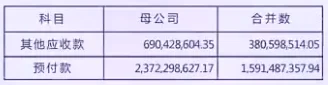

**定义**

T 检验是一类在总体方差未知的情况下，基于 t 分布的参数假设检验方法，用于判断样本统计量是否显著偏离给定的总体假设值。其核心特征在于：用样本标准差替代总体标准差，并通过 t 分布修正由此引入的不确定性。

T 检验的基本前提是：在原假设成立时，构造的检验统计量服从 t 分布，而非标准正态分布。

T 检验通常适用于以下情形：

- 样本量较小或中等（尤其是 n<30）

- 总体方差未知，只能由样本估计

- 研究对象为均值或均值差等参数

**T 统计量的构造**

以单样本均值检验为例，设样本来自总体 X，原假设为：

H\_0:\\ \\mu = \\mu\_0

样本均值为 \\bar X ，样本标准差为 s，样本容量为 n，则 t 统计量定义为：

t = \\frac{\\bar X - \\mu\_0}{s / \\sqrt{n}}

其中样本标准差为：

s = \\sqrt{\\frac{1}{n-1}\\sum\_{i=1}^n (X\_i-\\bar X)^2}

在 H\_0 成立时，有：

t \\sim t\_{n-1}

其中 t\_{n-1} 表示自由度为 n−1 的 t 分布。

**检验形式与判决规则**

与 Z 检验类似，T 检验同样可分为单侧和双侧检验。给定显著性水平 α：

- 右尾检验： H\_1:\\ \\mu \> \\mu\_0,\\quad \\text{拒绝规则： } t \> t\_{\\alpha,\\,n-1}

- 左尾检验： H\_1:\\ \\mu < \\mu\_0,\\quad \\text{拒绝规则： } t < -t\_{\\alpha,\\,n-1}

- 双侧检验： H\_1:\\ \\mu \\neq \\mu\_0,\\quad \\text{拒绝规则： } \|t\| \> t\_{\\alpha/2,\\,n-1}

或等价地（单侧与双侧均适用）： \\text{p-value} < \\alpha

其中 t\_{\\alpha,\\,n-1} 和 t\_{\\alpha/2,\\,n-1} 为 t 分布的分位点。

**量化分析中的应用与局限**

在量化分析中，T 检验比 Z 检验更为常见，尤其适用于：

- 回测样本较短的策略收益显著性检验

- 因子均值是否显著偏离零的判断

- 模型改动前后均值差异的统计检验

但需要注意的是，金融收益序列往往存在厚尾、自相关与异方差问题，使得独立同分布假设难以严格满足。因此，T 检验主要用于统计层面的初步验证，应结合样本外测试、稳健性分析和风险指标共同解读。

参考资料：

https://www.youtube.com/watch?v=zJ8e\_wAWUzE

https://www.reneshbedre.com/blog/ttest.html

https://www.geeksforgeeks.org/data-science/z-test-vs-t-test/

## 置信区间（Confidence Interval）

**定义**

置信区间是在给定置信水平下，对总体参数取值范围的区间估计，用于刻画参数估计的不确定性。与假设检验出“是否拒绝原假设”不同，置信区间直接给出参数可能取值的合理范围。

给定置信水平 1−α，置信区间的含义是：在重复抽样过程中，按该方法构造的区间有 1−α 的比例能够覆盖真实参数值。

**置信区间的构造**

以总体均值 μ 的区间估计为例，设样本均值为 \\bar X ，样本容量为 n。

- 总体方差已知（或样本量较大）：

\\bar X \\pm z\_{\\alpha/2}\\frac{\\sigma}{\\sqrt{n}}

其中 z\_{\\alpha/2} 为标准正态分布分位点。

- 总体方差未知：

\\bar X \\pm t\_{\\alpha/2,\\,n-1}\\frac{s}{\\sqrt{n}}

其中 t\_{\\alpha/2,\\,n-1} 为自由度 n−1n-1n−1 的 t 分布分位点。

**置信区间与假设检验的关系**

置信区间与双侧假设检验在统计意义上是等价的。对于显著性水平 α 的双侧检验：

- 若假设值 μ0 落在 1−α 置信区间之外，则拒绝 H0

- 若 μ0 落在置信区间之内，则不拒绝 H0

相比单一的显著性判断，置信区间能够同时反映估计值位置与不确定性大小。

**量化分析中的应用**

在量化分析中，置信区间常用于评估收益、因子暴露或参数估计的稳定性。例如，策略平均收益的置信区间若跨越零，通常意味着统计证据不足；即便显著不为零，区间过宽也表明估计不稳定。

需要强调的是，置信区间并不表示“参数以某概率落在区间内”，而是对抽样过程长期性质的描述。在金融数据存在厚尾、自相关或非平稳性的情况下，置信区间的覆盖性质可能偏离理论结果，应结合稳健估计与样本外验证使用。

> 策略真实期望收益区间估计

> 某量化工程师对一条日频交易策略进行了回测，得到过去 250 个交易日的收益数据。 样本统计结果如下：

- 样本日均收益： \\bar{R} = 0.08\\%

- 样本日标准差： \\sigma = 1.0\\%

- 样本量：n=250

> 假设日收益近似服从正态分布。

> 问：

- 构造该策略真实日均收益 μ 的 95% 置信区间

- 判断该置信区间是否支持“策略具有正期望收益”的结论

- 从量化工程角度解释该置信区间对策略决策的意义

> 答：

> <u>构造 95% 置信区间</u>

> 在样本量较大时，采用正态近似，置信区间公式为： \\bar{R} \\pm z\_{0.975} \\cdot \\frac{\\sigma}{\\sqrt{n}}

> 其中： z\_{0.975} = 1.96

> 代入数据：

> \\frac{\\sigma}{\\sqrt{n}} = \\frac{1.0\\%}{\\sqrt{250}} \\approx 0.063\\%

> 置信区间为：

> 0.08\\% \\pm 1.96 \\times 0.063\\%

> 即：

> \[-0.04\\%,\\ 0.20\\%\]

> <u>统计判断</u>

> 由于 95% 置信区间 包含 0：

> 0 \\in \[-0.04\\%,\\ 0.20\\%\]

> 因此：不能在 95% 置信水平下断言该策略具有正的真实期望收益。该结论与 <u>p-value 大于 5% </u>的检验结果是一致的。

> <u>量化工程中的实际含义</u>

> 该置信区间表明：策略的真实期望收益可能为正，也可能为负。当前样本无法提供足够证据区分这两种情形

> 从工程决策角度看：

- 策略尚不足以作为稳定 Alpha 来源

- 需要更长样本、更高频信息或结构性改进

- 若直接上线，收益不确定性较高，风险不可忽略

> 置信区间并不告诉我们“真实期望是多少”，而是告诉我们：在当前数据与置信水平下，真实期望可能落在什么范围内。

## 卡方统计量（Chi-Square Statistic）

**定义**

卡方统计量是一类基于 <u>平方偏差累加 </u>构造的统计量，用于刻画样本观测结果与理论期望之间的偏离程度。其核心思想是：若样本与假设模型一致，则各类偏差在统计意义上应当较小；反之，若偏差系统性偏大，则可能否定原假设。

卡方统计量在假设检验中通常与卡方分布（Chi-square Distribution）配合使用。

**卡方统计量的构造**

最常见的形式出现在频数型数据中。设样本被划分为 k 个互不重叠的类别，第 i 类的：

- 观测频数为 O\_i （Observed）

- 理论期望频数为 E\_i （Expected）

则卡方统计量定义为：

\\chi^2 = \\sum\_{i=1}^{k} \\frac{(O\_i - E\_i)^2}{E\_i}

在原假设成立时，当样本量足够大，有：

\\chi^2 \\sim \\chi^2\_{\\nu}

其中自由度通常为：

\\nu = k - 1 \\quad \\text{（或扣除估计参数后的自由度）}

**常见检验形式**

卡方统计量主要用于以下几类检验：

- 拟合优度检验（Goodness-of-Fit Test） 判断样本分布是否与给定理论分布一致。

- 独立性检验（Test of Independence） 判断两个分类变量是否统计独立，常基于列联表。

- 方差相关检验 在正态假设下，样本方差与总体方差的检验也可构造卡方统计量。

在所有情形中，检验的基本逻辑一致：比较观测偏差是否大到难以由随机性解释。

**量化分析中的应用与局限**

在量化分析中，卡方统计量常用于分布结构与频率结构的检验，例如：

- 检验离散交易信号是否符合预期概率

- 判断状态变量是否独立

- 评估模型残差的分布结构合理性

但需要注意的是，卡方检验对样本量和分组方式较为敏感，期望频数过小会破坏近似分布假设。此外，对于连续型金融收益数据，卡方方法通常不如基于均值或回归的检验直观。

**Z、t、χ² 检验对比**

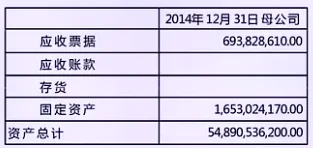

参考资料：

https://www.youtube.com/watch?v=WXPBoFDqNVk

https://www.youtube.com/watch?v=HKDqlYSLt68

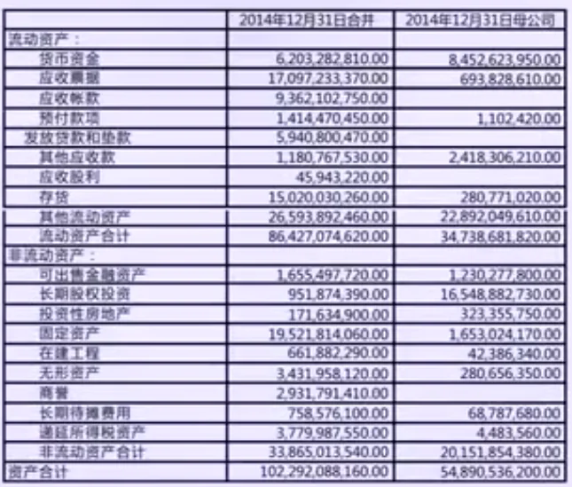

Chi-square distribution table (right-tail probabilities)

> 策略类别分布与预期一致性

> 某量化团队开发了一个高频交易策略，每笔交易可能属于三类市场行为：

- 趋势跟随

- 反转套利

- 波动卖出

> 团队对策略的交易类别有历史预期分布：

> 策略类型 预期比例

> 趋势跟随 50%

> 反转套利 30%

> 波动卖出 20%

> 在最近 200 笔交易中，实际观察到的类别分布为：

> 策略类型 实际次数

> 趋势跟随 110

> 反转套利 60

> 波动卖出 30

> 问题：

- 计算观测数据的 Chi-Square 统计量：

> \\chi^2 = \\sum\_{i=1}^{k} \\frac{(O\_i - E\_i)^2}{E\_i}

> 其中 O\_i 为观察次数， E\_i 为期望次数。

- 自由度是多少？

- 假设显著性水平 α=0.05，判断策略类别分布是否显著偏离历史预期。

> 答：

> <u>计算期望次数 </u>E\_i

> E\_i = \\text{总交易数} \\times \\text{预期比例}

- 趋势跟随： 200×0.5=100

- 反转套利： 200×0.3=60

- 波动卖出： 200×0.2=40

> <u>计算 χ² 统计量</u>

> \\chi^2 = \\frac{(110-100)^2}{100} + \\frac{(60-60)^2}{60} + \\frac{(30-40)^2}{40}

> \\chi^2 = \\frac{10^2}{100} + \\frac{0^2}{60} + \\frac{(-10)^2}{40} = 1 + 0 + 2.5 = 3.5

> <u>自由度</u>

> df = k - 1 = 3 - 1 = 2

> <u>显著性判断</u>

> 查 χ² 分布表，df = 2，α = 0.05 临界值约为 5.991。

> \\chi^2\_{\\text{obs}} = 3.5 < 5.991

> 在 5% 显著性水平下，无法拒绝原假设，说明观察到的交易类别分布与历史预期没有显著差异。

## 方差分析（ANOVA）

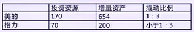

**定义**

方差分析（Analysis of Variance, ANOVA）是一种用于比较两个或两个以上样本均值是否存在显著差异的统计方法。它的核心思想是将总体的总方差分解为组间方差和组内方差，从而判断各组均值差异是否超过了随机波动的范围。形式上，方差分析可以表示为：

SS\_\\text{Total} = SS\_\\text{Between} + SS\_\\text{Within}

其中，SS 表示平方和， SS\_\\text{Between} 衡量各组均值与总体均值的差异， SS\_\\text{Within} 衡量组内观测值围绕各自均值的波动。通过比较组间方差和组内方差的大小，我们可以评估不同组的均值是否显著不同。

**基本原理**

方差分析的核心是 F 统计量，它表示组间均方与组内均方的比值：

F = \\frac{MS\_\\text{Between}}{MS\_\\text{Within}}

其中，均方 MS = SS / df ，自由度为：

- df\_\\text{Between} = k - 1 （k 为组数）

- df\_\\text{Within} = N - k （N 为总样本数）

F 统计量用于检验原假设 H\_0 ：各组均值相等。若 F \> F\_{\\alpha, k-1, N-k} 或 p-value < α，则拒绝原假设，说明至少有一组均值与其他组不同。组间方差越大或组内方差越小，F 值越大，均值差异越显著。

**类型**

方差分析可根据因素数量分为不同类型。单因素 ANOVA 只考虑一个分类因素，例如比较不同交易策略的日收益率；双因素 ANOVA 考虑两个分类因素，并可分析它们之间的交互作用，例如在不同市场环境下比较策略表现；多因素 ANOVA 则用于更复杂的策略组合或资产配置分析。这些类型的核心思想相同，都是通过分解方差来判断均值差异是否显著，只是涉及的因素和自由度计算有所不同。

**在量化中的应用**

在量化领域，ANOVA 常用于策略比较和组合优化。通过比较不同策略或资产在相同时间段内的收益率均值，可以判断哪些策略表现显著不同，为投资组合调整和风险管理提供依据。

参考资料：

https://www.youtube.com/watch?v=YllG5Cy6OFw

> 策略收益均值比较（ANOVA）

> 某量化团队正在比较三个策略 A、B、C 的日收益表现，数据如下（单位 %）：

> 策略 日收益率

> A 0.2, 0.3, 0.1, 0.4

> B 0.5, 0.4, 0.6, 0.3

> C 0.1, 0.0, 0.2, 0.1

> 团队希望判断三个策略的平均收益是否存在显著差异。

> 问题：

- 使用单因素方差分析（ANOVA）计算 F 值和 p-value。

- 根据显著性水平 α=0.05 判断是否拒绝原假设（策略均值相等）。

- 如果 F 值显著，说明至少有一组策略均值不同，解释如何进一步找出具体差异（Post-hoc test）。

- 思考：在不同市场波动率环境下，如何利用 ANOVA 对策略表现进行优化和组合配置。

> 答：

> <u>步骤 1：计算各策略均值和总体均值</u>

> \\bar X\_A = \\frac{0.2+0.3+0.1+0.4}{4} = 0.25

> \\bar X\_B = \\frac{0.5+0.4+0.6+0.3}{4} = 0.45

> \\bar X\_C = \\frac{0.1+0.0+0.2+0.1}{4} = 0.1

> 总体均值：

> \\bar X = \\frac{0.25+0.45+0.1}{3} \\approx 0.2667

> <u>步骤 2：计算组间平方和与组内平方和</u>

> SSB = n\_i \\sum (\\bar X\_i - \\bar X)^2 = 4\[(0.25-0.2667)^2 + (0.45-0.2667)^2 + (0.1-0.2667)^2\] \\approx 0.192

> 组内平方和：

> SSW = \\sum \\sum (X\_{ij} - \\bar X\_i)^2 \\approx 0.21

> <u>步骤 3：计算均方与 F 值</u>

> MSB = \\frac{SSB}{k-1} = \\frac{0.192}{2} = 0.096

> MSW = \\frac{SSW}{N-k} = \\frac{0.21}{12-3} = 0.02333

> F = \\frac{MSB}{MSW} = \\frac{0.096}{0.02333} \\approx 4.11

> <u>步骤 4：查 F 分布临界值 / 计算 p-value</u>

- 自由度： df1 = k-1 = 2，df2 = N-k = 9

- p-value ≈ 0.05（根据 F 表或计算器）

> 结论：

- F 值显著 → 拒绝原假设

- 至少有一组策略均值不同

> <u>步骤 5：Post-hoc 分析</u>

- 可以使用 Tukey HSD 或 Bonferroni 方法进行两两比较，找出具体差异策略组合。

> <u>步骤 6：实际量化应用提示</u>

- 可以将策略分组按市场波动率或其他特征，再做 ANOVA，评估策略在不同环境下表现差异

- 根据结果调整策略参数或组合权重，实现科学的量化决策

## 多重检验问题 / 偏差陷阱（Multiple Testing, Data Snooping Bias, Look-ahead Bias, Survivorship Bias）

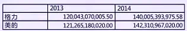

**定义**

在量化分析中，多重检验问题和各种偏差陷阱会导致统计结论失真或策略表现被高估。多重检验问题（Multiple Testing）指的是当我们在同一数据集上进行大量假设检验时，即使每个单独检验显著性水平为 α，总体犯第一类错误（假阳性）的概率会远高于 α。偏差陷阱包括数据挖掘偏差（Data Snooping Bias）、前视偏差（Look-ahead Bias）和幸存者偏差（Survivorship Bias），它们会在策略回测和模型评估中产生过于乐观的结果，从而误导决策。

**多重检验问题**

假设你在一组历史数据上测试 m 个不同的交易策略，每个策略的显著性水平为 α。则至少出现一次假阳性的概率为：

P(\\text{至少一个假阳性}) = 1 - (1-\\alpha)^m

当 m 较大时，这个概率会显著高于单次检验的 α，导致策略被错误地认为有效。常用的校正方法包括 Bonferroni 校正，将显著性水平调整为 α/m，或使用 False Discovery Rate (FDR) 控制假阳性比例。

**偏差陷阱**

- 数据挖掘偏差（Data Snooping Bias）：策略设计或参数优化基于历史数据反复试验，容易过拟合。

- 前视偏差（Look-ahead Bias）：在回测中不小心使用了未来信息，导致策略表现被高估。

- 幸存者偏差（Survivorship Bias）：仅使用幸存资产数据进行回测，忽略已退市或破产的资产，造成样本选择偏差。

这些偏差会使策略在历史回测中表现良好，但在真实市场中可能失效。

**在量化中的应用**

在量化研究中，理解和控制这些问题至关重要。举例来说，如果你测试了 100 个策略并选择历史表现最好的策略上线，而不进行多重检验校正，策略可能只是随机获胜。数据挖掘偏差要求在策略优化中使用严格的训练/验证/测试集划分，并避免重复调参。前视偏差则要求确保回测中每一步只使用当时可获得的信息。幸存者偏差提醒我们在回测历史股票策略时，应包含退市、破产和退市基金等数据。通过这些方法，量化工程师可以更真实地评估策略性能，避免过度乐观的历史回测结果，提升策略在实盘的稳定性和可靠性。

> 多重检验 / 偏差陷阱

> 你是一名量化工程师，想在过去 5 年的中国股市历史数据上寻找短期动量策略。你设计了 50 种不同参数组合（如动量窗口 5、10、20 天，止盈止损比例不同等），并对每个参数组合回测日收益率，计算 t 检验 p-value 来判断策略是否显著优于零收益。

> 回测结果显示，有 5 个策略的 p-value < 0.05，看起来这些策略在历史上表现很好。

> 问题：

- 是否可以直接认为这 5 个策略都是可靠策略？为什么？

- 如果使用 Bonferroni 校正，你应该将显著性水平调整为多少？

- 回测中，如果你使用了未来信息（例如当天收盘价就决定第二天买卖），会产生什么偏差？

- 回测只用活跃股票数据，不考虑退市或破产股票，会产生什么偏差？

> 解答思路:

- 不能直接认为可靠。这是多重检验问题：你测试了 50 个策略，即使每个策略单独显著性水平为 0.05，出现假阳性的概率实际上高得多：

> P(\\text{至少一假阳性}) = 1 - (1-0.05)^{50} \\approx 0.923

> 也就是说，有很大概率这些“好策略”只是随机出现的。

- Bonferroni 校正：显著性水平应调整为 α/m=0.05/50=0.001。只有 p-value < 0.001 的策略才可以认为真正显著。

- 前视偏差（Look-ahead Bias）：回测中使用了未来信息，会导致策略在历史回测中表现过高，但在真实交易中不可能达到同样收益。

- 幸存者偏差（Survivorship Bias）：只使用活跃股票数据，忽略退市股票，会导致历史收益被高估，因为退市股票往往表现差甚至为负。

# 回归分析

## 回归分析（Regression）

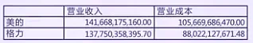

**定义**

回归分析是一种统计方法，用于研究一个或多个自变量（因子）与因变量（结果）之间的关系。它的核心目的是建立数学模型预测因变量的变化，同时量化各自变量对因变量的影响程度。在量化金融中，回归分析常用于策略因子分析、风险暴露估计和收益预测。

**基本原理**

最常见的是线性回归，假设因变量 Y 与自变量 X\_1, X\_2, ..., X\_k 之间的关系是线性的：

Y = \\beta\_0 + \\beta\_1 X\_1 + \\beta\_2 X\_2 + ... + \\beta\_k X\_k + \\varepsilon

其中：

- \\beta\_0 是截距

- \\beta\_i 是自变量 X\_i 对 Y 的回归系数，表示 X\_i 增加 1 单位时 Y 的变化量

- ε 是误差项，反映未被解释的波动

回归分析的核心任务是最小化误差平方和（Ordinary Least Squares, OLS）：

\\min\_{\\beta\_0, \\beta\_1,...,\\beta\_k} \\sum\_{i=1}^N (Y\_i - \\hat{Y}\_i)^2

得到的系数 \\beta\_i 可以用于因子有效性分析、风险敞口测算和预测未来收益。

**假设与检验**

线性回归有几个重要假设：

- 线性假设：因变量与自变量关系线性

- 误差独立同分布： \\varepsilon \\sim N(0, \\sigma^2)

- 无多重共线性：自变量间不高度相关

- 误差方差齐性：不同自变量水平下误差方差相同

在回归分析中，可以对单个回归系数进行 t 检验，判断某个自变量是否显著影响因变量；同时，也可以用 F 检验判断整个回归模型是否显著，即所有自变量组合在一起是否对因变量具有统计显著的解释力。

**在量化中的应用**

回归分析在量化金融中用途广泛。典型应用包括：

- 因子收益分析：用回归分析判断某个因子（如动量、价值、波动率）对股票收益的贡献：

R\_i = \\alpha + \\beta\_1 \\text{Momentum}\_i + \\beta\_2 \\text{Value}\_i + \\varepsilon\_i

- 风险敞口测算：用回归分析计算策略对市场因子的敏感度（β），如 CAPM 或多因子模型：

R\_\\text{strategy} = \\alpha + \\beta\_\\text{market} R\_\\text{market} + \\varepsilon

- 策略预测：通过回归模型预测未来收益，结合回测进行策略优化。

参考资料：

https://www.analyticsvidhya.com/blog/2022/01/different-types-of-regression-models/

> 动量因子显著性检验

> 某量化工程师想验证动量因子对股票月收益率的预测能力。已收集 250 个月的股票收益数据，并计算了对应动量因子值。回归模型如下：

> R\_\\text{stock} = \\alpha + \\beta \\cdot \\text{Momentum} + \\varepsilon

> 回归结果如下：

> 参数 估计值 标准误差

> α 0.12% 0.05%

> β 0.08% 0.03%

> 问：

- 计算 β 的 t 统计量，并判断在 5% 显著性水平下是否显著。

- 解释 β 显著为正对动量策略的含义。

> 答：

> <u>计算 t 统计量</u>

> t\_\\beta = \\frac{\\hat\\beta - 0}{\\text{SE}(\\hat\\beta)} = \\frac{0.08\\%}{0.03\\%} \\approx 2.67

> 样本量 n=250，参数数量 k=2

> df = n - k = 250 - 2 = 248

> 查 t 分布表（df ≈ 250，单侧 α = 0.05），临界 t ≈ 1.65

> 因为 t\_\\beta = 2.67 \> 1.65 ，拒绝原假设，β 显著为正。

> <u>策略含义</u>

- β 显著为正说明高动量股票下个月可能继续跑赢市场。

- 可据此构建动量多头组合，提高策略胜率。

## 最小二乘法（Least Squares Method）

**定义**

最小二乘法是一种参数估计方法，用于在给定模型结构的情况下，确定一组参数，使模型预测值与真实观测值之间的误差平方和最小。在回归分析中，它是最常用、也是最基础的估计方法。量化工程师在做因子回归、风险暴露估计、收益预测时，几乎默认使用的都是最小二乘法。

**基本思想与数学形式**

假设我们有一元线性回归模型：

y\_i = \\beta\_0 + \\beta\_1 x\_i + \\varepsilon\_i

其中 y\_i 为观测收益， x\_i 为因子值， \\varepsilon\_i 为误差项。最小二乘法的目标不是让每个点都落在直线上，而是选择 \\beta\_0, \\beta\_1 ，使所有残差平方和最小：

\\min\_{\\beta\_0,\\beta\_1} \\sum\_{i=1}^{N} (y\_i - \\hat{y}\_i)^2

其中 \\hat{y}\_i = \\beta\_0 + \\beta\_1 x\_i 。

“平方”有两个好处：一是正负误差不会相互抵消，二是大误差会被更严厉地惩罚，这在金融数据中非常重要。

**解的性质（OLS 解）**

对第 i 个样本：

y\_i = \\beta\_0 + \\beta\_1 x\_{i1} + \\beta\_2 x\_{i2} + \\cdots + \\beta\_k x\_{ik} + \\varepsilon\_i

这里：

- i：第 i 条样本

- k：自变量（因子）个数

- x\_{ij} ：第 i 条样本的第 j 个因子

在多元回归中，用矩阵形式表示为：

\\begin{bmatrix} y\_1 \\\\ y\_2 \\\\ \\vdots \\\\ y\_N \\end{bmatrix} = \\begin{bmatrix} 1 & x\_{11} & x\_{12} & \\cdots & x\_{1k} \\\\ 1 & x\_{21} & x\_{22} & \\cdots & x\_{2k} \\\\ \\vdots & \\vdots & \\vdots & \\ddots & \\vdots \\\\ 1 & x\_{N1} & x\_{N2} & \\cdots & x\_{Nk} \\end{bmatrix} \\begin{bmatrix} \\beta\_0 \\\\ \\beta\_1 \\\\ \\vdots \\\\ \\beta\_k \\end{bmatrix} + \\begin{bmatrix} \\varepsilon\_1 \\\\ \\varepsilon\_2 \\\\ \\vdots \\\\ \\varepsilon\_N \\end{bmatrix}

这就是

\\mathbf{y} = \\mathbf{X}\\boldsymbol{\\beta} + \\boldsymbol{\\varepsilon}

最小二乘解为：

\\hat{\\boldsymbol{\\beta}} = (\\mathbf{X}^\\top \\mathbf{X})^{-1} \\mathbf{X}^\\top \\mathbf{y}

在满足经典假设（误差期望为 0、同方差、无自相关）的情况下，OLS 估计具有以下重要性质：

- 它是无偏的

- 在所有线性无偏估计中具有最小方差（Gauss–Markov 定理）

这也是最小二乘法在量化中被广泛使用的核心原因。

**在量化中的应用**

在量化研究中，最小二乘法通常不是“单独出现”，而是作为回归分析的计算引擎。例如，在因子模型中，我们常用 OLS 来估计因子暴露：

R\_i = \\alpha + \\beta\_1 F\_{1,i} + \\beta\_2 F\_{2,i} + \\varepsilon\_i

这里的 β 就是通过最小二乘法估计得到的因子暴露系数。

再比如，在策略回测中，用最小二乘法回归策略收益对市场收益，可以判断策略是否真的有 Alpha，还是只是市场 Beta 的变形。

需要注意的是，金融数据往往存在异方差、厚尾和极端值，这会削弱最小二乘法的效果。因此在实务中，量化工程师常在 OLS 基础上引入加权最小二乘（WLS）、稳健回归或正则化方法，以提升模型稳定性。

> 用 OLS 判断策略到底有没有 Alpha

> 你在回测一个股票多空策略，拿到了 60 个月的月度收益率。为了判断策略是否真的有 Alpha，你决定用单因子回归（CAPM）：

> R^{\\text{strategy}}\_t = \\alpha + \\beta R^{\\text{market}}\_t + \\varepsilon\_t

> 用 OLS 回归后，得到如下结果（单位：% / 月）：

- \\hat{\\alpha} = 0.35\\%

- \\hat{\\beta} = 1.10

- \\text{SE}(\\hat{\\alpha}) = 0.18\\%

- \\text{SE}(\\hat{\\beta}) = 0.15

> 样本量 N=60，显著性水平取 α=5%

> 问题：

- 这个策略是否存在统计显著的 Alpha？

- 这个策略的风险特征是什么？

- 如果你在回测中对参数反复调优，得到这个结果，可能踩了什么坑？

- 作为量化工程师，你还会做哪一步验证？

> 答：

> <u>是否存在显著 Alpha？</u>

> 计算 t 统计量：

> t\_\\alpha = \\frac{0.35}{0.18} \\approx 1.94

> 在 5% 显著性水平、自由度约 58 的情况下，临界值约为 2。Alpha 接近显著，但严格来说不显著。

> <u>风险特征怎么看？</u>

> \\hat{\\beta} = 1.10

> 说明：

- 策略比市场更激进

- 市场涨 1%，策略平均涨 1.1%

- 这是一个高 Beta 策略

> 很可能收益来自市场风险暴露，而不是纯 Alpha。

> <u>可能踩了什么坑？</u>

> 这一步是面试高频点：

- 多重检验 / Data Snooping：参数反复调出来的

- 回测期太短（60 个月不算多）

- 忽略异方差或自相关（OLS 的 SE 可能偏小）

> <u>下一步你该做什么？</u>

> 一个合格量化工程师通常会：

- 用 Newey–West 修正标准误

- 加入更多因子（Fama–French 三因子）：

> R = \\alpha + \\beta\_M MKT + \\beta\_S SMB + \\beta\_H HML + \\varepsilon

- 做 样本外测试 / 滚动回归

- 看 Alpha 在不同市场环境是否稳定

## 线性回归（Linear Regression）

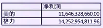

线性回归 vs. 非线性回归

**定义**

线性回归是一种用于刻画因变量与一个或多个自变量之间线性关系的统计建模方法。其核心目标不是精确预测单次结果，而是刻画“平均意义下”的关系结构。

最基本的一元线性回归模型定义为：

y\_i = \\beta\_0 + \\beta\_1 x\_i + \\varepsilon\_i,\\quad i=1,\\dots,n

其中， \\beta\_0 表示截距项， \\beta\_1 表示自变量 x 对因变量 y 的线性影响强度， \\varepsilon\_i 为随机误差项，用于刻画模型无法解释的部分。 “线性”指的是模型对参数 β 是线性的，而不是要求变量本身只能呈直线关系。

**模型含义与几何直观**

从统计角度看，线性回归试图估计的是：

\\mathbb{E}\[y \\mid x\] = \\beta\_0 + \\beta\_1 x

即在给定 x 的条件下，y 的条件期望是 x 的线性函数。

从几何角度看，线性回归是在样本点 (x\_i, y\_i) 的散点图中，寻找一条“最合适”的直线，使得所有样本点到该直线的垂直偏差平方和最小。这条直线并不要求通过所有点，而是反映整体趋势。

因此，线性回归并不假设“世界是线性的”，而是假设：在噪声存在的前提下，用线性结构是一个足够好的近似。

**参数估计与统计假设**

在线性回归中，参数 \\beta\_0, \\beta\_1 通常通过最小二乘法（OLS）估计，即最小化残差平方和：

\\min\_{\\beta\_0,\\beta\_1} \\sum\_{i=1}^n (y\_i - \\beta\_0 - \\beta\_1 x\_i)^2

在经典假设下（误差项零均值、同方差、无相关），OLS 估计量具有良好的统计性质：它是无偏的，并且在所有线性无偏估计中具有最小方差（Gauss–Markov 定理）。

在线性回归分析中，常关注以下统计量：

回归系数的显著性（t 值、p 值）、模型整体解释能力（ R^2 ），以及残差是否违反模型假设。这些并不是形式要求，而是用于判断回归结果是否“可信”。

**线性回归在量化中的作用**

在量化研究中，线性回归是因果拆解和风险归因的基础工具。例如，通过回归策略收益对市场收益，可以判断策略是否只是市场 Beta 的线性映射，还是存在独立于市场的 Alpha：

R\_{\\text{strategy}} = \\alpha + \\beta R\_{\\text{market}} + \\varepsilon

此时，β 衡量策略的系统性风险暴露，α 则被解释为风险调整后的超额收益。

进一步地，线性回归还是多因子模型、风控归因、特征筛选和模型验证的基础模块。即使在非线性模型盛行的今天，线性回归仍然承担着“基准模型”和“解释工具”的角色，是量化工程师绕不开的基本功。

## 多元线性回归（Multiple Linear Regression）

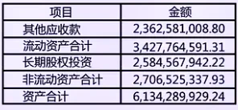

**定义**

多元线性回归用于刻画一个因变量与多个解释变量之间的线性关系，其一般形式为：

y\_i = \\beta\_0 + \\beta\_1 x\_{i1} + \\beta\_2 x\_{i2} + \\cdots + \\beta\_k x\_{ik} + \\varepsilon\_i

其中， y\_i 为因变量， \\mathbf{x}\_i=(x\_{i1},\\dots,x\_{ik}) 为解释变量向量， \\boldsymbol{\\beta} 为待估参数， \\varepsilon\_i 为随机误差项。

多元线性回归的核心目标，是在同时控制多个解释变量的条件下，估计各变量对因变量的条件期望影响。

**基本假设**

为了保证回归系数的统计解释有效，多元线性回归通常建立在以下基本假设之上：

1. 线性关系假设

条件期望满足线性结构：

\\mathbb{E}\[y \\mid \\mathbf{X}\] = \\mathbf{X}\\boldsymbol{\\beta}

该假设针对参数而非变量本身，允许解释变量经过变换。

1. 误差项独立性

不同观测之间的误差项相互独立：

\\text{Cov}(\\varepsilon\_i,\\varepsilon\_j)=0,\\quad i\\neq j

该假设在时间序列数据中尤为关键。

1. 同方差性（Homoscedasticity）

误差项方差不随解释变量变化：

\\text{Var}(\\varepsilon\_i \\mid \\mathbf{X})=\\sigma^2

1. 误差项正态性

\\varepsilon\_i \\sim \\mathcal{N}(0,\\sigma^2)

该假设并非 OLS 无偏性的必要条件，但用于构造 t 检验和置信区间。

1. 无完全多重共线性

解释变量之间不存在精确线性关系，否则参数无法唯一识别。

**多重共线性**

多重共线性指某一解释变量可被其他解释变量高度线性解释，即解释变量之间存在强相关结构。

其直接后果包括：

回归系数方差增大、估计不稳定、显著性检验失效，但模型整体拟合度可能仍然较高。

在实践中，常用以下方法识别多重共线性：

- 将某一解释变量对其余解释变量进行回归，观察拟合程度

- 使用方差膨胀因子（VIF）：

\\text{VIF}\_j = \\frac{1}{1-R\_j^2}

当 VIF\>10 时，通常认为存在显著共线性风险

常见处理方式包括：删除冗余变量、合并高度相关变量、或采用正则化方法（如 Ridge 回归）。

**回归结果的统计输出**

多元回归结果通常包括以下关键量：

- 回归系数（Coefficients）：衡量解释变量对因变量的边际影响

- 标准误（Standard Error）：参数估计不确定性的度量

- t 值与 p 值：用于检验系数是否显著偏离零

- R^2 与调整 R^2 ：衡量模型对因变量波动的解释能力

- 标准化回归系数：在不同量纲变量之间比较影响强度

在量化研究中，更关注系数的稳定性与经济含义，而非单次回归的显著性结果。

**分类变量在多元线性回归中的处理**

当解释变量为分类变量时，需通过”哑变量“（Dummy Variables）纳入模型。

若分类变量包含 m 个类别，则引入 m−1 个哑变量：

D\_{ij} = \\begin{cases} 1, & \\text{样本 } i \\text{ 属于类别 } j \\\\ 0, & \\text{其他} \\end{cases}

未被编码的类别作为基准组，其效应由截距项体现。该处理方式保证模型可识别，避免完全多重共线性。

**在量化研究中的作用**

在量化研究中，多元线性回归是多因子模型、风险暴露分析和收益归因的基础工具。通过将多个风险因子同时纳入回归，可以区分系统性风险暴露与策略特有收益，从而判断 Alpha 的真实性与稳定性。

其核心价值在于解释与诊断，而非单点预测。

参考资料：

https://www.youtube.com/watch?v=i3IadpjctWg

> 多元线性回归

> 某量化工程师希望评估多个因子对股票月度超额收益的解释能力，选取了以下三个常见因子：

- 市值因子（Size）

- 动量因子（Momentum）

- 波动率因子（Volatility）

> 建立多元线性回归模型：

> R\_{i} = \\alpha + \\beta\_1 \\cdot \\text{Size}\_i + \\beta\_2 \\cdot \\text{Momentum}\_i + \\beta\_3 \\cdot \\text{Volatility}\_i + \\varepsilon\_i

> 使用 300 个月的数据进行回归，得到结果如下：

> 变量 系数估计 标准误差

> α 0.10% 0.04%

> Size −0.06% 0.03%

> Momentum 0.09% 0.03%

> Volatility −0.02% 0.02%

> 问：

- 分别计算三个因子的 t 统计量

- 在 5% 显著性水平下，哪些因子是显著的？

- 为什么在多元回归中，因子显著性与单因子回归可能不同？

- 如果 Momentum 显著而 Volatility 不显著，策略上该如何处理？

> 答：

> <u>t 统计量计算</u>

> t 检验公式：

> t = \\frac{\\hat\\beta}{\\mathrm{SE}(\\hat\\beta)}

- Size：

> t\_{\\text{Size}} = \\frac{-0.06}{0.03} = -2.00

- Momentum：

> t\_{\\text{Mom}} = \\frac{0.09}{0.03} = 3.00

- Volatility：

> t\_{\\text{Vol}} = \\frac{-0.02}{0.02} = -1.00

> <u>显著性判断</u>

- 样本量 n=300

- 参数个数 k=4（含截距）

> df = n - k = 296

> 5% 双侧检验临界值：

> \|t\| \\approx 1.96

> 因子 t 值 是否显著

> Size −2.00 ✅ 显著

> Momentum 3 ✅ 显著

> Volatility −1.00 ❌ 不显著

> <u>为什么多元回归与单因子结果不同？</u>

> 因为多元回归中：

- 每个 β 衡量的是“在控制其他因子不变时”的边际影响\*\*

- 因子之间可能存在相关性（如 Size 与 Volatility）

- 单因子回归中的“显著性”可能只是代理效应

> <u>量化策略含义</u>

- Momentum 显著为正：是稳健、可直接用于构建策略的核心因子

- Volatility 不显著：不适合作为收益预测因子，但仍可能用于风控或仓位调整

> 工程实践中常见做法：

- 收益预测：用显著因子（Momentum、Size）

- 风险控制：用不显著但稳定的因子（Volatility）

> 多元线性回归通过同时引入多个因子，刻画其在控制其他因素条件下的边际影响，是因子筛选、风险分解和策略解释的核心工具。

> 多重共线性（VIF）

> 你在构建一个多因子股票收益预测模型，包含以下三个因子：

- Size（市值因子）

- Value（估值因子）

- Momentum（动量因子）

> 主回归模型为：

> R = \\alpha + \\beta\_1 \\cdot \\text{Size} + \\beta\_2 \\cdot \\text{Value} + \\beta\_3 \\cdot \\text{Momentum} + \\varepsilon

> 为检查是否存在多重共线性，你对每个自变量分别做辅助回归，得到如下结果：

- 回归 Size \~ Value + Momentum，得到

> R^2\_{\\text{Size}} = 0.75

- 回归 Value \~ Size + Momentum，得到

> R^2\_{\\text{Value}} = 0.60

- 回归 Momentum \~ Size + Value，得到

> R^2\_{\\text{Momentum}} = 0.20

> 问题:

- 计算三个因子的 VIF

- 判断是否存在严重多重共线性

- 哪个因子最值得警惕？为什么？

- 在量化工程实践中，你会如何处理这种情况？

> 答:

> <u>VIF 计算</u>

> VIF 定义：

> \\mathrm{VIF}\_j = \\frac{1}{1 - R\_j^2}

- Size：

> \\mathrm{VIF}\_{\\text{Size}} = \\frac{1}{1 - 0.75} = 4.00

- Value：

> \\mathrm{VIF}\_{\\text{Value}} = \\frac{1}{1 - 0.60} = 2.50

- Momentum：

> \\mathrm{VIF}\_{\\text{Momentum}} = \\frac{1}{1 - 0.20} = 1.25

> <u>多重共线性判断标准</u>

> 经验规则（工程常用）：

- VIF ≈ 1：几乎无共线性

- 1 < VIF < 5：可接受

- VIF ≥ 5：需要关注

- VIF ≥ 10：严重共线性

> 判断结果：

> 因子 VIF 判断

> Size 4 边缘偏高

> Value 2.5 可接受

> Momentum 1.25 很好

> <u>最值得警惕的因子</u>

> Size 因子。

> 原因：

- 75% 的波动可被其他因子解释

- 系数标准误差明显放大

- t 值不稳定，符号可能随样本变化

> Size 的“独立信息含量”偏低。

> <u>量化工程中的处理方式</u>

> 常见、务实的做法：

- 因子正交化：用 Size 对 Value、Momentum 回归后的残差

- 因子合成 / 降维：PCA、风格因子合并

- 用途分离：共线因子只用于风格暴露控制，不用于收益预测

- 稳定性优先：宁可要 t 值稳的因子，也不要看起来“理论完美”的因子

> VIF 衡量的是“一个因子中有多少信息是从其他因子借来的”，高 VIF 并不会降低模型的拟合度，但会显著削弱系数估计的稳定性与可解释性。

## R² / 决定系数（R-Squared / Coefficient of Determination）

**定义**

决定系数 R^2 用于衡量回归模型对因变量总体波动的解释比例，是回归分析中最常用的拟合优度指标之一。

其定义基于平方和分解：

\\text{TSS} = \\sum\_{i=1}^n (y\_i - \\bar{y})^2

\\text{RSS} = \\sum\_{i=1}^n (y\_i - \\hat{y}\_i)^2

R^2 = 1 - \\frac{\\text{RSS}}{\\text{TSS}}

其中，TSS 表示总平方和，RSS 表示残差平方和， \\hat{y}\_i 为模型预测值。

**数学含义与性质**

从数学角度看，在包含截距项的多元线性最小二乘回归模型中，决定系数 R^2 表示模型所解释的因变量样本方差占总样本方差的比例，其取值范围位于 \[0,1\] 之间。

---

性质1：在包含截距的线性回归中，当模型仅包含截距项（即仅预测样本均值），残差平方和等于总平方和，因此 R^2 = 0 ;

证明：

只有截距：

y\_i = \\alpha + \\varepsilon\_i

OLS 下：

\\hat\\alpha = \\bar y \\quad\\Rightarrow\\quad \\hat y\_i = \\bar y

也就是说，模型对所有样本的预测值都是样本均值。

总平方和：

\\text{TSS} = \\sum\_{i=1}^n (y\_i - \\bar y)^2

残差平方和：

\\text{RSS} = \\sum\_{i=1}^n (y\_i - \\hat y\_i)^2 = \\sum\_{i=1}^n (y\_i - \\bar y)^2

解释平方和：

\\text{ESS} = \\sum\_{i=1}^n (\\hat y\_i - \\bar y)^2 = 0

从而

R^2 = 1 - \\frac{\\text{RSS}}{\\text{TSS}} = 1 - 1 = 0

只有截距的模型什么也没解释，所有波动都留在残差里，模型只是在“复读均值”。因此解释比例为 0 是数学上的必然结果。

---

性质2：在包含截距的线性回归中，当模型对样本点实现完全拟合、残差为零时，有 R^2 = 1

证明：

对所有 i：

\\hat y\_i = y\_i \\quad\\Rightarrow\\quad e\_i = y\_i - \\hat y\_i = 0

残差平方和：

\\text{RSS} = \\sum\_{i=1}^n 0^2 = 0

总平方和：

\\text{TSS} = \\sum\_{i=1}^n (y\_i - \\bar y)^2 \\ge 0

代入 R^2

R^2 = 1 - \\frac{0}{\\text{TSS}} = 1

所有波动都被模型“吃掉了”，残差没有任何剩余，模型对样本内的解释是 100%。这与模型好不好、有没有过拟合没有直接关系，只是一个几何事实。

---

性质3：在包含截距的多元线性回归模型中， R^2 还可以等价地表示为真实值 y 与预测值 \\hat y 之间的平方相关系数：

R^2 = \\mathrm{Corr}(y, \\hat y)^2

证明：

考虑包含截距项的多元线性回归模型：

y = X\\beta + \\varepsilon

其中：

- y \\in \\mathbb{R}^n ：响应向量

- X \\in \\mathbb{R}^{n\\times p} ：设计矩阵，第一列为全 1（截距项）

- \\beta \\in \\mathbb{R}^p ：参数向量

最小二乘估计为：

\\hat\\beta = (X^\\top X)^{-1}X^\\top y

预测值：

\\hat y = X\\hat\\beta = \\underbrace{X(X^\\top X)^{-1}X^\\top}\_{P} y

其中

P := X(X^\\top X)^{-1}X^\\top

称为投影矩阵（hat matrix）。

<u>P 是正交投影矩阵</u>

P^\\top = P,\\quad P^2 = P

因此：

- \\hat y = Py 是 y 在 \\mathcal{C}(X) （X 的列空间）上的正交投影

- 残差 e = y - \\hat y = (I - P)y 位于 \\mathcal{C}(X)^\\perp

于是有关键结论：

\\hat y^\\top e = 0

即预测值与残差正交。

<u>预测值均值等于真实值均值</u>

因为 X 的第一列是全 1 向量 \\mathbf{1} ，有：

\\mathbf{1} \\in \\mathcal{C}(X)

而 \\hat y 是 y 在 \\mathcal{C}(X) 上的正交投影，所以：

\\mathbf{1}^\\top (y - \\hat y) = 0

即：

\\sum\_{i=1}^n y\_i = \\sum\_{i=1}^n \\hat y\_i \\quad\\Rightarrow\\quad \\bar y = \\overline{\\hat y}\_i=1

这是后面所有平方和分解成立的关键前提。

<u>平方和的正交分解</u>

- 总平方和（TSS）

\\text{TSS} = \\\|y - \\bar y\\mathbf{1}\\\|^2

- 解释平方和（ESS）

\\text{ESS} = \\\|\\hat y - \\bar y\\mathbf{1}\\\|^2

- 残差平方和（RSS）

\\text{RSS} = \\\|y - \\hat y\\\|^2

注意分解：

y - \\bar y\\mathbf{1} = (\\hat y - \\bar y\\mathbf{1}) + (y - \\hat y)

其中：

- \\hat y - \\bar y\\mathbf{1} \\in \\mathcal{C}(X)

- y - \\hat y \\in \\mathcal{C}(X)^\\perp

二者正交，因此由勾股定理：

\\text{TSS} = \\text{ESS} + \\text{RSS}

<u>推导 </u>R^2 = \\mathrm{Corr}(y,\\hat y)^2

由定义：

R^2 = 1 - \\frac{\\text{RSS}}{\\text{TSS}} = \\frac{\\text{ESS}}{\\text{TSS}}

这是几何意义下的方差解释比例。

相关系数定义为：

\\mathrm{Corr}(y,\\hat y) = \\frac{\\mathrm{Cov}(y,\\hat y)}{\\sqrt{\\mathrm{Var}(y)\\mathrm{Var}(\\hat y)}}

由于 \\bar y = \\overline{\\hat y} ，有：

\\mathrm{Cov}(y,\\hat y) = \\frac{1}{n}\\sum (y\_i-\\bar y)(\\hat y\_i-\\bar y)

又因为

y - \\bar y\\mathbf{1} = (\\hat y - \\bar y\\mathbf{1}) + e

且 e \\perp (\\hat y - \\bar y\\mathbf{1}) ，于是：

\\mathrm{Cov}(y,\\hat y) = \\frac{1}{n}\\sum (\\hat y\_i-\\bar y)^2 = \\mathrm{Var}(\\hat y)

因此：

\\mathrm{Corr}(y,\\hat y) = \\frac{\\mathrm{Var}(\\hat y)}{\\sqrt{\\mathrm{Var}(y)\\mathrm{Var}(\\hat y)}} = \\sqrt{\\frac{\\mathrm{Var}(\\hat y)}{\\mathrm{Var}(y)}}

两边平方：

\\mathrm{Corr}(y,\\hat y)^2 = \\frac{\\mathrm{Var}(\\hat y)}{\\mathrm{Var}(y)} = \\frac{\\text{ESS}}{\\text{TSS}} = R^2

需要注意的是， R^2 反映的是样本内拟合程度，并不直接衡量模型的样本外预测能力，也不能用于判断模型的因果有效性。

---

**调整 **R^2

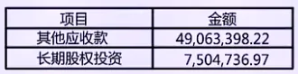

在多元线性回归中，随着解释变量数量的增加， R^2 不会下降，即使新增变量并不具备实际解释力。这一性质使得单纯依赖 R^2 容易导致过度拟合。

为此，引入调整决定系数（Adjusted R^2 ）：

\\bar{R}^2 = 1 - \\frac{\\text{RSS}/(n-k-1)}{\\text{TSS}/(n-1)}

其中，k 为解释变量个数。调整 R^2 对模型复杂度进行了惩罚，只有当新增变量显著降低残差平方和时， \\bar{R}^2 才会上升。即便如此，调整 \\bar{R}^2 仍然是拟合度指标，而非模型有效性的充分条件。

**在量化研究中的作用**

在量化研究中， R^2 主要用于解释能力评估与模型诊断。例如，在因子模型中，较高的 R^2 表明策略收益主要由已知风险因子驱动；较低的 R^2 则意味着存在较多未被模型解释的波动。

然而，高 R^2 并不等价于高 Alpha。许多市场中性或事件驱动策略往往表现出较低的 R^2 ，但仍具备显著的风险调整收益。因此，量化研究中通常结合回归系数稳定性、样本外表现及经济解释共同评估模型质量。

> 用 R^2 评估风险模型

> 某量化工程师在做股票组合风险拆解，用因子模型拟合组合日收益率：

> r\_t = \\alpha + \\beta\_1 \\cdot \\text{MKT}\_t + \\beta\_2 \\cdot \\text{SMB}\_t + \\beta\_3 \\cdot \\text{HML}\_t + \\varepsilon\_t

> 样本为最近 n=250 个交易日，回归结果给出：

- 组合日收益样本方差：

> \\frac{1}{n}\\sum\_{t=1}^{n}(r\_t - \\bar r)^2 = 0.0004

- 残差方差：

> \\frac{1}{n}\\sum\_{t=1}^{n}(r\_t - \\hat r\_t)^2 = 0.0001

> 问题：

- 计算该模型的 R^2 ；

- 从风险管理角度解释该 R^2 ；

- 若另一个模型的 R^2=0.9 ，是否一定更适合做风险控制？

> 答：

> <u>计算 </u>R^2

> 由于：

> R^2 = 1 - \\frac{\\text{RSS}}{\\text{TSS}}

> 在这里使用“方差形式”等价表示：

> R^2 = 1 - \\frac{0.0001}{0.0004} = 0.75

> <u>风险视角的解释</u>

> 该因子模型解释了组合收益 75% 的日波动来源，剩余 25% 属于特异风险（idiosyncratic risk）。

> 在量化工程实践中，这意味着组合的大部分风险可以被系统性因子解释；

> 残差风险可用于：风险预算，对冲设计，组合分散度评估。

> 这里的 R^2 不是用来预测收益，而是用来做风险拆解。

> <u>更高的 </u>R^2 <u>一定更好吗？</u>

> 在量化工程实践中，更高的 R2R^2R2 并不一定意味着风险模型更优，甚至可能适得其反。一方面，通过引入大量高度相关的因子，模型的样本内 R2R^2R2 容易被人为抬高，但这种提升往往源于过拟合，样本外的风险解释能力反而下降。另一方面，若高 R2R^2R2 主要来自不可交易或难以对冲的因子，即使模型在统计意义上拟合良好，也难以为实盘风险管理提供有效支持。此外，若因子载荷在时间上频繁漂移，模型的风险解释结构将缺乏稳定性，导致风险评估结果不可持续。因此，量化工程中的风险模型更强调 R2R^2R2 的稳定性、经济可解释性与可对冲性，而非单纯追求数值上的最大化。

## 3. 异方差（Heteroskedasticity）

**定义**

在经典线性回归模型中，通常假设误差项在给定解释变量条件下具有 **常数方差 **：

\\mathrm{Var}(\\varepsilon\_i \\mid \\mathbf{X}) = \\sigma^2

当误差项的条件方差随解释变量、时间或样本状态发生系统性变化时，即：

\\mathrm{Var}(\\varepsilon\_i \\mid \\mathbf{X}) = \\sigma\_i^2

且 \\sigma\_i^2 并非常数，则称模型存在异方差。

异方差并不改变回归模型的形式，但破坏了经典线性模型中关于误差结构的关键假设。

**对 OLS 性质的影响**

在存在异方差的情况下，最小二乘估计量仍然满足：

\\mathbb{E}\[\\hat{\\boldsymbol{\\beta}}\] = \\boldsymbol{\\beta}

即 OLS 估计仍然是无偏的。然而，其方差不再是最小的，且传统方差估计公式失效。

具体表现为：在错误的同方差假设下计算的标准误通常被低估或高估，从而导致 t 检验与置信区间的统计推断不再可靠。这意味着“显著性结论”可能是由方差结构错误引起的，而非真实关系。

**识别与处理方法**

异方差的识别通常依赖于残差分析与统计检验。常见做法包括观察残差平方随拟合值或解释变量变化的模式，以及使用形式化检验方法（如 Breusch–Pagan 检验或 White 检验）。

在实际建模中，处理异方差的常见方式包括：

- 使用异方差稳健标准误（Heteroskedasticity-robust Standard Errors），在不改变系数估计的情况下修正统计推断

- 对变量进行适当变换（如对数变换），以稳定误差方差

- 在已知方差结构的情形下，采用加权最小二乘法（WLS）

在量化研究中，稳健标准误是最常用、成本最低的处理方式。

**在量化研究中的作用**

在金融时间序列与横截面数据中，异方差几乎是常态而非例外。资产收益的波动往往随市场状态变化，在高波动阶段误差显著放大，在平稳阶段显著收敛。

因此，在因子回归、Alpha 检验和策略归因分析中，若忽略异方差，极易高估策略显著性，造成样本内“有效”、样本外“失效”的结论偏差。量化工程师通常将异方差稳健推断作为默认配置，而非事后修正。

## 回归残差分析（Residual Analysis）

**定义**

在回归分析中，残差（Residual）定义为观测值与模型预测值之间的差异：

e\_i = y\_i - \\hat{y}\_i

其中， \\hat{y}\_i 为回归模型给出的预测值。残差是对真实误差项 \\varepsilon\_i 的样本估计，是检验回归模型假设是否合理的主要依据。

残差分析的核心目的在于：通过研究残差的结构特征，判断模型形式、误差假设及变量选择是否存在系统性问题。

**残差的统计性质**

在包含截距项且使用最小二乘估计的线性回归模型中，残差具有若干基本性质：

\\sum\_{i=1}^n e\_i = 0

\\sum\_{i=1}^n e\_i x\_{ij} = 0,\\quad j=1,\\dots,k

这些性质表明残差在样本内与解释变量线性正交。但需要强调的是，这仅是代数结果，并不意味着误差项在统计意义上独立、同方差或正态。

因此，残差分析并不是验证模型“正确”，而是用于识别模型违反假设的证据。

**残差诊断的主要内容**

残差分析通常围绕以下几个方面展开：

- 非线性结构：残差随拟合值呈系统性曲线趋势，表明线性形式不足

- 异方差：残差的波动幅度随解释变量或预测值变化

- 自相关：残差在时间序列中呈现持续相关

- 异常值与高杠杆点：个别观测对回归结果产生过度影响

这些问题往往无法通过系数显著性直接发现，只能通过残差结构加以识别。

**在量化研究中的作用**

在量化研究中，残差分析是连接统计模型与金融现实的重要工具。通过分析因子回归残差，可以识别未被模型捕捉的风险来源，判断策略收益是否包含结构性模式或仅为噪声积累。

在策略回测中，残差的时间结构有助于发现波动聚集、 regime 切换以及模型失效的早期信号。因此，残差分析通常被视为模型上线前与实盘监控中的必备步骤，而非可选环节。

> 用残差分析判断因子模型是否“还能用”

> 某量化工程师使用如下多因子回归模型解释股票组合的日收益率：

> r\_t = \\alpha + \\beta\_1 \\cdot \\text{MKT}\_t + \\beta\_2 \\cdot \\text{Size}\_t + \\beta\_3 \\cdot \\text{Value}\_t + \\varepsilon\_t

> 模型基于过去 n=250 个交易日估计，用于风险分解与对冲。

> 在最近一个月（20 个交易日）的监控中，工程师对模型残差 \\varepsilon\_t 做了如下分析，得到结论：

- 残差均值接近 0；

- 残差与因子收益的相关系数接近 0；

- 但残差的平方 \\varepsilon\_t^2 与滞后一期的残差平方 \\varepsilon\_{t-1}^2 存在显著正相关；

- 残差在个别交易日出现明显的极端值。

> 问题:

- 从回归假设角度看，上述残差分析违反了哪一类常见假设？

- 这种残差特征在量化工程中意味着什么风险？

- 作为量化工程师，你应采取哪些改进措施？

> 答:

> <u>违反的回归假设</u>

> 虽然残差满足：

- \\mathbb{E}\[\\varepsilon\_t\] \\approx 0

- \\mathrm{Corr}(\\varepsilon\_t, X\_t) \\approx 0

> 但残差平方存在显著自相关，说明：误差项不满足方差齐性假设，存在条件异方差（heteroskedasticity）。在时间序列语境下，这通常表现为波动聚集。

> <u>对量化工程的实际影响</u>

> 该问题并不一定影响回归系数的无偏性，但会带来工程风险：

- 标准误被低估或高估

- t 检验与显著性判断失真

- 风险模型低估极端波动

- 对冲比例在高波动期严重失效

> <u>合理的工程改进方向</u>

> 典型、可执行的做法包括：

- 对残差建模波动结构（如 GARCH）

- 引入波动或流动性相关因子

- 使用稳健标准误（HAC / Newey–West）

- 分状态回归（高波动 / 低波动）

- 对极端残差设置风控阈值

# 时间序列统计

## 平稳性（Stationarity）

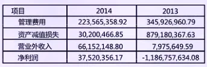

**定义**

在时间序列分析中，平稳性描述的是随机过程统计特征是否随时间保持不变。设时间序列为 \\{X\_t\\}\_{t=1}^T ，若其分布特性不依赖于时间 t，则称该序列是平稳的。

严格意义下，若对任意时间点 t\_1,\\dots,t\_k 及任意时间平移 h，随机向量 (X\_{t\_1},\\dots,X\_{t\_k}) 与 具有相同联合分布，则 (X\_{t\_1+h},\\dots,X\_{t\_k+h}) 称该过程为严格平稳。在实际建模中，更常使用弱化版本。

**弱平稳（协方差平稳）**

在量化与计量经济中，通常采用弱平稳（Weak Stationarity）或协方差平稳定义，其要求为：

\\mathbb{E}\[X\_t\] = \\mu \\quad \\text{（常数）}

\\mathrm{Var}(X\_t) = \\sigma^2 \\quad \\text{（常数）}

\\mathrm{Cov}(X\_t, X\_{t+h}) = \\gamma(h) \\quad \\text{仅依赖于滞后阶数 } h

弱平稳假设是大多数时间序列模型（如 ARMA）的理论基础。若序列不满足该条件，模型参数的统计性质往往不再成立。

**非平稳性的常见形式与处理**

金融时间序列中，非平稳性非常普遍，常见表现包括趋势项、单位根过程以及结构性变化。

典型例子是随机游走模型：

X\_t = X\_{t-1} + \\varepsilon\_t

该过程具有时间变化的方差，因此是非平稳的。

在实践中，常见的处理方式包括：对序列做差分、对数变换，或直接建模收益率而非价格水平。是否平稳通常通过统计检验（如单位根检验）进行判断。

**在量化研究中的作用**

在量化研究中，平稳性决定了模型是否可用。回归分析、因子模型和预测模型通常隐含平稳性假设；若直接在非平稳序列上建模，极易得到伪回归结果。

因此，量化工程师通常将“先检验平稳性，再建模”作为基本流程。价格是否平稳并不重要，重要的是：所建模的对象是否满足模型假设，这也是收益率而非价格被广泛使用的根本原因。

参考资料：

https://www.youtube.com/watch?v=aIdTGKjQWjA

> 价格水平建模 vs 收益率建模

> 你是一名量化工程师，正在为一只股票构建指数对冲型策略，目标是：

- 解释股票波动来源

- 估计对市场的风险暴露（beta）

- 为后续对冲与风险预算提供依据

> 你拥有以下日频数据（共 5 年，约 1250 个交易日）：

- 股票收盘价： P\_t

- 市场指数收盘价： M\_t

> <u>对价格水平建模</u>

> P\_t = \\alpha + \\beta M\_t + \\varepsilon\_t

> 回归结果：

- R^2 = 0.98

- \\hat\\beta = 1.15 ，t 值极大

- 残差均值接近 0

> 表面结论：股票价格与市场指数高度相关，市场几乎完全解释了股票价格。

> 数学问题：

- P\_t、M\_t 均为非平稳序列，存在趋势，方差随时间变化。

- 最小二乘回归捕捉到的是共同时间趋势，而非真实风险关系。

> 即使 P\_t、M\_t 经济上无关，也可能得到高 R^2 和显著系数。这属于伪回归（Spurious Regression）。

> 实盘后，β 随样本区间变化剧烈，对冲比例在实盘中不断失效，样本外表现崩塌，风控误判风险暴露。这个模型“拟合了时间”，而不是“拟合了风险”。

> <u>对收益率建模</u>

> 定义对数收益率：

> r\_t = \\log P\_t - \\log P\_{t-1}

> r^m\_t = \\log M\_t - \\log M\_{t-1}

> 收益率序列的典型性质：

- 均值近似稳定

- 方差有限（但有波动聚集）

- 无明显趋势

> 模型设定:

> r\_t = \\alpha + \\beta r^m\_t + \\varepsilon\_t

> 回归结果:

- R^2 = 0.25

- \\hat\\beta = 1.02 ，显著

- 残差均值约为 0 且残差无趋势

> 说明回归在近似平稳序列上进行，β 估计一致、可解释。 R^2=0.25 表示市场因子解释了 25% 的收益波动。低 R^2 并不等于模型差，而是金融收益率本身就高度噪声化。

> <u>总结</u>

> 维度 价格水平 收益率

> 平稳性 ❌ 非平稳 ✔ 近似平稳

> 回归有效性 伪回归 有统计意义

> R^2 含义 趋势重合 风险解释比例

> β 稳定性 差 好

> 对冲比例 不可用 可复用

> 样本外 崩溃 可迁移

> 在量化工程中，直接对价格水平建模会破坏平稳性假设，导致伪回归和虚假显著性；通过对价格序列取收益率，可以去除趋势并稳定统计特性，使回归结果具备可解释性、可对冲性和工程可用性。

> <u>进一步的工程应用</u>

> 基于收益率模型：

- 构建 beta-neutral 或 market-neutral 策略

- 进行风险分解： \\mathrm{Var}(r\_t) = \\beta^2 \\mathrm{Var}(r^m\_t) + \\mathrm{Var}(\\varepsilon\_t)

- 制定风险预算与杠杆限制

## 白噪声（White Noise）

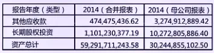

The waveform of a Gaussian white noise signal plotted on a graph

**定义**

在时间序列分析中，白噪声是最基本的随机过程，用于描述“完全不可预测的随机扰动”。设时间序列 \\{\\varepsilon\_t\\} ，若其满足：

\\mathbb{E}\[\\varepsilon\_t\] = 0

\\mathrm{Var}(\\varepsilon\_t) = \\sigma^2

\\mathrm{Cov}(\\varepsilon\_t, \\varepsilon\_{t+h}) = 0,\\quad \\forall h \\neq 0

则称该序列为弱白噪声（White Noise）。

白噪声是协方差平稳过程，其统计特性不随时间变化。

**白噪声与独立性的区别**

需要注意的是，“不相关”并不等价于“独立”。白噪声仅要求不同时间点之间的协方差为零，并不必然要求独立分布。

当进一步假设 \\{\\varepsilon\_t\\} 服从正态分布时：

\\varepsilon\_t \\sim \\mathcal{N}(0,\\sigma^2)

此时可称其为高斯白噪声。 在正态分布条件下，不相关等价于独立。 因此高斯白噪声同时满足独立同分布假设。

---

设随机变量 X,Y 服从 **联合正态分布 **，即

(X,Y) \\sim \\mathcal N(\\mu,\\Sigma)

其中

\\mu= \\begin{pmatrix} \\mu\_X\\\\ \\mu\_Y \\end{pmatrix},\\quad \\Sigma= \\begin{pmatrix} \\sigma\_X^2 & \\sigma\_{XY}\\\\ \\sigma\_{XY} & \\sigma\_Y^2 \\end{pmatrix}.

则有：

\\mathrm{Cov}(X,Y)=0 \\quad \\Longleftrightarrow \\quad X \\perp Y

证明：

<u>独立 ⇒ 不相关</u>

若 X,Y 独立，则

\\mathbb E\[XY\]=\\mathbb E\[X\]\\mathbb E\[Y\]

因此

\\mathrm{Cov}(X,Y) =\\mathbb E\[XY\]-\\mathbb E\[X\]\\mathbb E\[Y\] =0

该结论对任意分布成立。

<u>不相关 ⇒ 独立（联合正态情形）</u>

二维正态分布的联合概率密度函数为

f\_{X,Y}(x,y) = \\frac{1}{2\\pi \|\\Sigma\|^{1/2}} \\exp\\!\\left( -\\frac{1}{2} \\begin{pmatrix} x-\\mu\_X\\\\ y-\\mu\_Y \\end{pmatrix}^{\\!\\top} \\Sigma^{-1} \\begin{pmatrix} x-\\mu\_X\\\\ y-\\mu\_Y \\end{pmatrix} \\right)

若 \\mathrm{Cov}(X,Y)=\\sigma\_{XY}=0 ，则协方差矩阵为对角矩阵：

\\Sigma= \\begin{pmatrix} \\sigma\_X^2 & 0\\\\ 0 & \\sigma\_Y^2 \\end{pmatrix}, \\quad \\Sigma^{-1}= \\begin{pmatrix} \\sigma\_X^{-2} & 0\\\\ 0 & \\sigma\_Y^{-2} \\end{pmatrix}

代入可得指数项分解为：

-\\frac{1}{2} \\left( \\frac{(x-\\mu\_X)^2}{\\sigma\_X^2} + \\frac{(y-\\mu\_Y)^2}{\\sigma\_Y^2} \\right)

因此联合密度函数可写为：

f\_{X,Y}(x,y) = \\left\[ \\frac{1}{\\sqrt{2\\pi}\\sigma\_X} \\exp\\!\\left( -\\frac{(x-\\mu\_X)^2}{2\\sigma\_X^2} \\right) \\right\] \\cdot \\left\[ \\frac{1}{\\sqrt{2\\pi}\\sigma\_Y} \\exp\\!\\left( -\\frac{(y-\\mu\_Y)^2}{2\\sigma\_Y^2} \\right) \\right\] = f\_X(x)f\_Y(y)

由独立的定义可知，X 与 Y 相互独立。

<u>结论</u>

综上，在联合正态分布假设下，

\\mathrm{Cov}(X,Y)=0 \\quad \\Longleftrightarrow \\quad X \\perp Y

证毕。

> 上述等价性是正态分布的特殊性质。对于一般分布，协方差为零仅意味着不存在二阶线性相关性，并不能排除非线性或高阶依赖关系的存在。

---

**白噪声的识别与检验**

在实际应用中，白噪声通常不是建模对象，而是用于判断模型是否“已经解释完了数据结构”。

常见判断方法包括：通过自相关函数（ACF）观察各滞后阶数是否显著为零，或使用统计检验（如 Ljung–Box 检验）对“整体无自相关”进行检验。若残差近似白噪声，说明模型已捕捉序列中的主要线性依赖结构。

**在量化研究中的作用**

在量化研究中，白噪声具有基准意义。一个有效的时间序列模型，其残差应接近白噪声；否则，说明仍存在可利用的结构信息。

对于收益率序列而言，若其行为接近白噪声，则意味着基于历史信息的线性预测空间极为有限。这也是许多金融市场“弱有效性”在统计层面的体现。

> 高斯白噪声在量化残差建模中的应用

> 某量化工程师构建了一个用于预测股票日收益率的线性因子模型：

> R\_t = \\alpha + \\boldsymbol{\\beta}^\\top \\mathbf{F}\_t + \\varepsilon\_t

> 其中：

- R\_t ：第 t 日股票的超额收益率；

- F\_t \\in \\mathbb{R}^k ：第 t 日的 k 个因子收益；

- \\varepsilon\_t ：模型残差。

> 工程师希望判断该模型是否已经充分刻画了可解释结构，因此对残差序列 \\{\\varepsilon\_t\\} 做如下假设：

> \\varepsilon\_t \\sim \\text{i.i.d. } \\mathcal N(0,\\sigma^2)

> 即残差为高斯白噪声。

> 问题:

- 在量化建模中，“高斯白噪声残差”这一假设分别意味着哪些统计与工程含义？

- 若经验检验发现残差存在显著自相关或波动聚集，应如何解读？

- 若残差满足高斯白噪声假设，这一结论在策略工程上可以支持哪些决策？

> 答:

> <u>高斯白噪声假设的含义</u>

> 残差为高斯白噪声意味着：

> \\mathbb E\[\\varepsilon\_t\]=0,\\quad \\mathrm{Var}(\\varepsilon\_t)=\\sigma^2,\\quad \\mathrm{Cov}(\\varepsilon\_t,\\varepsilon\_{t-k})=0\\;(k\\neq 0)

> 且 \\varepsilon\_t 服从正态分布。

> 在量化工程中的含义是：

- 均值为零：模型不存在系统性漏掉的收益结构；

- 不相关：不存在可利用的时间依赖，模型已解释主要动态；

- 正态性：残差主要反映随机扰动而非结构性风险。

> <u>残差偏离白噪声的解读</u>

> 若发现：

- 残差存在自相关 → 模型遗漏了滞后结构（如动量、反转效应）；

- 残差方差随时间变化（波动聚集） → 需要引入 GARCH、状态切换或风险因子；

- 残差厚尾或偏态 → 极端风险未被因子解释，VaR / CVaR 可能被低估。

> 这些现象说明：残差并非纯噪声，仍包含可建模或需风控的结构。

> <u>白噪声结论的工程意义</u>

> 若残差可近似视为高斯白噪声，则：

- 模型结构基本充分, 无明显可榨取的线性或时间结构；

- t / F 检验结果可信, 回归系数显著性判断具有统计基础；

- 风险预测可简化, 波动率估计与蒙特卡洛模拟更稳定；

- 策略扩展需引入新信息, 仅靠历史残差无法继续挖掘收益。

## 自回归 AR / 移动平均 MA / ARMA / ARIMA

见 [📄 《时间序列分析》学习笔记](https://ai.feishu.cn/docx/ZADvdBUL1oBXFjxmZ2OcpdV5n8g?from=from_copylink)

## ACF / PACF（自相关函数与偏自相关函数）

见 [📄 《时间序列分析》学习笔记](https://ai.feishu.cn/docx/ZADvdBUL1oBXFjxmZ2OcpdV5n8g?from=from_copylink)

## 滞后变量（Lag）

**定义**

在时间序列分析中，滞后变量（Lag）指序列在过去时点的取值，用于刻画当前状态对历史信息的依赖关系。

对时间序列 \\{X\_t\\} ，其 k 阶滞后变量定义为：

X\_{t-k},\\quad k=1,2,\\dots

滞后变量是时间序列模型区别于截面模型的核心要素，它使模型能够显式表达动态结构。

**滞后结构的统计含义**

引入滞后变量意味着假设当前观测值的条件期望依赖于历史信息：

\\mathbb{E}\[X\_t \\mid \\mathcal{F}\_{t-1}\] = f(X\_{t-1}, X\_{t-2}, \\dots)

其中 \\mathcal{F}\_{t-1} 表示时点 t-1 可获得的信息集。

在最简单的线性形式下，可写为自回归模型：

X\_t = \\phi\_1 X\_{t-1} + \\phi\_2 X\_{t-2} + \\cdots + \\varepsilon\_t

滞后阶数的选择直接决定了模型对记忆长度的刻画能力。

**滞后变量的选择与风险**

滞后变量的引入并非越多越好。滞后阶数过低会遗漏重要动态结构，过高则可能导致参数不稳定、过拟合以及多重共线性问题。

实践中，滞后结构的选择通常结合自相关函数（ACF）、偏自相关函数（PACF）以及信息准则（如 AIC、BIC）进行。

在时间序列回归中，还需警惕滞后变量与误差项相关的问题，否则将破坏估计的无偏性。

**在量化研究中的作用**

在量化研究中，滞后变量广泛用于刻画动量、反转、均值回复等时间依赖特征。通过引入收益率、波动率或因子值的滞后项，可以构建动态预测模型或风险控制规则。

然而，在高效市场环境中，可预测性往往随滞后阶数迅速衰减。因此，滞后变量更多用于结构诊断与模型刻画，而非长期稳定的预测来源。

## \*随机过程（Stochastic Process）

**定义**

随机过程是一族按时间（或空间）索引的随机变量集合。

数学上表示为：

\\{X\_t : t \\in \\mathcal{T}\\}

其中：

- t：时间索引（如 t=0,1,2,… 或 t \\in \\mathbb{R} ）

- X\_t ：在时刻 t 的随机变量

随机变量描述“某一时刻的不确定结果”。随机过程：描述“整个时间序列的不确定演化”。时间序列分析研究的对象，本质上都是随机过程。

**样本路径与分布刻画**

<u>样本路径（Sample Path）</u>

一次实验或一次现实观测，会得到一条具体的时间序列：

x\_1, x\_2, \\dots, x\_T

这条序列是随机过程的一条样本路径。

随机过程是概率意义上的整体。而时间序列数据是随机过程的一次实现。

<u>有限维分布</u>

随机过程由其联合分布族完全刻画：

(X\_{t\_1}, X\_{t\_2}, \\dots, X\_{t\_k})

但在实际建模中，通常用更简洁的统计特征描述。

**统计刻画方式**

在时间序列中，随机过程通常通过以下量来刻画：

<u>均值函数</u>

\\mu(t) = \\mathbb{E}\[X\_t\]

<u>自协方差函数</u>

\\gamma(t,s) = \\mathrm{Cov}(X\_t, X\_s)

若过程是 **弱平稳的 **：

\\mu(t)=\\mu,\\quad \\gamma(t,s)=\\gamma(\|t-s\|)

此时只需研究滞后 k 下的统计性质。

**常见随机过程类型**

<u>白噪声过程</u>

X\_t \\sim (0,\\sigma^2),\\quad \\mathrm{Cov}(X\_t,X\_{t-k})=0,\\ k\\neq0

表示“纯随机、无记忆”的过程。

<u>随机游走（Random Walk）</u>

X\_t = X\_{t-1} + \\varepsilon\_t

- 非平稳

- 冲击具有永久影响

- 金融价格常被近似为随机游走

<u>AR / MA / ARMA 过程</u>

例如 AR(1)：

X\_t = \\phi X\_{t-1} + \\varepsilon\_t

通过有限滞后来描述时间依赖结构，是实际建模的核心工具。

**随机过程 vs 回归模型**

关键区别在于谁是随机的：

| 模型 | 随机性来源 |
| --- | --- |
| 经典回归 | 误差项随机，自变量视为给定 |
| 随机过程 | 整个序列都是随机的 |

时间序列分析中，回归是“截面视角”，随机过程是“动态视角”。

**在量化中的作用**

在量化研究中，随机过程是基础建模假设，量化不是在预测某一个点，而是在假设和利用一个随机过程的统计结构。

| 核心问题 | 随机过程视角 | 在量化中的实际意义 |
| --- | --- | --- |
| 收益是否可预测 | 收益序列近似随机过程，常被检验是否为白噪声 | 判断策略是否真的包含信息，还是过拟合 |
| 风险从何而来 | 波动率本身是随时间变化的随机过程 | 用于风险控制、仓位管理和波动率建模（如 GARCH） |
| 模型是否可用 | 建模对象需满足平稳性假设 | 决定是否可以使用回归、ARMA 等时间序列模型 |

# 模拟与数值方法

## 蒙特卡罗模拟（Monte Carlo Simulation）

**定义**

蒙特卡罗模拟是一类基于随机抽样的数值方法，用于近似计算解析解难以获得的期望、分布或概率。

一般形式为：

对随机变量 X 和函数 f(\\cdot) ，希望计算

\\mathbb{E}\[f(X)\]

当解析计算困难时，通过独立抽样

X^{(1)},\\dots,X^{(N)}

用样本均值近似：

\\mathbb{E}\[f(X)\] \\;\\approx\\; \\frac{1}{N}\\sum\_{i=1}^N f\\!\\left(X^{(i)}\\right)

其理论基础是大数定律。

**数学原理**

设估计量

\\hat{\\mu}\_N = \\frac{1}{N}\\sum\_{i=1}^N f(X^{(i)})

则有：

- 无偏性： \\mathbb{E}\[\\hat{\\mu}\_N\] = \\mathbb{E}\[f(X)\]

- 方差： \\mathrm{Var}(\\hat{\\mu}\_N) = \\frac{\\mathrm{Var}(f(X))}{N}

- 收敛速度： \\text{误差规模} \\sim O\\!\\left(\\frac{1}{\\sqrt{N}}\\right)

维度再高，蒙特卡罗的收敛速度也不变，这是它的核心优势。

**与随机过程的结合**

在量化中，蒙特卡罗往往用于模拟随机过程的路径。

例如连续时间模型：

X\_t = \\mu\\,dt + \\sigma\\,dW\_t

离散化后：

X\_{t+\\Delta t} = X\_t + \\mu\\,\\Delta t + \\sigma \\sqrt{\\Delta t}\\,Z\_t, \\quad Z\_t \\sim \\mathcal{N}(0,1)

通过重复生成大量路径，可以近似得到：

- 终值分布

- 路径相关统计量

- 极端事件概率

**在量化工程中的作用**

蒙特卡罗模拟在量化中的核心用途可以归纳为三类：

- 衍生品定价
  - 期权、路径依赖产品的定价与希腊值估计

- 风险度量
  - VaR / CVaR 的数值计算
  - 极端损失概率评估

- 策略压力测试
  - 在假设模型下检验策略在不同随机路径下的稳定性

参考资料：

[Simple Monte Carlo Simulation of Stock Prices](https://www.youtube.com/watch?v=_T0l015ecK4&pp=2Ab3BA%3D%3D)

## 随机过程模拟（Stochastic Process Simulation）

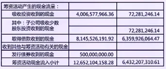

**定义**

随机过程模拟是指：在给定随机过程的概率结构下，通过数值方法生成其样本路径，以近似分析该过程的分布性质与路径行为。

设连续时间随机过程满足随机微分方程（SDE）：

dX\_t = a(X\_t,t)\\,dt + b(X\_t,t)\\,dW\_t

随机过程模拟的目标，是在离散时间网格 0=t\_0<t\_1<\\dots<t\_n=T 上构造 X\_{t\_i} 的数值近似。

**基本离散化方法（Euler 思想）**

最常用的方法是 **Euler–Maruyama 离散化 **。

对时间步长 Δt，有：

X\_{t\_{k+1}} = X\_{t\_k} + a(X\_{t\_k},t\_k)\\,\\Delta t + b(X\_{t\_k},t\_k)\\,\\sqrt{\\Delta t}\\,Z\_k, \\quad Z\_k \\sim \\mathcal{N}(0,1)

解释要点：

- 漂移项 a(\\cdot)\\Delta t ：确定性部分

- 扩散项 b(\\cdot)\\sqrt{\\Delta t}Z\_k ：随机冲击

- 每一步只依赖当前状态，便于工程实现

**常见随机过程的模拟形式**

以量化中最常见的模型为例：

- 布朗运动

W\_{t\_{k+1}} = W\_{t\_k} + \\sqrt{\\Delta t}\\,Z\_k

- 几何布朗运动（GBM）

S\_{t\_{k+1}} = S\_{t\_k}\\exp\\!\\left( \\left(\\mu - \\tfrac{1}{2}\\sigma^2\\right)\\Delta t + \\sigma\\sqrt{\\Delta t}\\,Z\_k \\right)

- 随机波动率模型

\\begin{aligned} dS\_t &= \\mu S\_t dt + \\sqrt{v\_t}\\,S\_t dW\_t^{(1)} \\\\ dv\_t &= \\kappa(\\theta - v\_t)dt + \\xi \\sqrt{v\_t} dW\_t^{(2)} \\end{aligned}

模拟的关键在于：既要保持统计性质，又要数值稳定。

**在量化工程中的作用**

随机过程模拟在量化工程中主要承担三类任务：

- 路径级分析
  - 研究回撤、止损、爆仓等路径相关风险

- 模型驱动的压力测试
  - 在假设模型下评估策略的极端情形表现

- 无法解析求解时的替代方案
  - 定价、风险或策略评估中的数值近似

参考资料：

[Simulating Stocks with Geometric Brownian Motion](https://www.youtube.com/watch?v=R8pDHvPWtE4)

## 风险模拟（最大回撤，Maximum Drawdown）

**定义**

最大回撤（Maximum Drawdown, MDD）用于刻画投资过程中从历史高点到随后最低点的最大跌幅。

设资产净值过程为 V\_t ，定义历史高点：

M\_t = \\max\_{0 \\le s \\le t} V\_s

则在区间 \[0,T\] 内的最大回撤为：

\\mathrm{MDD} = \\max\_{0 \\le t \\le T} \\left( \\frac{M\_t - V\_t}{M\_t} \\right)

最大回撤是典型的路径依赖风险指标，无法仅通过均值和方差刻画。

**回撤的随机过程视角**

将净值视为随机过程：

V\_t = V\_0 \\exp(X\_t)

其中 X\_t 可由收益随机过程生成。

最大回撤本质上是该随机过程路径上的函数：

- 依赖于整个历史路径

- 对极端负向波动高度敏感

因此，最大回撤的分布通常没有解析解。

**基于蒙特卡罗的回撤模拟**

风险模拟的基本流程如下：

- 假设收益或价格过程模型（如 GBM、ARMA-GARCH）

- 用随机过程模拟生成大量路径 \\{V\_t^{(i)}\\}

- 对每条路径计算最大回撤：

\\mathrm{MDD}^{(i)} = \\max\_t \\frac{M\_t^{(i)} - V\_t^{(i)}}{M\_t^{(i)}}

- 统计回撤的经验分布

由此可以得到：

- 回撤的期望

- 高分位数回撤（如 95% 回撤）

- 极端风险区间

**在量化工程中的作用**

最大回撤模拟在量化工程中的实际用途主要包括：

- 策略准入筛选：剔除在合理假设下回撤不可接受的策略

- 仓位与杠杆控制：根据高分位回撤设定最大杠杆

- 压力测试补充：弥补 VaR 对路径风险刻画不足的问题

在工程实践中，最大回撤往往与收益、波动率共同作为核心约束指标。

参考资料：

[Fast Monte Carlo Simulation For Estimation Maximum Expected Drawdown](https://www.youtube.com/watch?v=5AwX7OA3NTQ)

# 金融与量化专用统计模型

## 衍生品（Derivative）

**定义**

衍生品是指其价值依赖于某个基础资产价格或状态变量的金融合约。

用数学形式表示，衍生品在到期时的支付可写为：

\\text{Payoff} = f(S\_T)

其中：

- S\_T ：基础资产在到期时的价格

- f(\\cdot) ：已知的支付函数

例如欧式看涨期权：

f(S\_T) = \\max(S\_T - K,\\, 0)

**定价的统计建模视角**

衍生品定价的核心问题是计算未来不确定支付的当前价值。

在风险中性测度 \\mathbb{Q} 下：

\\text{Price}\_0 = e^{-rT}\\,\\mathbb{E}^{\\mathbb{Q}}\\!\\left\[f(S\_T)\\right\]

这一定价公式说明：

- 不需要预测真实世界的上涨或下跌

- 只需要刻画 S\_T  的概率分布

因此，衍生品定价本质上是一个概率分布建模问题。

**常见模型与假设**

最基础的模型假设基础资产服从几何布朗运动：

dS\_t = \\mu S\_t\\,dt + \\sigma S\_t\\,dW\_t

在风险中性世界中，漂移替换为无风险利率：

dS\_t = r S\_t\\,dt + \\sigma S\_t\\,dW\_t

由此可推导 Black–Scholes 定价公式。

当现实偏离这些假设时，引入：

- 随机波动率模型

- 跳跃扩散模型

- 本地波动率模型

**在量化工程中的作用**

在量化工程实践中，衍生品模型主要用于：

- 定价与估值：期权、公允价值计算

- 风险暴露分析：Delta、Gamma 等敏感度度量

- 隐含信息提取：从期权价格反推隐含波动率

衍生品模型也是量化中最早、最成熟的一类统计建模体系。

## 收益率分布（Return Distribution）

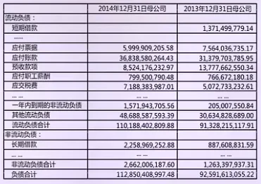

**定义**

收益率分布描述的是资产在给定时间尺度下收益随机变量的概率分布。

常用收益定义为对数收益：

r\_t = \\ln\\frac{P\_t}{P\_{t-1}}

收益率分布即随机变量 r\_t 的分布：

r\_t \\sim F(\\cdot)

它是风险度量、定价和策略设计的基础。

**理论分布与经验事实**

最早的建模假设是正态分布：

r\_t \\sim \\mathcal{N}(\\mu,\\,\\sigma^2)

该假设在解析计算上非常方便，但真实市场数据普遍呈现：

- 尖峰厚尾

- 偏度不为零

- 极端事件概率被低估

因此，正态分布更像是基准模型，而非真实描述。

**改进分布与动态特征**

为了更好拟合经验分布，常见做法包括：

- 使用厚尾分布（如 Student-t）

- 引入条件分布： r\_t \\mid \\mathcal{F}\_{t-1} \\sim \\mathcal{N}(0,\\,\\sigma\_t^2)

- 将“分布形状”与“时间变化的波动率”分离建模

这解释了为什么：

- 单期收益近似对称

- 长期分布却呈现厚尾

**在量化工程中的作用**

收益率分布在量化工程中的核心作用包括：

- 风险度量：VaR、CVaR 的基础输入

- 衍生品定价：决定尾部支付概率

- 策略评估：识别收益是否依赖少数极端事件

工程实践中，更关注尾部行为是否被合理刻画，而非均值是否精确。

## 波动率（Volatility）

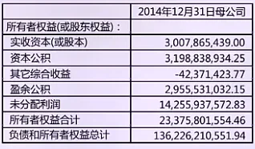

**定义**

波动率用于刻画收益率不确定性的尺度，是收益率分布中最核心的风险参数。

对收益率 r\_t ，在给定时间尺度下，波动率通常定义为其标准差：

\\sigma = \\sqrt{\\mathrm{Var}(r\_t)}

在连续时间模型中，波动率对应于随机过程扩散项的强度。

**实际市场中的波动特征**

经验数据表明，市场波动率具有以下典型特征：

- 时变性：高波动期与低波动期交替出现

- 聚集性：大波动后往往仍是大波动

- 收益与波动不对称：负收益常伴随波动上升

因此，假设波动率为常数在实践中通常不成立。

**波动率的建模方式**

常见的统计建模方法包括：

- **历史波动率 **：

\\hat{\\sigma}^2 = \\frac{1}{n-1}\\sum\_{i=1}^n (r\_i - \\bar r)^2

- **条件波动率模型 **（示意）：

r\_t = \\sigma\_t \\varepsilon\_t,\\quad \\sigma\_t^2 = \\omega + \\alpha r\_{t-1}^2 + \\beta \\sigma\_{t-1}^2

- **隐含波动率 **：由期权价格反推出的市场共识风险水平

这些方法分别对应不同的时间视角与信息集。

**在量化工程中的作用**

波动率在量化工程中的核心作用包括：

- 风险控制：波动率目标化、仓位调整

- 资产定价：期权定价与希腊值计算

- 策略结构设计：区分方向收益与波动收益

在实践中，波动率常被视为可预测的风险状态变量。

参考资料：

[What is Volatility in Trading?](https://www.youtube.com/watch?v=fT-HcX6f6Zk)

## \*默顿模型（Merton Model）

**定义**

默顿模型是一种基于结构化假设的信用风险模型，用于刻画企业违约概率。

核心思想是：企业股权可以被视为以企业资产为标的的看涨期权。

设企业资产价值为 V\_t ，到期时企业需要偿还债务面值 D，则：

- 若 V\_T \\ge D ：企业不违约，股东获得剩余价值

- 若 V\_T < D ：企业违约，股权价值为 0

**数学建模结构**

假设企业资产价值服从几何布朗运动：

dV\_t = \\mu V\_t\\,dt + \\sigma\_V V\_t\\,dW\_t

股权的到期支付为：

E\_T = \\max(V\_T - D,\\,0)

因此，企业股权价值可写为：

E\_0 = e^{-rT}\\,\\mathbb{E}^{\\mathbb{Q}}\[\\max(V\_T - D,\\,0)\]

这在数学形式上等价于 Black–Scholes 看涨期权定价。

**违约概率与距离违约（Distance to Default）**

在风险中性测度下，违约事件定义为：

V\_T < D

违约概率为：

\\mathbb{P}(V\_T < D) = \\Phi(-d\_2)

其中：

d\_2 = \\frac{\\ln(V\_0/D) + (r - \\tfrac{1}{2}\\sigma\_V^2)T}{\\sigma\_V\\sqrt{T}}

d\_2 也被称为距离违约（Distance to Default），刻画资产价值距离违约边界的安全程度。

**在量化与风险管理中的作用**

默顿模型在实践中的主要用途包括：

- 违约概率估计：企业信用风险定量化

- 信用利差解释：将股权波动与债券风险联系起来

- 结构化产品建模：信用衍生品的基础模型之一

工程实践中，资产价值与资产波动率通常通过反演股价与股权波动率获得。
