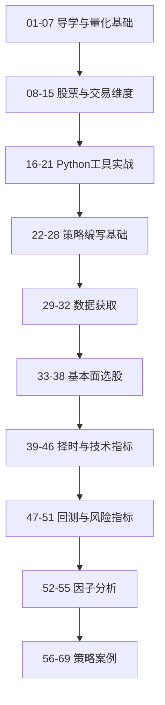

> 把 B站量化课公开 69 讲压缩成十段学习路径，并和当前知识库的概念页、主题页与逐讲摘要做对照。

## 背景与动机

这门课现在已经有：

- 69 讲逐讲字幕原文
- 69 讲逐讲资料摘要
- 课程入口页与课程总摘要

但如果没有一页更短的导航，用户仍然要在几十个摘要页里来回切换。最适合的做法不是继续堆页，而是先把“按什么顺序看、每段对应哪些概念、哪些讲次最值得优先看”压缩成一张学习地图。

## 核心内容

### 1. 最短学习顺序

如果只想先建立一条最短可用路径，优先按这个顺序看：

1. [[资料摘要：B站量化课 01 课程导学]]
2. [[资料摘要：B站量化课 04 量化交易开发流程]]
3. [[资料摘要：B站量化课 15 量化交易平台]]
4. [[资料摘要：B站量化课 22 简易策略框架]]
5. [[资料摘要：B站量化课 47 回测流程与平台机制]]
6. [[资料摘要：B站量化课 52 因子分析概述]]
7. [[资料摘要：B站量化课 56 双均线策略]]
8. [[资料摘要：B站量化课 68 逆三因子策略（上）]]

这 8 讲足以先建立“行业认知 -> 工具链 -> 策略 -> 回测 -> 因子 -> 案例”的总骨架。

### 2. 十段课程模块

#### 01-07 导学与量化基础

- 入口：[[资料摘要：B站量化课 01 课程导学]] 到 [[资料摘要：B站量化课 07 策略信号分类]]
- 作用：先回答“量化交易是什么、为什么值得学、开发流程长什么样”
- 对应知识库页：
  - [[量化交易]]
  - [[量化交易学习路径]]
  - [[量化研究]]

#### 08-15 股票与交易维度

- 入口：[[资料摘要：B站量化课 08 股票基本概念（上）]] 到 [[资料摘要：B站量化课 15 量化交易平台]]
- 作用：建立股票、行业、影响因素、择时和平台的基础语言
- 对应知识库页：
  - [[量化交易]]
  - [[阿尔法模型]]
  - [[执行模型]]

#### 16-21 Python 工具实战

- 入口：[[资料摘要：B站量化课 16 Numpy股价统计分析]] 到 [[资料摘要：B站量化课 21 Matplotlib 绘制 KDJ]]
- 作用：把股价统计、时间序列、K线和指标可视化真正落到 Python
- 对应知识库页：
  - [[量化研究]]
  - [[回测]]

#### 22-28 策略编写基础

- 入口：[[资料摘要：B站量化课 22 简易策略框架]] 到 [[资料摘要：B站量化课 28 Portfolio 与 SubPortfolio 对象]]
- 作用：从平台对象、核心函数、定时函数、交易函数开始搭策略脚手架
- 对应知识库页：
  - [[执行模型]]
  - [[投资组合构建]]
  - [[量化AI工作区模板]]

#### 29-32 数据获取

- 入口：[[资料摘要：B站量化课 29 财务数据获取]] 到 [[资料摘要：B站量化课 32 行情与龙虎榜数据获取]]
- 作用：补齐策略和选股前的事实输入层
- 对应知识库页：
  - [[财务报表分析]]
  - [[量化研究]]

#### 33-38 基本面选股

- 入口：[[资料摘要：B站量化课 33 量化选股概览]] 到 [[资料摘要：B站量化课 38 质量类因子选股]]
- 作用：把营收、利润、规模、价值、质量等基础因子压成选股逻辑
- 对应知识库页：
  - [[多因子策略]]
  - [[Alpha]]
  - [[财务报表分析]]

#### 39-46 择时与技术指标

- 入口：[[资料摘要：B站量化课 39 量化择时基本概念]] 到 [[资料摘要：B站量化课 46 OBV 与成交量指标]]
- 作用：系统铺开 MACD、RSI、WR、均线、布林带、量价指标
- 对应知识库页：
  - [[动量策略]]
  - [[均值回归]]
  - [[波动率]]

#### 47-51 回测与风险指标

- 入口：[[资料摘要：B站量化课 47 回测流程与平台机制]] 到 [[资料摘要：B站量化课 51 基准波动率与最大回撤]]
- 作用：把回测流程和核心评价指标讲成一条完整解释链
- 对应知识库页：
  - [[回测]]
  - [[样本外测试]]
  - [[Alpha]]
  - [[Beta]]
  - [[Sharpe Ratio]]
  - [[波动率]]
  - [[最大回撤]]

#### 52-55 因子分析

- 入口：[[资料摘要：B站量化课 52 因子分析概述]] 到 [[资料摘要：B站量化课 55 Alpha013 因子实战]]
- 作用：从概述、自定义因子、结果解读一路讲到 alpha 因子实战
- 对应知识库页：
  - [[多因子策略]]
  - [[IC（信息系数）]]
  - [[IR（信息比率）]]
  - [[Z-Score]]
  - [[量化研究]]

#### 56-69 策略案例

- 入口：[[资料摘要：B站量化课 56 双均线策略]] 到 [[资料摘要：B站量化课 69 逆三因子策略（下）]]
- 作用：把双均线、KDJ、MA-RSI、能量型指标、布林带、主题轮动、低估值、大小盘轮动、逆三因子都走一遍
- 对应知识库页：
  - [[动量策略]]
  - [[统计套利]]
  - [[配对交易]]
  - [[市场中性策略]]
  - [[CAPM]]
  - [[多因子策略]]

### 3. 如果你只关心回测与研究防错

优先看：

1. [[资料摘要：B站量化课 47 回测流程与平台机制]]
2. [[资料摘要：B站量化课 49 阿尔法、贝塔与夏普]]
3. [[资料摘要：B站量化课 50 索提诺、信息比率与波动率]]
4. [[资料摘要：B站量化课 51 基准波动率与最大回撤]]
5. [[回测]]
6. [[样本外测试]]
7. [[前视偏差]]
8. [[幸存者偏差]]
9. [[量化回测常见幻觉清单]]

### 4. 如果你只关心因子研究

优先看：

1. [[资料摘要：B站量化课 33 量化选股概览]]
2. [[资料摘要：B站量化课 52 因子分析概述]]
3. [[资料摘要：B站量化课 53 自定义因子实战]]
4. [[资料摘要：B站量化课 54 因子分析结果解读]]
5. [[资料摘要：B站量化课 55 Alpha013 因子实战]]
6. [[多因子策略]]
7. [[IC（信息系数）]]
8. [[IR（信息比率）]]
9. [[行业中性化]]
10. [[因子研究从IC到实盘的淘汰链]]

### 5. 如果你只想先看最像“策略模板”的讲次

- [[资料摘要：B站量化课 56 双均线策略]]
- [[资料摘要：B站量化课 57 KDJ 策略]]
- [[资料摘要：B站量化课 58 MA-RSI 策略（上）]]
- [[资料摘要：B站量化课 61 布林带策略]]
- [[资料摘要：B站量化课 62 新能源股票轮动策略]]
- [[资料摘要：B站量化课 63 低估值量化策略]]
- [[资料摘要：B站量化课 68 逆三因子策略（上）]]

## 现状与趋势

这门课现在已经完成了三层沉淀：

- 视频入口层：课程入口页与总摘要页
- 原始资料层：69 讲逐讲字幕与合并版
- 摘要层：69 个逐讲资料摘要页

后续最值得补的，不是再重复整理字幕，而是把这些摘要进一步压成：

- 概念反向补链
- 模块级学习图
- 更短的“只看 10 页”版本

## 开放问题

- 这门课里哪些讲次最值得进一步升级成独立概念页或综合分析页？
- 是否要把 “策略案例” 模块再拆成一个专门的案例导航页？
- 对 `67` 讲这类字幕不完整页，是否要后续重抓或人工补录？

## 相关

- [[B站Python量化交易教程（BV1D52CBREpX）]]
- [[B站Python量化交易教程 69讲学习地图.canvas]]
- [[B站Python量化交易教程 69讲学习地图.base]]
- [[资料摘要：B站Python量化交易教程（BV1D52CBREpX）]]
- [[量化交易学习路径]]
- [[量化研究导航]]
- [[Wiki 目录]]
