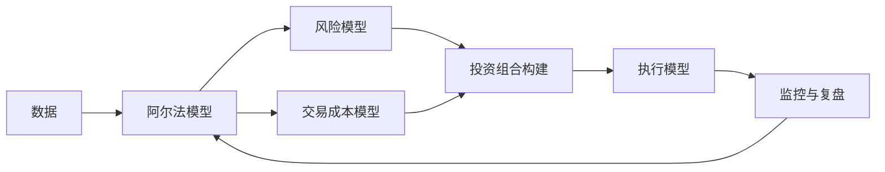

> 量化交易本质上是把投资判断拆成可复现的模型与流程，用统计优势替代临场直觉，用风险约束与执行系统把收益兑现出来。

## 背景与动机

量化交易之所以重要，不是因为它比人“更聪明”，而是因为它比人更一致。主观投资最容易失效的地方往往不是认知本身，而是执行中的情绪扰动、临场改口和无法持续复盘。量化把这些问题转化为系统设计问题。

这也是“黑箱”一词容易误导人的地方。对外部观察者来说系统是黑的；对系统设计者来说，它应该被拆成一组清楚的模块，每个模块都能说明输入、输出、假设和失败条件。

## 核心内容

### 一条主线：收益不等于策略正确

量化交易首先关心的不是“这次会不会涨”，而是“这套规则在大量样本上是否存在统计优势，以及优势是否能在成本和风险之后留存下来”。因此它天然比主观投资更强调分布、回撤、失效场景和执行摩擦。

### 六个核心模块

- [[阿尔法模型]]：定义预期收益来自哪里，负责生成买卖方向、强度或相对优势。
- [[风险模型]]：识别那些没有报酬的附加敞口，例如板块暴露、杠杆失衡或结构性拥挤。
- [[交易成本模型]]：估算佣金、滑点和市场冲击，回答“理论收益能剩多少”。
- [[投资组合构建]]：把多个信号与约束转成真实仓位，不让单点判断主导全局。
- [[执行模型]]：决定订单如何拆分、在哪个流动性池执行、采用主动还是被动风格。
- [[量化研究]]：负责提出想法、训练和验证模型，并持续对抗过拟合与市场变化。

### 为什么系统观比单点策略更重要

单看一个因子、一个信号或一条回测曲线，无法判断策略是否值得相信。一个策略即便逻辑成立，也可能被以下环节毁掉：

- 风险暴露没有被识别，导致收益只是某类市场 beta 的伪装。
- 交易成本过高，实盘净收益被反复吃掉。
- 执行过慢或过于激进，造成滑点和冲击失控。
- 研究方法过拟合，样本外完全失效。

### 高频交易只是时间尺度更短的量化交易

[[高频交易（HFT）]] 并不是另一套哲学，而是把同样的问题压缩到极短时间窗口中重新求解。预测周期更短，成本更敏感，基础设施更关键，但核心依旧是“信号、风险、成本、执行”的平衡。

## 现状与趋势

从这份资料看，量化交易的长期趋势至少有三条：

- 从“比速度”逐步转向“比智慧”，尤其在低延迟竞争逼近物理极限后。
- 从单策略依赖走向多策略组合，重视结构多样性和收益来源去相关。
- 从单纯回测导向走向更严格的研究与监控导向，更强调失效识别、异常监控和持续迭代。

但它也天然面临衰减压力：市场结构变化、监管变化、拥挤交易和数据优势流失都会削弱既有模型。

## 开放问题

- 哪些风险可以被模型化，哪些风险只能通过仓位和杠杆保守管理？
- 当策略拥挤度上升时，历史样本还能否代表未来收益分布？
- 机器学习模型在量化中的增益，究竟来自更强预测力，还是来自更复杂的过拟合风险？
- 高频和中频策略的边界，未来是否会更多由市场结构而非技术能力决定？

## 相关

- [[资料摘要：打开量化投资的黑箱]]
- [[阿尔法模型]]
- [[风险模型]]
- [[交易成本模型]]
- [[投资组合构建]]
- [[执行模型]]
- [[量化研究]]
- [[高频交易（HFT）]]
- [[Wiki 目录]]
